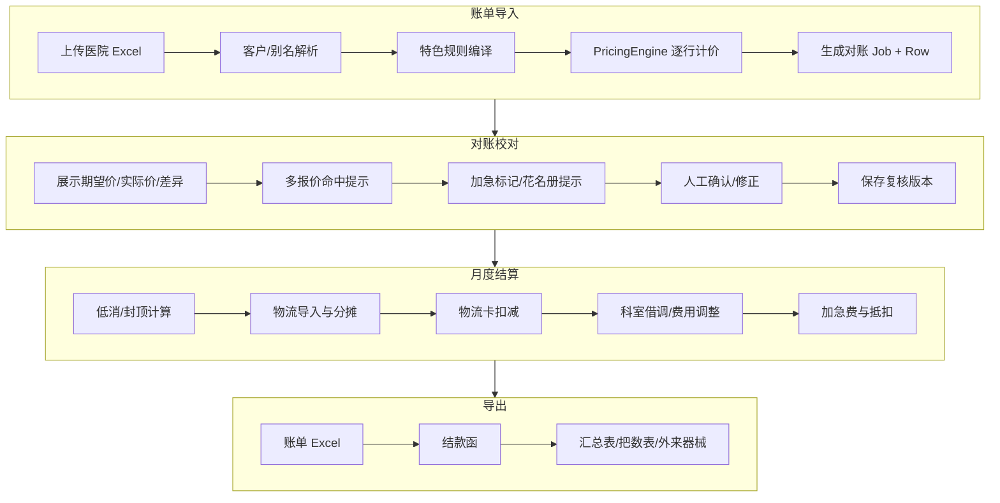

# 特色账单系统功能需求说明书

## 文档信息

| 项目 | 内容 |
|------|------|
| **文档名称** | 特色账单系统功能需求说明书 |
| **版本** | v1.0 |
| **编制日期** | 2026-07-17 |
| **编制依据** | `铂康/特色账单规则.txt`、`铂康/特色账单系统需求原始对话.txt` |
| **关联文档** | `system-docs/特色账单升级开发规划.md`、`system_docs/客户升级计划说明.md` |
| **文档性质** | 功能需求规格说明（FRD），聚焦业务需求与验收标准，不涉及具体技术实现 |
| **适用范围** | 医院消毒供应账单导入、Excel 对账校对、账单/结款函/汇总表导出全流程 |

---

## 1. 背景与目标

### 1.1 业务背景

铂康医疗为多家医院提供器械消毒灭菌服务。各医院在合同谈判、科室结构、物流模式、折扣政策等方面差异显著，导致**同一套标准计费规则无法覆盖全部客户**。当前业务人员需将系统导出的「未改账单」手工加工为符合医院要求的「特色账单」，涉及删列、插列、改价、拆行、凑数、分科室汇总、制作结款函等大量重复劳动，**两名业务人员每月需投入约半个月**。

原始对话中描述的典型手工流程包括：

1. 删除系统导出账单中的 I/J/K 列及器械数（M 列）等字段（部分医院需保留）；
2. 在包数后插入「包装材料」「单包器械数量」「单价」三列；
3. 依据包名、单价、包装材料等匹配特色计费规则，填充或拆分账单行；
4. 对「5 件算 1 件」等产品进行行拆分与凑数（如 82 件拆为 10+10+5+1+1+…）；
5. 按医院要求生成结款函、分科室汇总、价格汇总、外来器械表等多份输出物。

### 1.2 建设目标

| 编号 | 目标 | 说明 |
|------|------|------|
| G1 | **可配置化** | 任意医院可在客户管理中启用「特色账单」模式，无需改代码 |
| G2 | **规则引擎化** | 折扣、特殊计费、低消、物流、加急、分科室等业务规则可配置、可复算 |
| G3 | **流程一体化** | 特色规则嵌入账单导入 → 对账校对 → 多格式导出的完整链路 |
| G4 | **结果可解释** | 对账详情明确展示规则命中、多报价选择、费用调整原因 |
| G5 | **逐步替代手工** | 优先覆盖高频、规则相对稳定的医院，复杂医院分阶段交付 |

### 1.3 成功标准

- 已配置特色规则的医院，系统导出账单与业务人员手工账单在**金额、行结构、汇总口径**上可核对一致；
- 对账界面可逐行查看期望价、实际价、命中规则及差异说明；
- 新增/变更医院规则可通过客户管理配置完成，无需发版（在规则类型已支持范围内）。

---

## 2. 业务范围与系统边界

### 2.1 范围内（In Scope）

特色账单能力贯穿以下业务环节：

```
账单数据导入 → 规则匹配与计价 → Excel 对账校对 → 月度结算（低消/封顶/物流） → 多格式导出
```

具体能力域：

| 能力域 | 说明 |
|--------|------|
| 折扣 | 整单折扣、分温折扣、结款函独立折扣、导出阶段折扣 |
| 特殊计费 | 关键词/包名/材料/件数/科室等条件的固定价、倍率、凑数、拆行 |
| 低消（最低消费） | 月度最低收费，不足补差，超额按实 |
| 物流 | 独立计费、物流卡额度抵扣、跨院区/跨客户均摊、按科室比例分摊 |
| 导出 | 账单、结款函、分科室汇总、价格汇总、器械量表、外来器械表等 |
| 加急 | 加急标记、加急费（125%/102.5%）、加急物流费及医院专属减免 |
| 科室借调/费用调整 | 手术室→科室分配、供应室借包、花名册辅助判断（市五院等） |
| 花名册 | 医生/科室对照，辅助器械归属判断 |
| 外来器械 | 独立维护与计价，计入总结款函 |

### 2.2 范围外（Out of Scope — 本阶段）

| 编号 | 内容 | 备注 |
|------|------|------|
| O1 | 单行内「监测/检测」等附加服务的单独计价 | 如省二院 xx 钉 200 元报价的构成拆解 |
| O2 | 小腔包/工具包多报价的「内容差异」语义 | 仅记录多报价均可接受 |
| O3 | 结款函高低温分栏导出（维多利亚、九州等） | 建议后续导出模块升级 |
| O4 | 九州妇科：物流费减免（月 4 次）、低消 3000 | 当前版本不考虑 |
| O5 | 工大医院「口腔类」全品类规则 | 语义待业务确认，暂缓 |
| O6 | 库存系统、车间 MES 加急源头采集 | 加急信息当前由业务人员标记 |
| O7 | 中医三院「器械量表」月度审计 | 建议独立审计功能，Phase 5 |

### 2.3 系统边界

- **上游**：医院发货 Excel、物流路线数据、医院反馈的科室使用表、花名册、外来器械清单
- **本系统**：客户与规则配置、账单导入与计价、对账校对、月度结算、多格式导出
- **下游**：医院结款、内部财务对账；不直接对接医院 HIS/ERP

### 2.4 院区处理约定

**一家医院的多个院区按独立客户处理**（如省二院南岗、省二院松北分别建档），分别配置折扣、特色规则、物流费，不开发院区/分院区自动匹配能力。发货表中的院区名称通过客户别名解析。

---

## 3. 用户角色

| 角色 | 职责 | 主要使用功能 |
|------|------|--------------|
| **账单业务员** | 导入账单、核对差异、标记加急、触发导出 | 账单导入、对账校对、行级操作、导出 |
| **规则配置员** | 维护客户特色规则、折扣、物流策略 | 客户管理、特色账单配置、花名册维护 |
| **审核人员** | 复核金额、确认低消/封顶/物流分摊 | 对账详情、月度结算预览、审计日志 |
| **系统管理员** | 通用计价规则、权限、数据迁移 | 通用规则库、客户升级、系统配置 |

---

## 4. 功能需求总览

### 4.1 能力模块矩阵

| 模块 | 账单导入 | 对账校对 | 导出 | 配置管理 | 优先级 |
|------|:--------:|:--------:|:----:|:--------:|:------:|
| M1 特色账单开关与客户档案 | ● | ● | ● | ● | P0 |
| M2 折扣体系 | ● | ● | ● | ● | P0 |
| M3 特殊计费规则引擎 | ● | ● | ● | ● | P0 |
| M4 多报价与对账提示 | ● | ● | ○ | ● | P0 |
| M5 低消/封顶 | ○ | ● | ● | ● | P1 |
| M6 物流独立计费与均摊 | ● | ● | ● | ● | P1 |
| M7 物流卡额度 | ○ | ● | ● | ● | P1 |
| M8 账单/结款函/汇总导出 | ○ | ● | ● | ○ | P0 |
| M9 加急收费与减免 | ● | ● | ● | ● | P2 |
| M10 科室借调与费用调整 | ● | ● | ● | ● | P2 |
| M11 花名册管理 | ● | ● | ○ | ● | P2 |
| M12 外来器械计价 | ● | ● | ● | ● | P2 |
| M13 器械量表/把数表 | ○ | ○ | ● | ○ | P3 |
| M14 日结拆分（远东） | ● | ● | ● | ○ | P3 |

> ● 强相关　○ 弱相关/间接

### 4.2 医院覆盖分级

| 级别 | 说明 | 代表医院 |
|------|------|----------|
| **L1 首批** | 规则相对独立、已有部分系统支持 | 省二院、呼兰一院、红十字妇产、冰城医疗美容 |
| **L2 第二批** | 需增强折扣/物流/低消/导出 | 呼兰中医、祖研三院区、太平人民、新发红十字 |
| **L3 第三批** | 高复杂度，科室借调/外来器械/多表汇总 | 市五院、市二院、省医院、汽轮机（国药总院） |
| **L4 后续** | 分温结款函、日结拆分、器械量表审计 | 维多利亚、九州、远东、中医三院 |

---

## 5. 各模块详细功能需求

### 5.1 M1 特色账单开关与客户档案（FR-M1）

#### FR-M1-01 特色账单模式开关

- **需求**：在「客户管理 → 编辑」中提供「启用特色账单」开关。
- **行为**：启用后，该客户导入/对账/导出走特色规则链路；未启用则走标准计价。
- **验收**：任意医院均可独立开关，互不影响。

#### FR-M1-02 客户别名与名称映射

- **需求**：支持客户规范名 + 多个别名（contains/exact），用于发货表医院名称解析。
- **场景**：电机厂/锅炉厂/汽轮机医院导出时替换为国药总医院各院区名称；新发红十字与「新发」（无红十字）区分「未改/已改」状态。

#### FR-M1-03 计价模式

- **需求**：支持 `standard`（标准）、`special_only`（仅特色项覆盖）、`hybrid`（特色 + 标准阶梯混合）等模式配置。
- **场景**：道外区人民「无低温、高温统一 3 元」需路径覆盖；武警总队「0 元导入按包装类型计费」。

---

### 5.2 M2 折扣体系（FR-M2）

#### FR-M2-01 整单折扣

- **需求**：每家医院可配置一个或多个折扣率，作用于账单明细或结款函。
- **规则示例**：

| 医院 | 折扣 | 作用范围 |
|------|------|----------|
| 黑龙江省第二医院（南岗/松北） | 7 折 | 账单明细 |
| 哈尔滨市呼兰区第一人民医院 | 7 折 | 账单明细 |
| 黑龙江省社会康复医院 | 75 折 | 结款函灭菌费 |
| 哈尔滨工程大学医院 / 南岗区人民医院（九院） | 9 折 | 结款函灭菌费 |
| 南岗区先锋路社区卫生服务中心 | 8 折 | 结款函灭菌费 |
| 黑龙江东大肛肠 | 75 折 | 结款函灭菌费 |
| 黑龙江省远东心脑血管医院 | 9 折 | 结款函 |

#### FR-M2-02 分温折扣

- **需求**：同一客户可对高温、低温分别配置折扣率。
- **规则示例**：

| 医院 | 高温折扣 | 低温折扣 | 附加条件 |
|------|----------|----------|----------|
| 黑龙江省维多利亚妇产医院 | 5 折 | 7 折 | 月合计 ≤8000 收 8000（低消/封顶） |
| 黑龙江九州妇科医院 | 5 折 | 7 折 | 方盘 5.5 元；物流减免、低消 3000 暂不做 |

#### FR-M2-03 导出阶段折扣

- **需求**：支持「原价导入、折扣导出」模式。
- **场景**：太平人民医院 — 系统内按原价导入/存储，导出时应用折扣规则：
  - 1 把器械：按价格表收费，保留 **1 位小数**；
  - 2 把及以上：75 折，保留 **2 位小数**；
  - 3 把器械：特殊规则；
  - 所有原价 16.5 元的均收 **8.91 元**（含 2 把情形）；
  - **不收物流费**。

#### FR-M2-04 结款函独立折扣

- **需求**：账单明细按正常价计费，结款函中灭菌费单独打折，物流费不变。
- **验收**：账单总额与结款函灭菌费折扣后金额分别可核对。

#### FR-M2-05 折扣互斥与跳过

- **需求**：固定价/特殊计费项可配置 `skipHospitalDiscount`，避免重复打折。
- **验收**：命中固定价且配置跳过的行，不再叠加客户折扣。

---

### 5.3 M3 特殊计费规则引擎（FR-M3）

#### FR-M3-01 规则配置维度

系统需支持按以下条件组合匹配规则（OR/AND 可配置）：

| 维度 | 说明 | 示例 |
|------|------|------|
| 关键词（包名） | 子串匹配，支持排除词 | 「xx 钉」且排除「空心钉」 |
| 产品 ID | 精确匹配 | 指定产品变体 |
| 包装材料 | 无纺布/纸塑袋等 | 辅料包（手术衣）分材料计价 |
| 灭菌类型 | 高温/低温/等离子等 | 10mm 30 度镜（高温）28 元 |
| 件数区间 | 包内器械数量 | 低温器械 1 件统一 22 元 |
| 科室 | 指定科室或科室组 | 市二院部分科室特殊收费 |
| 原价 | 匹配原始单价 | 原价 16.5 → 8.91 |

#### FR-M3-02 规则动作类型

| 动作类型 | 说明 | 示例 |
|----------|------|------|
| FIXED_PRICE | 固定单价 | 软镜类 300 元 |
| PRICE_PER_INSTRUMENT | 按件/把计价 | 道外人民高温 3 元/件 |
| MULTIPLIER | 倍率 | 3 件及以上器械包单价 2.75 |
| FOLD | N 件算 1 件 | 洁牙尖 5 件算 1 件；排针 10 个算 1 件 |
| EXTRA_FEE | 加收 | 加急费 +25% |
| SPLIT_ROW | 行拆分 | 82 件拆为多行凑数 |
| MATERIAL_BRANCH | 材料分支价 | 无纺布 38 / 纸塑袋 40 |
| ZERO_PRICE_OVERRIDE | 0 元覆盖价 | 武警总队按包装类型计费 |

#### FR-M3-03 医院特殊计费规则清单

##### A. 黑龙江省第二医院（南岗院区 / 松北院区 — 独立客户）

| 规则项 | 条件 | 价格 | 备注 |
|--------|------|------|------|
| 折扣 | 整单 | 7 折 | 账单明细 |
| 物流 | 各院区 | 80.5 元/次 | 南岗、松北分别配置 |
| xx 钉（除空心钉） | 关键词，排除空心钉 | 200 或 50 | 多报价 |
| 软镜类 | 关键词 | 300 元 | |
| 3.6 空心钉 | 关键词 | 19 元 | |
| 7.3 空心钉 | 关键词 | 19 元 | |
| 泌尿显微镜头 | 关键词 | 300 元 | |
| 小腔包 | 关键词 | 71 或 76.5 | 多报价，内容差异暂不区分 |
| 辅料包（手术衣） | 包名 + 材料 | 无纺布 38 / 纸塑袋 40 | |
| 3.6 空心钉工具包 | 关键词 | 293.5 或 271.5 | 多报价 |

##### B. 哈尔滨市呼兰区第一人民医院

| 规则项 | 条件 | 价格 |
|--------|------|------|
| 折扣 | 整单 | 7 折 |

##### C. 哈尔滨市红十字妇产医院

| 规则项 | 条件 | 价格 |
|--------|------|------|
| 低温器械 | 包内数量 = 1 | 22 元（不论包装材料） |
| 湿化瓶 | 2 件 | 22 元 |
| 纤维喉镜/气管镜/软管 | 关键词 | 300 元/件 |
| T 型管 | 关键词 | 25 元 |

##### D. 黑龙江中医药大学附属第三医院

| 规则项 | 条件 | 价格 | 备注 |
|--------|------|------|------|
| 等离子镜 | 低温 | 36 元 | |
| 小件盒 | 高温 | 25 元 | |
| 器械量表 | 按科室月汇总 | — | 建议独立审计功能 |

##### E. 哈尔滨市呼兰区中医医院

| 规则项 | 条件 | 价格 | 备注 |
|--------|------|------|------|
| 外科包 | 固定价 | 249.5 元/个 | |
| 阑尾包 | 固定价 | 288 元/个 | |
| 胸腔止血钳 | 固定价 | 16.5 元/个 | |
| 物流 | — | 185 元/次 | |
| 低消 | 月合计 | 10000 元 | 不足补差 |
| 手术室（备包）科室 | 外科包/阑尾包/器皿包 | 单独列于结款函 | 不计入上方灭菌费合计 |

##### F–I. 其他首批/二批医院（摘要）

| 医院 | 核心特殊规则 |
|------|--------------|
| 维多利亚妇产 | 高温 5 折/低温 7 折；月 ≤8000 收 8000 |
| 九州妇科 | 高温 5 折/低温 7 折；方盘 5.5 元 |
| 工大医院 | 口腔类针类 5.5；洁牙尖/成型片 5 件算 1 件 |
| 道外区人民 | 无低温；高温 3 元/件；敷料正常价 |
| 哈尔滨华夏眼科 | ≥3 件器械包单价 2.75，其余正常 |
| 三精肾病医院 | ≥3 件器械包单价 3 元 |
| 冰城医疗美容 | 整形包/脂充包 54.5；环钻 27.5 |
| 太平人民 | 见 FR-M2-03；参照价格表；不收物流 |
| 武警黑龙江省总队医院 | 0 元导入：无纺布 20 / 纸塑袋 8 / 过氧化氢（包名）35 |
| 新发红十字 | 穿刺器帽-3 → 22 元；低温敷料按科室独立 Sheet |
| 呼兰区红十字 | 低消 1500 |
| 悦美芳华 | 低消 1000 |
| 汽轮机（国药总院主院区） | 10mm 30 度镜（高温）28；驱血带 13 |
| 电机厂/锅炉厂/汽轮机 | 导出时医院名称替换为国药总院各院区 |
| 香坊中医院 + 三辅社区 | 两家独立计费、结款函合并；同日物流只收一次 50 |
| 仁胜医院 | 物流卡抵扣（见 M7） |

#### FR-M3-04 凑数与行拆分

- **需求**：当产品存在「N 件算 1 件」规则且数量无法整除时，系统自动拆分为多行（如 10 件组、5 件组、1 件组）。
- **场景**：
  - 冲洗头 82 件（5 件算 1 件）→ 拆为 10+10+5+1+1+…；
  - 祖研排针：10 个算 1 件，11–20 加包装费 2.5，21–30 为 3×5.5；
  - 排针包可附带「盘」，盘单独 5.5 元/个，不与排针凑数合并。
- **验收**：拆分后各行单价、数量、总价与手工账单一致。

#### FR-M3-05 小件优先再打折

- **需求**：部分医院需先执行小件/针类/FOLD 规则，再应用折扣或反向推算。
- **场景**：中医三院（电力）「三件以上（含三件）器械」存在小件计费，需先处理小件再 7 折，或按账单剩余金额反填灭菌包装表。

#### FR-M3-06 导出列结构变换

- **需求**：按医院配置导入后/导出前的列删增规则。
- **默认（多数医院）**：删除 I/J/K 列及 M 列（器械数）；包数后插入包装材料、单包器械数量、单价。
- **例外（省医院南岗/香坊）**：**不删除**包装材料和器械把数列。
- **验收**：导出 Excel 列结构与医院样表一致。

---

### 5.4 M4 多报价与对账提示（FR-M4）

#### FR-M4-01 同一商品多报价

- **需求**：数据库支持同一商品配置多个合法报价；对账时账单价与**任一**报价（含折扣后）一致即判定通过。
- **场景**：省二院 xx 钉 200/50、小腔包 71/76.5、空心钉工具包 293.5/271.5。
- **验收**：对账详情展示「命中报价 A：200 元」或「命中报价 B：50 元」。

#### FR-M4-02 多报价未命中提示

- **需求**：若账单价与所有报价均不一致，标记为差异行并列出全部可选报价。
- **验收**：业务人员可快速判断是录入错误还是新增报价。

---

### 5.5 M5 低消/封顶（FR-M5）

#### FR-M5-01 月度最低消费（低消）

- **需求**：配置月度最低收费金额；实际计费不足时补差至低消，超过则按实计费。
- **规则示例**：

| 医院 | 低消金额 | 备注 |
|------|----------|------|
| 呼兰区中医医院 | 10000 | 结款函备注「执行低消 1 万元」 |
| 呼兰区红十字医院 | 1500 | |
| 悦美芳华医疗门诊 | 1000 | |
| 九州妇科 | 3000 | 当前版本不做 |

#### FR-M5-02 月度封顶

- **需求**：月合计超过上限时按上限收费。
- **场景**：维多利亚妇产 — 月合计 ≤8000 收 8000（兼作低消/封顶）。

#### FR-M5-03 低消展示

- **需求**：结款函/汇总表展示：实际费用、低消金额、补差金额、是否触发低消。
- **验收**：与手工结款函格式一致。

---

### 5.6 M6 物流独立计费与均摊（FR-M6）

#### FR-M6-01 客户级物流单价

- **需求**：每家医院可配置物流单价及计费次数来源。
- **规则示例**：

| 医院 | 物流单价 | 说明 |
|------|----------|------|
| 省二院南岗/松北 | 80.5 | 各院区独立 |
| 呼兰中医 | 185 | 按次 |
| 市五院 | 50 | 次数由业务员导入，非账单时间 |
| 祖研等 | 50 | 默认 |
| 太平人民 | 0 | 不收物流 |

#### FR-M6-02 按科室消毒费比例分摊

- **需求**：月物流总费按各科室器械消毒费用占比分摊至科室。
- **场景**：
  - 祖研三院区 — 各院区单独出汇总，物流费按科室灭菌费比例分摊；
  - 市五院 — 供应中心销器械不收物流，物流次数及路线由司机/立体化平台提供，按月导入后分摊。
- **验收**：各科室分摊之和 = 月物流总费；分摊公式可审计。

#### FR-M6-03 跨院区/跨客户物流合并

- **需求**：同一自然日多个院区/客户共用一次物流时，物流费只计一次或按比例拆分。
- **场景**：
  - **祖研三辅 + 香安**：若当日两院区均有发货，50 元平分（各 25）；仅三辅则三辅 50；
  - **香坊中医院 + 三辅社区**：两家独立账单，结款函合并，同日物流只收 50。
- **验收**：系统识别同日发货记录并合并计费。

#### FR-M6-04 按星期/日期物流计费

- **需求**：支持按「周几是否收物流」配置。
- **场景**：祖研南岗院区 — 周一/三/五有发货则计物流，无发货不计。
- **备注**：复杂度较高，建议独立物流模块（Phase 3）。

#### FR-M6-05 物流独立导入

- **需求**：物流次数/金额可独立于账单导入，由业务员维护。
- **场景**：市五院 — 账单内物流时间不可作为计费依据。

---

### 5.7 M7 物流卡额度（FR-M7）

#### FR-M7-01 物流卡账户

- **需求**：为客户维护物流卡余额；每月物流费从卡内扣减，不足部分另行计费或补录。
- **场景**：
  - 仁胜医院 — 卡上约 2000+ 元，账单标注剩余余额；
  - 国药总院三院区 — 各赠 3000 元物流卡，主院区可能用尽。

#### FR-M7-02 账单展示

- **需求**：账单/结款函展示：本月物流费、卡抵扣额、卡剩余余额。
- **验收**：与手工账单标注一致。

---

### 5.8 M8 账单/结款函/汇总导出（FR-M8）

#### FR-M8-01 账单导出

- **需求**：按医院模板导出「已改账单」，含特色规则处理后的列结构与单价。
- **变体**：
  - 标准删列 + 插三列；
  - 省医院 — 保留包装/把数；
  - 新发红十字 — 每科室低温敷料独立 Sheet。

#### FR-M8-02 结款函导出

- **需求**：按医院模板生成结款函 Word/Excel，字段包括：
  - 灭菌费（可分科室/分温/分手术室）；
  - 折扣行；
  - 物流费；
  - 独立收费项（外科包、阑尾包等）；
  - 低消补差；
  - 加急费及减免后金额；
  - 设备抵扣（如新发红十字每月 -3270）。

**结款函结构示例 — 呼兰中医**：

| 行次 | 项目 | 说明 |
|------|------|------|
| 1 | 灭菌费用 | 处置室+妇产科+手术室（**不含**手术室备包） |
| 2 | 物流费 | 185 |
| 3 | 外科包 | 手术室备包科室，249.5×数量 |
| 4 | 阑尾包 | 同上 |
| 5 | 胸腔止血钳/器皿包等 | 同上 |
| 6 | 合计 | 触发低消 10000 时展示补差 |

**结款函结构示例 — 新发红十字**：

| 行次 | 项目 | 说明 |
|------|------|------|
| 1 | 系统灭菌费 | 高温 |
| 2 | 折扣 | 如 75 折 |
| 3 | 低温敷料 | 自账单拆出 |
| 4 | 加急灭菌费 | 总价×125%，减免后约 102.5% |
| 5 | 加急物流费 | 150 元/次，减免后 9 折 |
| 6 | 设备抵扣 | -3270/月 |

#### FR-M8-03 汇总表导出

| 汇总类型 | 适用医院 | 内容 |
|----------|----------|------|
| 价格汇总表 | 中医大二院、祖研、市五院 | 各科室/各品类金额汇总 |
| 包数据+金额汇总 | 中医大二院 | 包数量与金额 |
| 包数据（不含金额） | 中医大二院 | 仅包数量 |
| 分科室汇总 | 市五院 | 两手术室包数/把数/费用 |
| 总汇总表 | 市五院 | 全院区+二门诊+外来器械，高低温拆分 |
| 器械把数表 | 中医三院（电力） | 保留器械数列，与账单把数一致 |
| 灭菌包装表 | 中医三院（电力） | 体现 7 折，与账单总额一致 |
| 日结单 | 远东心脑血管 | 按日拆分 |

#### FR-M8-04 汽轮机核算数量算法

- **需求**：国药总院结款函中「器械包」数量按以下规则核算：
  1. 器械包总价 ÷ 5.5 = 把数；
  2. 把数向下调整至能被 15 整除；
  3. 核算数量 = (把数÷15×10) + 余数；
  4. 计费金额 = 核算数量 × 5.5。
- **备注**：额外包、敷料包、低温单包装按实际包数计费，不适用此算法。

#### FR-M8-05 导出名称替换

- **需求**：导出时将系统内旧名替换为医院现行名称（电机厂→国药第二院区等）。

---

### 5.9 M9 加急收费与减免（FR-M9）

#### FR-M9-01 加急标记

- **需求**：对账界面支持将指定行标记为「加急」；支持批量/逐行操作。
- **来源**：当前由业务员根据车间信息手工标记；后续可对接车间数据源。

#### FR-M9-02 通用加急费

- **需求**：加急灭菌费 = 加急行总价 × **125%**（即加收 25%）。

#### FR-M9-03 医院专属加急减免 — 新发红十字

| 项目 | 规则 |
|------|------|
| 加急灭菌费 | 125% 基础上，加收部分的 90% 计入（约等于总价 **102.5%**） |
| 加急物流费 | 150 元/次 × 加急次数；减免后 **9 折** |
| 设备抵扣 | 每月固定减免 **3270** 元 |

#### FR-M9-04 加急与结款函

- **需求**：结款函独立展示加急灭菌费、减免后加急灭菌费、加急物流费、减免后加急物流费。

---

### 5.10 M10 科室借调与费用调整（FR-M10）

> **核心复杂场景：哈尔滨市第五医院（含二门诊）**

#### FR-M10-01 业务背景

市五院器械消杀后存放于手术室，实际使用时按医生所属科室分配费用。存在：

- 手术室 → 各科室（按医生花名册）；
- 供应室备用包 → 各科室借调；
- 各科室 → 手术室送器械；
- 费用调整项（电钻、肖/啸等）从手术室调出至调整表；
- 低温与高温 **不可同表**；
- 两院区账单分开，总结款函合并。

#### FR-M10-02 费用调整（不移除原行）

- **需求**：指定关键词（电钻、肖、啸等）的费用从手术室总额中 **扣减**，单独生成「费用调整」Sheet，手术室表展示 **原价**（不删除原行）。
- **验收**：手术室合计 − 调整表合计 = 净计费。

#### FR-M10-03 按医生花名册分配

- **需求**：手术室账单行若包名/备注含医生姓名，按花名册映射至对应科室，从手术室拆出至科室 Sheet。
- **验收**：拆出后手术室不含该医生行；科室 Sheet 含对应行。

#### FR-M10-04 低温拆分

- **需求**：一手术室低温器械（低温等离子、老肯低温、EO、ETO 等）按日/按类型拆至各科室「xx 低温」Sheet，从手术室删除。
- **验收**：高低温分表，各科室低温表之和 = 原低温总量。

#### FR-M10-05 供应室借调

- **需求**：医院每月提供各科室使用供应室包数量表；系统将费用从供应室分摊至各科室，**供应室原行不删除**。
- **备注**：存在跨月消耗差异，以医院提供数量为准。

#### FR-M10-06 科室送手术室器械

- **需求**：按科室名前缀（骨四、补一等）将行分配至对应科室 Sheet。

#### FR-M10-07 分科室汇总表

- **需求**：为两个手术室分别汇总：包数、把数、单价、合计；与手术室 Sheet 净额一致（扣除已分出部分）。

#### FR-M10-08 总汇总表

- **需求**：全院各科室常规/低温/外来器械分类汇总；含市五院+二门诊；物流分摊；合计与结款函一致。

#### FR-M10-09 市二院（简版）

- **需求**：部分科室特殊收费；部分科室需合并（如供应室与供应室、手术室合并）。

---

### 5.11 M11 花名册管理（FR-M11）

#### FR-M11-01 花名册维护

- **需求**：按客户维护「医生姓名 → 科室」映射表，支持导入/编辑。
- **用途**：市五院、省医院等按医生名分配器械费用。

#### FR-M11-02 辅助判断

- **需求**：对账时若行文本命中花名册姓名，提示建议归属科室，支持确认或 override。
- **验收**：减少手工查找医生所属科室时间。

#### FR-M11-03 未匹配处理

- **需求**：未命中花名册的 doctor 关键字行标记待人工处理，不自动分配。

---

### 5.12 M12 外来器械计价（FR-M12）

#### FR-M12-01 独立数据维护

- **需求**：外来器械与常规账单 **分开维护**，独立导入/编辑；计入总结款函。
- **字段**：科室、包名、包类别号、包装材料、患者、使用日期、金额等。

#### FR-M12-02 计价规则

- **需求**：外来器械同名不同价情况普遍，需以 **包类别号**（独立不重复）或业务约定后缀作为计价主键。
- **场景**：市五院骨科外来器械，同名包价格从百余至千余不等。
- **验收**：每条外来器械记录可匹配唯一价格。

#### FR-M12-03 与总汇总关系

- **需求**：总汇总表中各科室「外来器械」= 外来器械表 + 手术室分出至科室的外来器械 + 骨科送手术室费用调整等。
- **验收**：外来器械分项与总表勾稽一致。

#### FR-M12-04 流程待定项

- **备注**：业务方需规范包名后缀或类别号录入规范；系统提供维护界面与导入模板，规则可后续迭代。

---

### 5.13 M13 器械量表/把数表（FR-M13）

#### FR-M13-01 器械把数表 — 中医三院（电力）

- **需求**：导出「器械把数表」，**保留器械数列**；各科室把数与账单器械数一致。
- **验收**：把数表汇总 = 账单把数汇总。

#### FR-M13-02 灭菌包装表

- **需求**：按包装规格（10cm/15cm/20cm 纸塑袋、2 把/3 把及以上等）填包数/把数，单价为 **7 折后**价格；「三件以上含三件」特殊行按账单剩余金额反填。
- **验收**：包装表合计 = 账单金额；结款函体现 7 折。

#### FR-M13-03 器械量表 — 中医三院

- **需求**：每科室每月消毒器械数量汇总。
- **建议**：作为 **独立审计功能** 单独立项，本阶段可仅做导出占位。

---

### 5.14 M14 日结拆分 — 远东心脑血管（FR-M14）

#### FR-M14-01 按日计费

- **需求**：支持将整月账单按 **发货日期** 拆分为每日账单；日结金额之和 = 月账金额。
- **场景**：远东心脑血管 — 每日单独出表，月结款函基于日结汇总。

#### FR-M14-02 独立计价

- **需求**：日结表价格可与系统默认导出价不一致，支持按日结规则覆盖。
- **验收**：日结单与结款函（9 折）可勾稽。

#### FR-M14-03 导入方式

- **需求**：支持一次导入 30 个日 Excel 或单月总表自动按日期拆分。
- **优先级**：P3，量不大可后置。

---

## 6. 与账单导入/校对/导出的集成点

### 6.1 流程总览



### 6.2 账单导入集成需求

| 编号 | 集成点 | 需求 |
|------|--------|------|
| INT-01 | 客户解析 | 发货表医院名 → 客户档案（含别名、特色开关） |
| INT-02 | 规则加载 | 加载 `customer_billing_profile` + 产品规则 + 折扣 + 物流策略 |
| INT-03 | 行级计价 | 每行输出：期望单价、期望总价、命中规则 ID、多报价选项、policy_traces |
| INT-04 | 列预处理 | 按医院配置决定是否删除/保留 I/J/K/M 等列 |
| INT-05 | 0 元行处理 | 武警总队等：导入价 0，按包装/包名规则覆盖计价 |
| INT-06 | 外来器械 | 独立导入通道，不参与常规行计价 |
| INT-07 | 物流数据 | 支持独立导入物流次数/路线，不与账单行强绑定 |

### 6.3 对账校对集成需求

| 编号 | 集成点 | 需求 |
|------|--------|------|
| INT-08 | 差异展示 | 行级：账单价、期望价、差额、是否通过 |
| INT-09 | 规则追溯 | 展示命中规则名称、条件、动作、折扣链 |
| INT-10 | 多报价 | 列出全部合法报价及当前命中项 |
| INT-11 | 加急操作 | 行级「标记加急」按钮，影响后续加急费 |
| INT-12 | 花名册提示 | 命中医生名时提示建议科室 |
| INT-13 | 版本管理 | 支持多版本对账结果保存与对比 |
| INT-14 | 复核状态 | 未复核/已复核/已导出状态流转 |

### 6.4 导出集成需求

| 编号 | 集成点 | 需求 |
|------|--------|------|
| INT-15 | 模板引擎 | 按客户绑定导出模板（列结构、Sheet 拆分） |
| INT-16 | 折扣时机 | 支持账单阶段折扣 vs 导出阶段折扣 |
| INT-17 | 名称替换 | 导出时客户名/产品名替换 |
| INT-18 | 多 Sheet | 低温敷料分科室、费用调整、外来器械等 |
| INT-19 | 结款函 | Word/Excel 模板填充，含公式行 |
| INT-20 | 汇总勾稽 | 总汇总 = 结款函 = 各分项之和 ± 低消/抵扣 |

### 6.5 与现有代码模块映射（参考）

| 现有模块 | 特色账单需求映射 |
|----------|------------------|
| `CustomerResolver` | 客户/别名解析（INT-01） |
| `PricingRuleCompiler` | 规则编译，需扩展多报价、分温折扣、条件组合 |
| `PricingEngine` | 行级计价，需扩展 FOLD/SPLIT/MATERIAL_BRANCH 等 |
| `customer_product_rule` | 特色产品规则 CRUD |
| `customer_discount` | 折扣配置，需支持分阶段/分温 |
| `HospitalReconciliationService` | 导入、对账 Job/Row 存储 |
| `MonthlySettlementCalculator` | 低消、封顶、物流分摊 |
| `product_variant` | 多报价载体，需贯通编译与引擎 |

---

## 7. 数据与规则配置需求

### 7.1 核心配置实体

| 实体 | 说明 | 关键字段 |
|------|------|----------|
| customer | 客户主数据 | 名称、别名、特色开关 |
| customer_billing_profile | 计费档案 1:1 | enabled, pricing_mode, path_override |
| customer_product_rule | 产品级规则 | 类型、关键词、价格、条件 JSON |
| customer_discount | 折扣 | 折扣率、作用阶段、温别、品类 |
| customer_logistics_config | 物流配置 | 单价、分摊策略、星期规则 |
| logistics_card | 物流卡 | 余额、扣减记录 |
| minimum_charge_config | 低消/封顶 | 金额、周期、品类范围 |
| roster_entry | 花名册 | 医生名、科室、客户 ID |
| external_instrument | 外来器械 | 包类别号、价格、科室 |
| export_template | 导出模板 | 客户 ID、模板类型、列映射 |
| billing_rule_group | 规则组 | 优先级、match_mode(any_price) |

### 7.2 规则配置 UI 需求

| 编号 | 需求 |
|------|------|
| CFG-01 | 客户管理页集中入口：特色开关、折扣、规则列表、物流、低消 |
| CFG-02 | 规则弹窗：关键词、排除词、材料、温别、件数区间、科室、动作、多报价 |
| CFG-03 | 规则优先级拖拽排序 |
| CFG-04 | 规则试算：输入样例行，预览命中与价格 |
| CFG-05 | 批量导入/导出规则（Excel） |
| CFG-06 | 花名册独立管理页，支持 Excel 导入 |
| CFG-07 | 物流卡余额维护与充值记录 |
| CFG-08 | 导出模板上传与字段映射配置 |

### 7.3 数据迁移与初始化

- 已有 `customer_product_rule` 数据需迁移至新规则模型，保持 backward compatible；
- 省二院等首批 9 家医院规则作为 **种子数据** 预置；
- 院区拆分为独立客户时需批量复制/拆分规则。

---

## 8. 非功能需求

### 8.1 可追溯性

| 编号 | 需求 |
|------|------|
| NFR-01 | 每行对账结果记录：matched_rule_id、matched_price_option、discount_chain |
| NFR-02 | 导出日志：导出人、时间、模板版本、源 Job ID |
| NFR-03 | 规则变更审计：变更人、时间、变更前后 JSON |

### 8.2 可配置性

| 编号 | 需求 |
|------|------|
| NFR-04 | 新增医院规则无需发版（在已支持动作类型范围内） |
| NFR-05 | 规则「所见即所算」，配置界面与引擎行为一致 |
| NFR-06 | 批量保存规则不得 silent skip（修复已知缺陷） |

### 8.3 准确性与一致性

| 编号 | 需求 |
|------|------|
| NFR-07 | 金额计算使用 Decimal，避免浮点误差 |
| NFR-08 | 分摊/凑数/拆行后分项之和必须等于总额 |
| NFR-09 | 同一 Job 重复计算结果 deterministic |

### 8.4 性能

| 编号 | 需求 |
|------|------|
| NFR-10 | 单客户月账单（≤5000 行）导入+计价 ≤ 30 秒 |
| NFR-11 | 对账详情页首屏 ≤ 3 秒 |

### 8.5 安全与权限

| 编号 | 需求 |
|------|------|
| NFR-12 | 规则配置仅授权角色可改；对账/导出按客户数据权限隔离 |
| NFR-13 | 导出文件含金额敏感数据，下载需登录审计 |

---

## 9. 待确认事项

| 编号 | 事项 | 影响 | 建议 |
|------|------|------|------|
| OQ-01 | 工大医院「口腔类」完整产品范围 | 规则完整性 | 业务提供产品清单后配置 |
| OQ-02 | 道外区人民「辅料包价格明细」缺失 | 对账通过性 | 补充价格表 |
| OQ-03 | 南岗区妇产医院单独报价单 | 规则验证 | 待账单表格对比验证 |
| OQ-04 | 省医院 / 市二院完整科室特殊规则 | L3 交付 | 需补全企业微信文件 |
| OQ-05 | 外来器械包类别号录入规范 | 市五院外来器械 | 业务与系统共建规范 |
| OQ-06 | 加急信息源头采集方案 | 自动化程度 | 短期手工标记，长期对接车间 |
| OQ-07 | 中医附一院规则 | 未梳理 | 需单独沟通 |
| OQ-08 | 呼兰中医 6 月结款函与「手术室备包」口径 | 结款函结构 | 以最新账单+结款函样例为准 |
| OQ-09 | 太平人民价格表「打印价 vs 手写价」 | 导入基准 | 已确认：以打印价为准，导出折扣 |
| OQ-10 | 九州/维多利亚结款函分温导出 | Phase 范围 | 本阶段不做，后续导出升级 |

---

## 10. 分期实施建议

### Phase 1 — 基础能力（P0，约 2–3 周）

**目标**：任意医院可启用特色账单；核心规则可配置；首批 L1 医院可用。

| 交付项 | 包含 |
|--------|------|
| 特色开关 + 计费档案 | FR-M1 |
| 整单折扣 + 固定价/关键词/材料/件数规则 | FR-M2-01, FR-M3 |
| 多报价对账 | FR-M4 |
| 标准账单导出（删列+插列） | FR-M8-01 |
| 首批医院 | 省二院、呼兰一院、红十字妇产、冰城医疗美容 |

**验收**：上述医院系统导出与手工账单核对通过。

### Phase 2 — 结算与导出增强（P1，约 2–3 周）

| 交付项 | 包含 |
|--------|------|
| 低消/封顶 | FR-M5 |
| 客户级物流 + 科室比例分摊 | FR-M6-01~02 |
| 结款函基础模板 | FR-M8-02 |
| 分温折扣 | FR-M2-02 |
| 第二批医院 | 呼兰中医、祖研（不含复杂物流日期）、太平人民 |

### Phase 3 — 物流与物流卡（P1，约 2 周）

| 交付项 | 包含 |
|--------|------|
| 跨院区物流合并 | FR-M6-03 |
| 按星期物流 | FR-M6-04 |
| 物流卡 | FR-M7 |
| 物流独立导入 | FR-M6-05 |
| 医院 | 香坊+三辅、仁胜、国药三院区 |

### Phase 4 — 加急与复杂导出（P2，约 3 周）

| 交付项 | 包含 |
|--------|------|
| 加急标记与计费 | FR-M9 |
| 新发红十字完整结款函 | FR-M8-02 |
| 导出阶段折扣 | FR-M2-03 |
| 汇总表（中医大二院三表） | FR-M8-03 |
| 器械把数表/灭菌包装表 | FR-M13 |

### Phase 5 — 市五院与外来器械（P2，约 4–6 周）

| 交付项 | 包含 |
|--------|------|
| 花名册 | FR-M11 |
| 科室借调/费用调整 | FR-M10 |
| 外来器械维护与计价 | FR-M12 |
| 市五院全套表 | 账单+分科室+总汇总+结款函 |
| 市二院、省医院 | 科室规则与合并 |

### Phase 6 — 长尾与审计（P3）

| 交付项 | 包含 |
|--------|------|
| 远东日结拆分 | FR-M14 |
| Victoria/九州分温结款函 | 导出升级 |
| 中医三院器械量表审计 | 独立模块 |
| 中医附一院 | 待沟通 |

### 优先级总览（业务方口述）

> **重中之重**：省医院、市五院、市二院、中医附一院  
> **可后置**：远东（量小）、Victoria/九州结款函分温

---

## 11. 附录

### 11.1 术语表

| 术语 | 说明 |
|------|------|
| 未改账单 | 系统默认规则导出的原始账单 |
| 已改账单 | 经特色规则处理后的账单 |
| 结款函 | 面向医院财务的月度结算通知 |
| 低消 | 最低消费，不足补差 |
| 凑数 | 将数量拆分为符合「N 件一组」的多行 |
| 物流卡 | 预充值物流额度，按月扣减 |
| 外来器械 | 非本院/非供应方自有，由器械商提供名称的器械包 |
| 花名册 | 医生姓名与科室对照表 |
| 手术室备包 | 呼兰中医等医院的特殊科室，备包单独计费 |

### 11.2 医院规则速查索引

| 序号 | 医院 | 章节 |
|------|------|------|
| A | 黑龙江省第二医院（南岗/松北） | §5.3 FR-M3-03-A |
| B | 呼兰区第一人民医院 | §5.3 FR-M3-03-B |
| C | 红十字妇产医院 | §5.3 FR-M3-03-C |
| D | 中医三院 | §5.3 FR-M3-03-D, §5.13 |
| E | 呼兰区中医医院 | §5.3 FR-M3-03-E, §5.5 |
| F | 维多利亚妇产 | §5.2 FR-M2-02, §5.5 |
| G | 九州妇科 | §5.2 FR-M2-02 |
| H | 工大医院 | §5.3 F–I |
| I | 道外区人民 | §5.3 F–I |
| — | 市五院 | §5.10 |
| — | 祖研三院区 | §5.6 FR-M6 |
| — | 太平人民 | §5.2 FR-M2-03 |
| — | 新发红十字 | §5.9, §5.8 |
| — | 远东心脑血管 | §5.14 |
| — | 国药总院三院区 | §5.3, §5.7, §5.8 |

### 11.3 修订记录

| 版本 | 日期 | 修订内容 | 作者 |
|------|------|----------|------|
| v1.0 | 2026-07-17 | 初稿，整合规则 txt 与原始对话 | — |

---

*本文档为功能需求规格说明，具体接口设计、表结构、前端原型见 `system-docs/特色账单升级开发规划.md`。*
