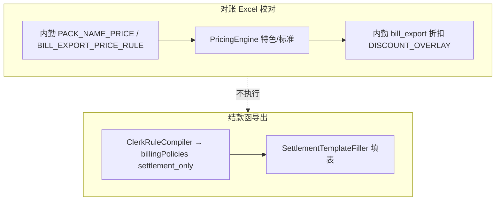

# 内勤规则客户测试反馈分析报告（10.9）

**报告日期：** 2026-10-09  
**材料来源：** 客户 Word《10.9问题.docx》（含 11 张截图）  
**对照代码：** 工作区 `main` 未提交改动基线；内勤 baseline `clerk-rules/baseline/*.json`；对账编排 `ReconciliationPricingOrchestrator`；结款填充 `SettlementTemplateFiller`；客服特色 `billing-rules/baseline/*.json`  
**范围说明：** 本报告按客户反馈逐条归因，区分 **对账页账单计价（bill_export）** 与 **结款函导出（settlement）** 两条管线（见 `docs/内勤规则架构与迁移方案.md`）。

---

## 1. 执行摘要

客户在 2026-10-09 对内勤规则做了一批 **9 月账期** 实测，反馈可归纳为三类问题：

| 类别 | 条数 | 典型现象 | 主导根因 |
|------|------|----------|----------|
| **A. 对账未走内勤/特色计价** | 5 | 规则徽章为「标准灭菌计费规则」，计价规则列为高温纸塑/无纺布阶梯 | 内勤价表 **未命中** 或 **未参与编排**；或应走 **客服特色规则**（`billing-rules`）却未命中 |
| **B. 结款函折扣/低消/物流未生效** | 6 | 灭菌费为明细加总原价，无九折/七五折/低消补差；物流仍按 50/次 | `settlement` 阶段策略 **未合并进导出**、Job 未写入 `monthlyBreakdown`/`settlementAdjustment`，或 **客户代码未解析** |
| **C. 结款函逻辑/实现缺陷** | 2 | 呼兰中医「外科包」金额；九洲/维多利亚「特色结款函」 | **硬编码**与 baseline 规则不一致；**Compiler 未转译**的规则类型；多策略叠加未验收 |

**重要结论：** 多数医院在 **classpath 内勤 baseline 中已有规则 JSON**，客户看到的现象不等于「没录规则」，更常见是 **命中条件不满足**、**管线阶段不对**（对账看了结款规则）、或 **运行时未解析到 customerCode**。

---

## 2. 系统能力边界（避免误判）



| 客户反馈中的能力 | 应走的阶段 | 对账页是否应体现 |
|------------------|------------|------------------|
| 包名/包材特价（三精、道外、南岗妇产价表） | `bill_export` | 是；应出现「内勤计价」或折后规则价 |
| 根管锉/加长锉 5 合 1（省妇幼） | `billing-rules` 特色 FOLD | 是；应出现特色规则名，而非纯「高温纸塑袋×cm」 |
| 省二院七折 | `bill_export` 的 `PRICE_VALIDATE_ONLY`（当前为 **仅校对**） | 规则价=标准价；账单价=七折 → **故意显示差额** |
| 结款九折/七五折、低消、免物流 | `settlement` | **否**（对账顶栏仍可能显示「标准灭菌」） |
| 九洲/维多利亚低消+温区分折 | `settlement` + 专用行布局 | 仅结款函/导出向导 |

---

## 3. 逐条反馈对照

### 3.1 三精肾脏病医院 — 账单有特殊价格未改（图 1）

**现象（截图）：** `三精肾病医院9月.xlsx`；顶栏「标准灭菌计费规则」；行如 `盘-1/Z3032` 包装材料 `高温纸塑袋300*320`，规则列为「高温纸塑袋25cm计费」等，**原单价=规则单价**，无内勤标签。

**baseline：** `SANJING-SB` 含大量 `BILL_EXPORT_PRICE_RULE`（按类型 + **包材档位** `20cm`/`25cm`/`N≥3` 等），见 `clerk-rules/baseline/SANJING-SB.json`。

**根因分析：**

1. **包材匹配语义不一致**  
   `ClerkBillPriceRuleApplier.matchesPackaging` 使用 `actual.contains(expected)`。规则写的是 `25cm`/`20cm`，账单写的是 `高温纸塑袋300*320`。字符串 **不包含** `25cm`（仅有 `300`、`320`），导致 **整表价规则不命中**，回落 `PricingEngine` 标准高温纸塑阶梯。

2. **UI 未体现内勤命中**  
   即使部分行账单价偶然等于特价，未命中时用户只能看到「标准灭菌」，符合客户「还是基础单价」的主观描述。

3. **需排查的运行时项**  
   - 任务 `customerCode` 是否为 `SANJING-SB`（`ClerkRuleIndex.resolveCustomerCodeByHospitalName`）。  
   - 对账 Job 是否在内勤三层编排上线 **之后** 导入且 **未重跑 reprice**。

**建议修复方向：** 价表包材改为与铂康列一致的匹配（如从 `*` 尺寸推导 cm，或规则改为 `300`/`250` 等实际文案）；补 SANJING 导入回归用例。

---

### 3.2 呼兰区红十字医院 — 结款函未做低消 1500 元/月（图 2）

**现象：** 结款函灭菌费 **420.00** + 物流 **50.00** = **470.00**，无「低消补差」行。

**baseline：** `HULAN-HSZ` 已配置 `SETTLEMENT_MIN_CHARGE`，`minCharge: 1500`，`baseComponents: [sterilize, logistics]`（`clerk-rules/baseline/HULAN-HSZ.json`）。

**根因分析：**

1. **阶段正确、数据可能未写入 Job**  
   低消补差在 `SettlementTemplateFiller` 中依赖 Job 的 `monthlyBreakdown` / `settlementAdjustment` 或 `BillingPolicyInspector` 解析出的 `SettlementOverride.minChargeAdjustment`（见 `SettlementTemplateFiller` 约 503–521 行）。若导出前 **未跑结款校验/未合并 clerk 的 `MONTHLY_SETTLEMENT` 策略**，则不会插入「低消补差」行（应补约 **1030** 元）。

2. **Compiler 路径**  
   `SETTLEMENT_MIN_CHARGE` 会经 `ClerkRuleCompiler` 转为 `billingPolicies` 的 `MONTHLY_SETTLEMENT`（`ClerkRuleCompiler.java` 79–80 行），逻辑上 **已支持**；缺口在 **导出链路是否调用** `ClerkRuleExportService.compileSettlementPolicies` 并回写 Job。

**建议验证：** 同院 9 月 Job 导出前看 `monthlyBreakdown` JSON；对比 `docs/内勤规则配置生效核查报告-20260923.md` 中 HULAN-HSZ 为 ✅ 的配置态与生产 Job 实态。

---

### 3.3 呼兰中医院 — 结款函计算错误（图 3，外科包红框）

**现象：** 「外科包」备注 **249.5元×13个**，费用列仅 **249.50**（应为 **3243.50**）；客户要求 **仅统计「手术室（备包）」科室** 的备包。

**baseline：** `HULAN-TCM` 含 `SETTLEMENT_PACK_SPLIT`（`deptKeyword: 手术室（备包）`）、低消 10000、物流 185/次。

**根因分析：**

1. **已知实现缺陷（硬编码）**  
   `SettlementTemplateFiller` 对呼兰中医外科包/阑尾包使用常量价，且对 **「外科包」故意只加一次固定价、不乘包数**：

```663:667:backend/src/main/java/com/hospital/backend/export/SettlementTemplateFiller.java
                if ("外科包".equals(keyword)) {
                    sum += fixedPrice;
                } else {
                    sum += fixedPrice * Math.max(1, agg.packCount());
```

   与客户备注「249.5×13」直接冲突；属 **代码 bug**，非 Excel 录错。

2. **`SETTLEMENT_PACK_SPLIT` 未进入 Compiler**  
   `ClerkRuleCompiler` 的 `switch` **无** `SETTLEMENT_PACK_SPLIT` 分支（`docs/内勤规则配置生效核查报告-20260923.md` 已标注「Compiler 无转译」）。科室过滤仍依赖 filler 内硬编码与聚合逻辑，**与 baseline 的 deptKeyword 脱钩**。

3. **备包科室范围**  
   若明细科室名与「手术室（备包）」不一致，聚合包数可能混入其它科室，需用实际 sheet 科室列核对。

---

### 3.4 黑龙江省妇幼保健院 — 根管锉/针类/加长锉未按特殊收费（图 4）

**现象：** `根管锉-5/Z7520` 等；规则单价 **27.50**（标准 10cm 纸塑阶梯），账单 **8.00**；「全冠套装(针7盒1)」规则价 **44** vs 账单 **16.5**。

**规则归属：** 属 **客服特色** `HLJ-FY-RK`（`billing-rules/baseline/HLJ-FY-RK.json`），如 `妇幼人口根管锉5合1含包材`、`加长锉@contains`、`针类组件@contains` 等 **FOLD**，**不是**内勤 clerk 价表。

**根因分析：**

1. **对账编排顺序**  
   `ReconciliationPricingOrchestrator` 先内勤价表，再 `PricingEngine`。省妇幼无内勤 bill 价表时，全靠 **特色 FOLD** 命中。

2. **未命中时的表现**  
   与截图一致：走 **高温纸塑袋 N×5.5 + 袋费**，与 Excel 客服价 **8 元/把** 背离。

3. **可能失配点**  
   - 包名 `根管锉-5` 与关键词 `根管锉@contains` 应能命中 → 需查 **件数门槛**（≤10 含包材 / >10 免包材）、**类型门控** `acceptedTypes`。  
   - `全冠套装(针7盒1)` **不含**「针类组件」子串，若 Excel 意图为「盒1」折算规则，则 **baseline 关键词未覆盖该包名**，属规则缺口或 Excel 口径需澄清。

**建议：** 用 `hospital-cli` simulate 或单测复现 HLJ-FY-RK 行；核对生产 `billingEnabled` 与 `HLJ-FY-RK` manifest 是否同步。

---

### 3.5 道外区人民医院 — 特殊价格没做（图 5）

**现象：** 与三精类似，**标准灭菌** + 纸塑阶梯，差额 0。

**baseline：** `DAOWAI-RM` 含完整 `BILL_EXPORT_PRICE_RULE` 矩阵（`clerk-rules/baseline/DAOWAI-RM.json`）。

**根因：** 与 **3.1 同类** — 包材档位 `20cm`/`25cm` 与 `高温纸塑袋100*290` 等 **contains 不匹配**；或 customerCode 未解析为 `DAOWAI-RM`。

---

### 3.6 哈尔滨工程大学医院 — 结款函没做折扣（图 6）

**现象：** 灭菌 **2530** + 物流 **250**（50/次×5），**无折扣行**。

**baseline：** `HRB-HEU` 配置为 **`SETTLEMENT_DISCOUNT` 九折（0.9）**，非八折（`clerk-rules/baseline/HRB-HEU.json`）。

**根因分析：**

1. **结款折扣未体现在导出** — 同 3.2，`settlement_only` 策略需进入 `compileSettlementPolicies` 并在汇总灭菌费时 `applyTemperatureDiscount` / discount policy 生效。

2. **需求与 baseline 不一致**  
   客户文案写 **「8折」**，当前 JSON 为 **9折**。需与《医院内勤规则-20260924》Excel 原文核对，避免「系统按 9 折实现、客户按 8 折验收」的伪失败。

---

### 3.7 哈尔滨市公安医院 — 不收物流费（图 7）

**现象：** 物流费 **200.00**（50/次×4）。

**baseline：** `GONGAN-YY` → `LOGISTICS_WAIVE`（`feePerTrip: 0`）。

**根因：** `LOGISTICS_WAIVE` 已编译为 logistics policy，但结款函仍显示 200，说明 **导出时未应用 waive**（或 `shouldShowLogisticsRow` / `resolvePayableLogisticsFee` 仍读 Job 原始物流统计）。需查 Job `logisticsBreakdown` 与 policy 合并顺序。

---

### 3.8 哈尔滨市南岗区人民医院 — 结款函没打折（图 8）

**现象：** 灭菌 **4004** + 物流 **250**，无九折。

**baseline：** `HRB-NGJY`（南岗区人民医院·九院）`SETTLEMENT_DISCOUNT` **0.9**（`clerk-rules/baseline/HRB-NGJY.json`）。

**根因：** 同 3.2/3.6 — **settlement 折扣未作用于导出**；另确认医院名是否解析到 `HRB-NGJY`（全称含「九院」）。

---

### 3.9 南岗区妇产医院 — 特殊价格没做（图 9）

**现象：** `腹腔镜` 等 **170.50**，规则列仍为「高温无纺布计费」。

**baseline：** `NG-FUCHAN` 含 `PACK_NAME_PRICE`「腹腔镜」**170.5**（与截图账单价一致）。

**根因分析：**

1. **价格相同但路径错误**  
   170.5 可能既是内勤价又是当前标准无纺布结果，客户以 **「标准灭菌」徽章** 判断未走内勤。应看 `billingNotes.pricingLayer` / `clerkRuleName` 是否为空。

2. **若 clerk 未命中**  
   检查 `packNameKeywords` 与包名「腹腔镜」、customerCode `NG-FUCHAN`、对账规则开关是否禁用 `clerk_price`。

---

### 3.10 黑龙江东大肛肠 — 结款函没打折（图 10）

**现象：** 灭菌 **5305.50**，无七五折。

**baseline：** `DONGDA-GC` → `SETTLEMENT_DISCOUNT` **0.75**（`clerk-rules/baseline/DONGDA-GC.json`）。

**根因：** settlement 折扣未应用（同 3.6）。

---

### 3.11 黑龙江省第二医院（松北）— 账单未做七折（图 11）

**现象：** 规则单价高于账单约 **1/0.7**（如 24.5 vs 35，7.7 vs 11）；顶栏「标准灭菌」；待复核多。

**baseline：** `ERYY-SB` → `PRICE_VALIDATE_ONLY`，`rate: 0.7`，`validateOnly: true`（`clerk-rules/baseline/ERYY-SB.json`）。

**根因（设计行为 + 体验问题）：**

1. **`validateOnly` 故意不把折后价写入规则单价**  
   `ClerkRuleCompiler` 对 `validateOnly` **不**生成 bill_export 折扣 policy（53–54 行）；`ExportStageDiscountApplier` 亦跳过应用。编排器走 **标准价**，账单为 **七折后价** → 大额差额。

2. **与客户期望偏差**  
   客户认为「内勤规则 = 应算出七折应付价」；当前产品定义是 **「标准价校对，七折由账单体现」**。若需与账单一致，应改为 `DISCOUNT_OVERLAY`（bill_export）或关闭 validateOnly。

---

### 3.12 九洲 / 维多利亚 — 未做特色结款函导出（文档文字）

**baseline 摘要：**

- `JIUZHOU-FK`：低消 3000、物流减免 4 次、`DISCOUNT_OVERLAY` 七折 + `SETTLEMENT_DISCOUNT` 高温五折/低温七折。  
- `VICTORIA`：低消 8000、结款七折 + 温区分折。

**根因分析：**

1. **多策略叠加 + 温拆行** 依赖 `SettlementTemplateFiller.shouldSplitSterilizeByTemperature` 与 `billingPolicies` 中 **同时存在 htRate/ltRate**（见 675–707 行）。若导出未 merge clerk policies，则退化为「灭菌费 + 物流」两行简表。

2. **与路径 B 验收**  
   `clerk_export_verify_report` 曾覆盖 37 家 bill_export 样式；**九洲/维多利亚特色结款函** 需单独用处理后 Excel 做 settlement 行级对比（客户反馈项）。

---

## 4. 共性根因矩阵

| 根因 ID | 描述 | 影响反馈项 |
|---------|------|------------|
| **R1** | 内勤价表包材字段 `xxcm` 与铂康「高温纸塑袋 W*H」不一致 | 三精、道外 |
| **R2** | 对账 UI 仅展示 PricingEngine 规则名，内勤命中标识弱 | 三精、道外、南岗妇产 |
| **R3** | 客服特色 `billing-rules` 未命中（关键词/类型/件数） | 省妇幼 |
| **R4** | `PRICE_VALIDATE_ONLY` 只校对不折价 | 省二松北 |
| **R5** | 结款 Job 未写入低消/折扣；或 export 未 merge settlement policies | 呼兰红十字、哈工程、南岗人民、东大、公安物流 |
| **R6** | `SettlementTemplateFiller` 外科包硬编码不乘数量 | 呼兰中医 |
| **R7** | `SETTLEMENT_PACK_SPLIT` 等规则类型 Compiler 未转译 | 呼兰中医科室范围 |
| **R8** | 客户代码 / 医院名解析失败 → `clerkCompiled == null` | 全院潜在 |
| **R9** | Excel 与 baseline 折扣率不一致（8折 vs 9折） | 哈工程 |

---

## 5. 建议验证步骤（生产/预发）

1. **对账 Job 抽样**（三精、道外、南岗妇产、省二松北、省妇幼各 1）：  
   - `GET job` → `customerCode`、`reviewComment` 是否 `customerUnresolved`  
   - 任一行 `billingNotes` → `pricingLayer`、`clerkRuleName`、`ruleName`

2. **结款导出前**（呼兰红十字、哈工程、公安、东大、南岗人民）：  
   - `monthlyBreakdown`、`settlementAdjustment`、`logisticsBreakdown`  
   - 导出向导校验接口返回的 `settlementAdjustment`

3. **自动化**  
   - 扩展 `ExcelBillImportSupport` / 价表：包材 `300*320` → 命中 `25cm` 规则的单测  
   - 呼兰中医：外科包 13 件 → 结款行 **3243.5** 回归  
   - HLJ-FY-RK：`根管锉-5` → FOLD 价 **8** 单测

4. **路径区分**  
   - 对账问题 → 查 `ReconciliationPricingOrchestrator` + `ClerkBillPriceRuleApplier`  
   - 结款问题 → 查 `ClerkRuleExportService.compileSettlementPolicies` + `SettlementTemplateFiller`  
   - 省妇幼类 → 查 `billing-rules` manifest 与 `PricingEngine` FOLD，**非** clerk 价表

---

## 6. 与客户沟通要点

1. **对账页「标准灭菌」不等于没配内勤规则**，需看是否命中；不少医院 **结款折扣/低消只在结款函体现**，对账顶栏仍可显示标准计费。  
2. **省二松北七折** 当前为 **校对模式**，差额大是预期行为；若需规则价=七折，需改规则类型。  
3. **哈工程折扣率** 请以 Excel 为准核对 8 折还是 9 折。  
4. **呼兰中医外科包** 属已定位的 **实现错误**（少乘包数），与「规则没录入」无关。

---

## 7. 附录：反馈项 — 医院代码 — 规则文件

| 客户描述 | customerCode | 主要规则文件 |
|----------|--------------|--------------|
| 三精肾病 | SANJING-SB | clerk `SANJING-SB.json` |
| 呼兰红十字 | HULAN-HSZ | clerk 低消 1500 |
| 呼兰中医 | HULAN-TCM | clerk 低消/物流/备包拆分 |
| 省妇幼人口 | HLJ-FY-RK | billing `HLJ-FY-RK.json` |
| 道外人民 | DAOWAI-RM | clerk `DAOWAI-RM.json` |
| 哈工程 | HRB-HEU | clerk 结款九折 |
| 公安医院 | GONGAN-YY | clerk 免物流 |
| 南岗区人民 | HRB-NGJY | clerk 结款九折 |
| 南岗妇产 | NG-FUCHAN | clerk 包名特价 |
| 东大肛肠 | DONGDA-GC | clerk 结款七五折 |
| 省二松北 | ERYY-SB | clerk 七折校对 |
| 九洲 / 维多利亚 | JIUZHOU-FK / VICTORIA | clerk 低消+温折+物流 |

---

## 8. 修复与复测状态（2026-10-09 后续）

依据本节实施 [Clerk fixes local retest](26ed5f5a-dd36-4d84-a177-a6eb332fe4f4) 中的高确定性修复；Docker 单测 **22 项通过**；本地栈 backend `8088`、frontend `1001` 已用最新镜像拉起。

| 优先级 | 内容 | 状态 |
|--------|------|------|
| R1 | 纸塑 `W*H` ↔ cm 档位匹配；`N≥3` 区间；有包材约束规则优先于通配价表 | **已落地**（`ClerkPackagingMaterialMatcher` + `ClerkBillPriceRuleApplier`） |
| R2 | 对账顶栏在内勤命中时显示「内勤计价」 | **已落地**（`reconciliation/index.vue`） |
| R4 | 仅 `PRICE_VALIDATE_ONLY` 时仍执行校对 | **已落地**；省二松北 **未** 改为 bill_export 七折价（产品设计不变） |
| R6 | 呼兰中医外科包 `单价×包数` | **已落地**（`SettlementTemplateFiller`） |
| R7 | `SETTLEMENT_PACK_SPLIT` 编译 + 备包科室过滤 | **已落地**（`ClerkRuleCompiler` + filler） |
| R3/R5/R12 | 省妇幼 FOLD、结款低消/折扣/特色结款函 | **待 Job 重算/规则补全或商务确认**（见第 5 节矩阵） |

**建议验收：** 三精/道外/南岗妇产对账 Job **reprice**；结款类问题在 **finalize 后** 再导出结款函，核对 `monthlyBreakdown` / `logisticsBreakdown`。
