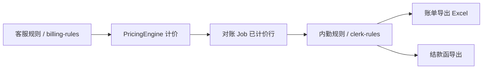

# 内勤规则架构与迁移方案

**版本：** 2026-09-17 初版  
**状态：** 基础架构已落地，逐院迁出进行中

---

## 一、问题背景

系统历史上将三类机制混放在 `CustomerBillingPolicy` / `customer_discount` 与特殊计价 baseline 中：

| 机制 | 本应归属 | 历史落点 | 问题 |
|------|----------|----------|------|
| 特色 FIXED/FOLD 计价 | 客服规则 | `billing-rules/baseline/` | 正确 |
| 账单明细七折（呼兰、省二） | **内勤规则** | `bill_detail` 折扣策略 | 污染对价页/计价引擎 |
| 导出七五折（太平） | **内勤规则** | `export_only` 策略 | 与计价同表，难独立管理 |
| 结款函九折（工程大学） | **内勤规则** | `settlement_only` 策略 | 与物流/低消混在同一 UI |
| 附一独立价表 + 11 列导出 | 价表=客服；布局=内勤 | `standardPricingOverride` + 导出模板 | 无独立建档 |

**目标：** 客服规则只管「算价对不对」；内勤规则只管「导出给客户看的 Excel 长什么样、金额要不要二次折算」。

---

## 二、分层架构



### 2.1 客服规则层（不变）

- 目录：`backend/src/main/resources/billing-rules/baseline/{CODE}.json`
- API：`/api/v1/billing-rules/*`
- UI：设置 → 计价规则；主数据 → 特殊计价客户管理
- 生效：`PricingEngine.processRow()`、规则试算、对价页

### 2.2 内勤规则层（新增）

- 目录：`backend/src/main/resources/clerk-rules/baseline/{CODE}.json`
- 索引：`clerk-rules/index.json`
- API：`/api/v1/clerk-rules/*`
- UI：账单配置 → **内勤规则**（与客户折扣 Tab 分离）
- 生效：
  - `bill_export` → `ClerkRuleExportService` → `ExportStageDiscountApplier` / `ExportFixedPriceApplier`
  - `settlement` → `SettlementTemplateFiller`（后续接入 `compileSettlementPolicies`）

### 2.3 规则类型

| ruleType | 说明 | stage |
|----------|------|-------|
| `DISCOUNT_OVERLAY` | 整单或全温区比例折扣 | `bill_export` |
| `PIECE_TIER_DISCOUNT` | 按把数阶梯折扣（太平） | `bill_export` |
| `FIXED_PRICE_EXPORT` | 仅导出时覆盖单价（exportApply） | `bill_export` |
| `SETTLEMENT_DISCOUNT` | 结款函灭菌费折扣 | `settlement` |
| `EXPORT_LAYOUT` | 列裁剪、分表方式（元数据） | `bill_export` |
| `SEPARATE_PRICING_SYSTEM` | 独立价表标记（附一） | `both` |

每条规则含 `isActive` 与 `migrationStatus`（`active` / `pending` / `legacy_only`）。

---

## 三、目录与 API

```
backend/src/main/resources/
├── billing-rules/          # 客服计价规则（已有）
│   ├── index.json
│   └── baseline/{CODE}.json
└── clerk-rules/            # 内勤规则（新增）
    ├── baseline.schema.json
    ├── index.json
    └── baseline/{CODE}.json

backend/src/main/java/.../
├── config/ClerkRuleIndex.java
├── service/ClerkRuleCompiler.java
├── service/ClerkRuleExportService.java
└── controller/ClerkRuleController.java
```

| 端点 | 说明 |
|------|------|
| `GET /api/v1/clerk-rules/index` | 索引摘要 |
| `GET /api/v1/clerk-rules/customers` | 已建档医院列表 |
| `GET /api/v1/clerk-rules/customers/{code}` | baseline + 编译预览 |
| `GET /api/v1/clerk-rules/customers/{code}/compiled` | 仅编译结果（配置员） |

计价 API `/api/v1/billing-rules/*` **不得**读写 clerk-rules。

---

## 四、导出挂钩点

`ExportEngineServiceImpl.applyExportStageDiscounts()` 已改为：

```java
request.setRows(clerkRuleExportService.applyBillExportRules(hospitalName, compiled, request.getRows()));
```

逻辑：

1. 按医院名解析 `customerCode`
2. 若该院 clerk baseline 存在**已激活**的 `bill_export` 规则 → 仅用 clerk 编译结果
3. 否则回退 legacy `billingPolicies` 中 `export_only`（兼容太平等未切换院）

**待办：** 结款函路径调用 `compileSettlementPolicies()`，从 `CustomerBillingPolicy` 剥离 `settlement_only`。

---

## 五、前端

| 页面 | 路径 | 职责 |
|------|------|------|
| 计价规则 | `/settings/pricing-rules` | 客服商品规则、标准价表 |
| 特殊计价客户 | `/master-data/customers` | 客户档案、商品规则、**计费策略（待瘦身）** |
| **内勤规则** | `/billing-config/clerk-rules` | 逐院内勤 baseline 只读浏览（首期） |

首期 UI 为列表 + 详情抽屉；编辑/落库 API 在 Phase 2 实现。

---

## 六、迁移步骤

### Phase A — 建档（本次已完成）

- [x] 创建 `clerk-rules/` 目录与 schema
- [x] 抽取 9 家已知内勤院 baseline
- [x] `ClerkRuleExportService` 导出挂钩
- [x] 独立侧边栏「内勤规则」
- [x] `docs/内勤规则医院清单.md`

### Phase B — 迁出敏感折扣（下一步）

1. **呼兰 `HULAN-RM`**
   - 将 `呼兰7折` 从 `customer_billing_policy`（`bill_detail`）删除
   - 启用 clerk baseline 中 `敷料包账单七折`（`isActive: true`）
   - 跑路径 A 严格对账确认对价页不再显示 0.7

2. **省二南岗 `ERYY-NG`**
   - 同上，迁出 `省二院 0.7 折扣`

3. **太平 `TAIPING-RM`**
   - clerk 已 `isActive: true`；删除 legacy `export_only` policy 避免双轨

### Phase C — 结款函策略归位

- 工程大学、九院、电力三院、社会康复、九州妇科：`settlement_only` → clerk baseline
- `SettlementTemplateFiller` 读 clerk 编译结果

### Phase D — exportApply 固定价

- 市五、三精、呼兰中医等 `exportApply=true` 规则迁入 `FIXED_PRICE_EXPORT`
- 从 `billing-rules-manifest` 剔除仅导出生效条目

### Phase E — 配置 UI 写回

- clerk-rules CRUD API + 审计
- 从 `CustomerBillingPolicyPanel` 移除「账单明细折扣」Tab 或标注只读/废弃

---

## 七、门禁

| 闸门 | 命令 | 期望 |
|------|------|------|
| G1 | `ClerkRuleCompilerTest` | 编译结构与 stage 正确 |
| G2 | 导出回归 | 太平/呼兰样例 Excel 金额不变 |
| G3 | 对价页 | 迁出后 `PricingEngine` notes 不含「× 0.7」 |
| G4 | `rules compare --all` | 客服 baseline 无内勤折扣字段 |

---

## 八、与现有 `applyStage` 对照

| 历史 applyStage | 新 stage | 新归属 |
|-----------------|----------|--------|
| `bill_detail` / `after_base` | — | 若属敏感折扣 → 迁为 `bill_export` + clerk |
| `export_only` | `bill_export` | clerk-rules |
| `settlement_only` | `settlement` | clerk-rules |

客服合同价折扣（如维多利亚高温 5 折写入合同）需业务确认：若对客户公开则留客服层；若仅内勤知晓则迁 clerk。
