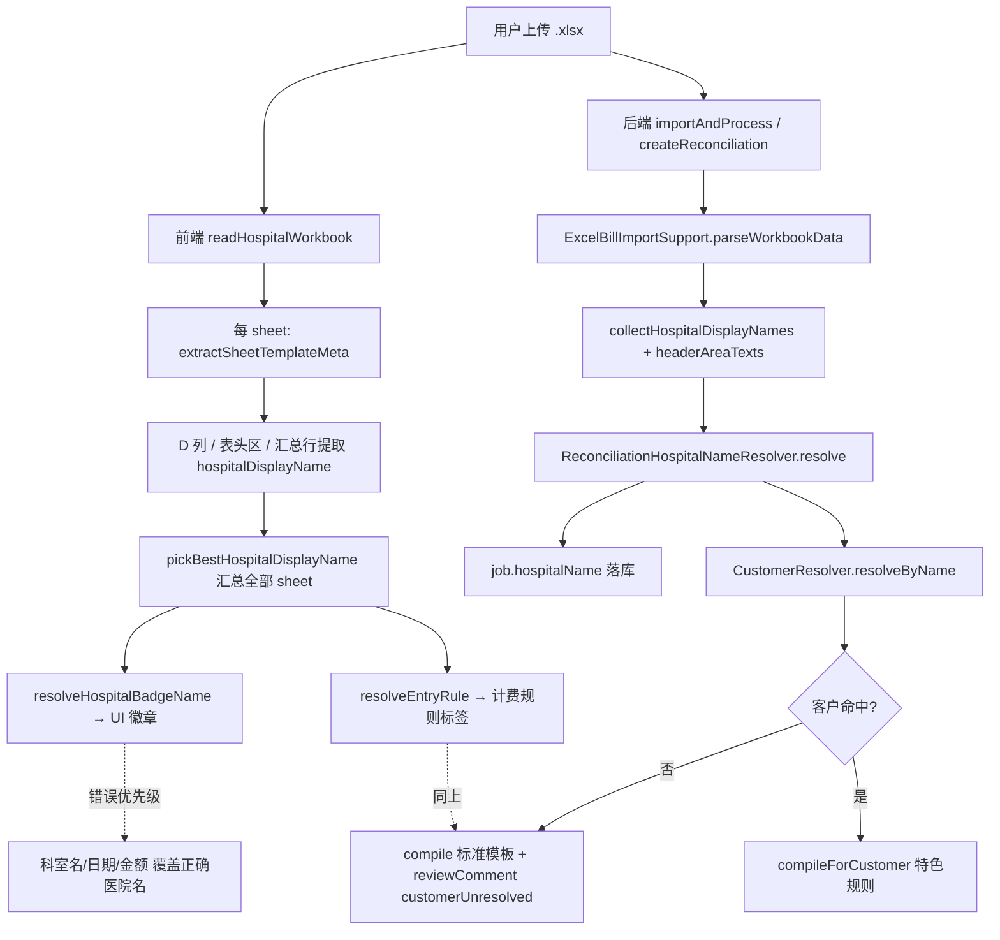

# 医院名称识别错误排查报告

**日期：** 2026-09-28  
**问题级别：** P0（对账 UI 医院徽章错误 → 特色计价规则未匹配 → 大额价差）  
**范围：** Excel 对账上传 → 医院名解析 → UI 徽章 → 计费规则绑定  
**说明：** 本报告仅做根因分析与修复指引，**不含代码改动**。

---

## 1. 问题现象（含截图对照表）

用户在上传铂康标准多 sheet 账单时，文件名明确指向省二院/省医院，但 UI 顶部「医院徽章」显示的是 **Excel 内部的科室/汇总噪声**，而非客户主数据中的医院全称。

| 上传文件名 | UI 错误徽章（截图） | 期望医院 | 截图中计费规则 | 截图差额 |
|---|---|---|---|---|
| `省二院南岗.xlsx` | `4419.799999999998`（汇总行金额，非科室名） | 黑龙江省第二医院（南岗院区/南岗区） | 标准灭菌计费规则 | +2,850.25 |
| `省二院松北.xlsx` | **静配中心** | 黑龙江省第二医院（松北院区/松北区） | 标准灭菌计费规则 | +352,186.90 |
| `省医院南岗.xlsx` | **息肉中心** | 黑龙江省医院（南岗院区） | 标准灭菌计费规则 | （大账单，37 sheet） |
| `省医院香坊.xlsx` | **体检中心** | 黑龙江省医院（香坊院区） | 标准灭菌计费规则 | （大账单，83 sheet） |

**共同特征：**

- 文件名人类可读且正确（`省二院*` / `省医院*`）。
- 徽章字符串能在 Excel 内找到对应来源：科室 sheet 名、科室汇总行首列、或 D 列/汇总行误读的数值/日期。
- 多 sheet 账单（3～83 个工作表）均受影响；科室 Tab 列表本身解析正常。
- 计费规则标签均为 **「标准灭菌计费规则」**，说明前端/引擎未绑定到 `ERYY-*` / `SHENG-YY-*` 等特色客户规则。

**截图资产（供对照）：**

- 省二院南岗：`assets/c082627bc94df8e037e5f166fa718857-*.png`
- 省二院松北 → 静配中心：`assets/24ad5401bc9a5e490a3373e4d36bff36-*.png`
- 省医院南岗 → 息肉中心：`assets/04fccf02bd24ffe9f2b7db344351b030-*.png`
- 省医院香坊 → 体检中心：`assets/818c2301441cf95a805cc2606cdcffa0-*.png`

---

## 2. 影响范围与严重级别

### 严重级别：P0

| 维度 | 影响 |
|---|---|
| **UI 可信度** | 业务员无法从徽章确认当前正在对哪一家医院，易误操作、误审核。 |
| **计价规则** | `resolveEntryRule()` 按错误徽章关键字匹配规则 → 回退「标准灭菌计费规则」；省二院/省医院 hybrid 特色规则（折扣、固定价、anyPrice 等）未生效。 |
| **金额** | 截图样例差额 +2,850～+352,187；多 sheet 大账单系统性偏高/偏低风险极高。 |
| **客户解析** | 若最终 `job.hospitalName` 落库为科室名，`customerUnresolved` 或静默使用标准模板。 |
| **历史数据** | `scripts/fix-reconciliation-hospital-names.sh` 仅覆盖 `手术室/门诊部/ICU…` 等固定前缀，**不含** `*中心` 类科室，历史 job 可能存在同类脏数据。 |

### 受影响医院（机制性，而非个案）

凡同时满足以下条件的账单均可触发：

1. **多 sheet**，每 sheet 一个科室；
2. 表头上方 D 列医院全称以 **`（南岗区）` / `（松北区）` / `（南岗院区）` 等括号结尾**，不满足「字符串末尾 = 医院/中心/…」的正则；
3. 存在 **`XX中心`** 科室 sheet 或汇总行（静配中心、息肉中心、体检中心、伤口造口门诊等）；
4. 部分 sheet 表头行偏移（header@7 vs @8），D 列被读成 **日期/金额**（长度 ≥ 6 即通过「像医院名」判定）。

**已验证的测试材料路径：**

| 文件 | 路径 |
|---|---|
| 用户样例 | `/Users/yangxinghui/.../temp/drag/省二院南岗.xlsx` |
| 省二院南岗 | `测试用例/黑龙江省第二医院（南岗院区）/原始表格/省二院南岗6月账单.xlsx` |
| 省二院松北 | `测试用例/黑龙江省第二医院（松北院区）/原始表格/省二院松北6月账单.xlsx`（含 sheet `静配中心`） |
| 省医院南岗 | `测试用例/黑龙江省医院（南岗院区）/原始表格/省医院南岗2.21-3.20.xlsx`（含 sheet `息肉中心`） |
| 省医院香坊 | 测试集暂无 `体检中心` sheet；用户 83 sheet 文件为更大版本，机制相同 |

---

## 3. 识别链路



**关键分叉：**

- **前端徽章路径**（用户肉眼所见）：`sheet meta 聚合` → `pickBestHospitalDisplayName` → `resolveHospitalBadgeName`。
- **后端落库/计价路径**：`ExcelBillImportSupport` → `ReconciliationHospitalNameResolver` → `CustomerResolver`。
- 两条路径**算法不一致**；前端路径存在致命优先级 bug，会在保存后仍用 sheet meta **覆盖**后端返回的正确 `hospitalName`（见 `applySavedImportResult`）。

---

## 4. 根因分析

### 4.1 主根因：`pickBestHospitalDisplayName` 的「后缀优先」误判（前端）

`frontend/src/utils/reconciliationHospitalName.ts` 中：

```typescript
const HOSPITAL_NAME_PATTERN = /(医院|诊所|集团|中心|…)$/

// pickBestHospitalDisplayName：先收集「末尾匹配后缀」的最长串，再 fallback 到 length≥6 的其他串
if (HOSPITAL_NAME_PATTERN.test(trimmed)) {
  if (trimmed.length > bestWithSuffix.length) bestWithSuffix = trimmed
} else if (trimmed.length > bestFallback.length) {
  bestFallback = trimmed
}
return bestWithSuffix || bestFallback
```

**问题：** 铂康账单 D 列医院名常见写法为：

- `黑龙江省第二医院（南岗区）` — 字符串以 **`）`** 结尾，**不**匹配 `$…中心|医院…$`；
- `黑龙江省医院（南岗院区）` — 同理。

而科室名：

- `静配中心` / `息肉中心` / `体检中心` — **以「中心」结尾**，进入 `bestWithSuffix` 桶。

**结果：** 只要任意 sheet 的 `hospitalDisplayName` 提取到 `*中心`，就会在 `pickBestHospitalDisplayName` 中 **击败** 真正的医院全称。Python 复现：

```
pickBest(['黑龙江省第二医院（松北区）','4419.79…','静配中心'])
→ '静配中心'
```

### 4.2 次根因：候选优先级把 sheet meta 置于文件名/已存医院名之前

`buildHospitalNameCandidates` 顺序：

1. `pickBestHospitalDisplayName(sheetHospitalDisplayNames)` ← 常为错
2. `currentName`（后端已解析的 hospitalName）
3. `inferHospitalNameFromFileName(fileName)`

`resolveReconciliationHospitalName` 取 **第一个** `isLikelyHospitalName` 为 true 的候选 → **sheet meta 永远优先**，即使 `currentName` 已是正确医院。

`applySavedImportResult`（`index.vue`）在保存成功后再次调用 `resolveHospitalBadgeName`，用 sheet meta **覆盖** API 返回的正确名称 → UI 持久显示错误。

### 4.3 第三根因：`isLikelyHospitalName` 过宽（前后端共有）

判定条件：`HOSPITAL_SUFFIX` **或** `length >= 6`。

下列非医院字符串均会通过：

| 误识别串 | 来源 | 长度 |
|---|---|---|
| `4419.799999999998` | 汇总行「口腔科」sheet 合计 | 17 |
| `2026-01-06 00:00:00` | D 列误读为 Excel 日期 | 19 |
| `42676.1999999997` | ICU sheet 汇总金额 | 16 |

省二院南岗仅 3 个 sheet、无 `*中心` 时，徽章表现为 **金额** 而非科室名（与用户截图一致）。

### 4.4 第四根因：科室黑名单不完整

`DEPARTMENT_NAME` / `isLikelyDepartmentName` 仅覆盖「手术室、ICU、XX科（≤8 字）」等，**未覆盖**：

- `静配中心`、`息肉中心`、`体检中心`（不以「科」结尾，且不在白名单）；
- `伤口造口门诊`、`NICU（9楼 新生儿）` 等（末尾「中心/门诊」仍可能通过后缀规则）。

这些名称在 `isLikelyDepartmentName` 中为 **false**，在 `isLikelyHospitalName` 中为 **true**。

### 4.5 第五根因：文件名别名未覆盖「省二院*」短名

| 客户 code | 规范名（种子/Clerk） | 已有别名（部分） | 文件名 infer | 能否 alias 命中 |
|---|---|---|---|---|
| `ERYY-NG` | 黑龙江省第二医院（南岗院区） | `省二南岗`、`黑龙江省第二医院（南岗院区）`（legacy seed） | `省二院南岗` | **否**（缺「院」字） |
| `ERYY-SB` | 黑龙江省第二医院（松北院区） | 同上模式 | `省二院松北` | **否** |
| `SHENG-YY-NG` | 黑龙江省医院（南岗院区） | `省医院南岗`（phase7） | `省医院南岗` | **是** |
| `SHENG-YY-XF` | 黑龙江省医院（香坊院区） | `省医院香坊` | `省医院香坊` | **是** |

`phase7-batch-e.json` **未**为 `ERYY-NG/SB` 配置 profile；legacy 别名使用「省二**南岗**」而非「省二**院**南岗」。文件名兜底对省二院不可靠。

### 4.6 第六根因：Excel 表头 D 列 / 汇总行提取噪声

`ExcelBillImportSupport.collectHospitalDisplayNames` 与前端 `extractSheetTemplateMeta` 逻辑对称：

1. 优先 D 列（header±1、第 9 行）；
2. 否则扫描表头区含「医院/诊所」的单元格；
3. 前端额外扫描 **表头下一行 summaryRow**。

多 sheet 账单中，大量 sheet 的 D 列在 header@7 时为 **发货日期**，summary 行首列为 **科室合计金额** 或 **科室名**。这些值因 `length >= 6` 进入候选池，参与 `pickBest` 竞争。

**表头结构实测（openpyxl）：**

| 文件 | sheet 数 | D 列医院名（首 sheet） | 有害 meta 示例 |
|---|---|---|---|
| 省二院南岗.xlsx | 3 | `黑龙江省第二医院（南岗区）` ✓ | `4419.799999999998` |
| 省二院松北6月账单.xlsx | 25 | `黑龙江省第二医院（松北区）` ✓ | `静配中心`、多条日期 |
| 省医院南岗2.21-3.20.xlsx | 28 | `黑龙江省医院（南岗院区）` ✓ | `息肉中心`、日期 |
| 省医院香坊4.21-5.20.xlsx | 53 | `黑龙江省医院（香坊院区）` ✓ | `NICU（9楼 新生儿）` 等 |

### 4.7 后端与前端差异（为何后端有时仍「看起来能跑」）

`ReconciliationHospitalNameResolver.resolve` 按 **候选顺序** 取首个 `isLikelyHospitalName` 且非科室项；sheet 医院名在 `LinkedHashSet` 中通常 **ICU 首 sheet 的真实医院名排在日期/中心之前**，故后端 `importAndProcess` 可能落库正确全称。

但：

1. 前端徽章/规则标签仍错（不读 DB 名而读 sheet meta）；
2. `createReconciliation`（前端引擎 JSON 提交）携带错误 `hospitalName` 参数；
3. 若首几个 sheet 均无 D 列医院名，后端也会退化为日期/中心名；
4. `CustomerResolver` 对 `黑龙江省第二医院（南岗区）` vs alias `黑龙江省第二医院（南岗院区）` **exact 不匹配**，contains 方向也不命中 → 可能 `customerUnresolved`。

---

## 5. 复现步骤

### 5.1 环境

- 前端：对账页「业务员视图」
- 后端：`POST /api/hospital-reconciliations/import`（处理并保存）

### 5.2 用例 A — 科室「中心」覆盖（省二院松北）

1. 上传 `测试用例/黑龙江省第二医院（松北院区）/原始表格/省二院松北6月账单.xlsx`（或用户 `省二院松北.xlsx`）。
2. 等待前端解析完成，**尚未保存**即可观察顶部徽章。
3. **期望：** 黑龙江省第二医院（松北院区）。
4. **实际：** 徽章显示 **「静配中心」**；规则标签为「标准灭菌计费规则」；差额量级与截图同阶（数十万）。

### 5.3 用例 B — 汇总金额覆盖（省二院南岗）

1. 上传用户样例 `省二院南岗.xlsx`（或 `测试用例/.../省二院南岗6月账单.xlsx`）。
2. **实际：** 徽章显示 **`4419.799999999998`** 类数值；3 个科室 Tab 正常。

### 5.4 用例 C — 息肉中心（省医院南岗）

1. 上传 `测试用例/黑龙江省医院（南岗院区）/原始表格/省医院南岗2.21-3.20.xlsx`。
2. **实际：** 徽章 **「息肉中心」**（该文件含 `息肉中心` sheet）。

### 5.5 命令行快速验证（不启动服务）

```bash
cd /Users/yangxinghui/CODE/My_Projects/hospital_longservice
python3 - <<'PY'
# 复现 pickBest 逻辑：医院全称输给 *中心
import re
H=re.compile(r'(医院|诊所|集团|中心|卫生院|卫生服务中心|医疗美容|妇产医院|肛肠医院)$')
def pick(names):
    bs=''; bf=''
    for t in names:
        t=t.strip()
        if len(t)<6 and not H.search(t): continue
        if H.search(t): bs=t if len(t)>len(bs) else bs
        else: bf=t if len(t)>len(bf) else bf
    return bs or bf
print(pick(['黑龙江省第二医院（松北区）','静配中心']))
print(pick(['黑龙江省第二医院（南岗区）','4419.799999999998']))
PY
```

---

## 6. 为何误识别为科室名（机制解释）

```text
铂康 Excel 结构                     提取器行为                      UI 结果
─────────────────────────────────────────────────────────────────────────
Sheet 名 = 科室（静配中心）    →    sheetName 仅用于行.sheetName      科室 Tab 正确
D9 = 医院全称（括号结尾）      →    isLikelyHospital ✓ 但后缀不命中   进入 fallback 桶
Summary 行 = 科室名/合计       →    pickBestFromHeaderArea 收进 meta  *中心 进入 suffix 桶
                                                              pickBest → *中心 胜出
文件名 = 省二院松北.xlsx       →    排在候选第 3 位                  永不生效
```

**一句话：** 识别器把「末尾是中心的科室」当成比「括号结尾的医院全称」更可信的机构名；同时数值/日期因长度阈值被当成医院名。

---

## 7. 修复方向建议

### P0 — 短期（应尽快）

1. **修正 `pickBestHospitalDisplayName` 优先级**
   - 含「医院」且长度 ≥ 8 的字符串应 **始终优先** 于「仅含中心后缀」的短串；
   - 或：`*中心` 默认视为科室，除非 `CustomerResolver` 命中客户。
2. **调整 `buildHospitalNameCandidates` 顺序**
   - 建议：`CustomerResolver(文件名)` → `CustomerResolver(Excel D 列医院名)` → sheet meta → 其他；
   - **禁止** sheet meta 覆盖已解析/已落库的 `hospitalName`（`applySavedImportResult` 应信任 `saved.hospitalName`）。
3. **收紧 `isLikelyHospitalName`**
   - 排除：纯数字/小数、ISO 日期、`^\d{4}-\d{2}-\d{2}`；
   - `*中心` 列入科室模式（静配中心、体检中心、息肉中心、内镜中心已有部分覆盖，需补全）。
4. **补充 customer_alias**
   - `省二院南岗` → `ERYY-NG`；`省二院松北` → `ERYY-SB`；
   - 同步 Excel 写法：`黑龙江省第二医院（南岗区）` exact/contains → `ERYY-NG`（与 Clerk 中「南岗院区」规范名对齐）。

### P1 — 中期

5. **统一前后端解析器** — 将 `reconciliationHospitalName.ts` 与 `ReconciliationHospitalNameResolver` + `ExcelBillImportSupport` 提取为单一 spec + 共享测试夹具（现有 `reconciliationHospitalName.test.ts` / `ReconciliationHospitalNameResolverTest` 需增加本报告 4 个回归用例）。
6. **后端返回 `customerCode` / `customerUnresolved`** 到 `ReconciliationJobResponse`，前端徽章与规则 **只读后端字段**，不再二次猜测。
7. **扩展 `fix-reconciliation-hospital-names.sql`** — 增加 `*中心`、纯数字、日期型 `hospital_name` 的批量修复预览。
8. **D 列读取** — 仅当单元格文本含「医院/诊所」或 alias 命中时才采纳；日期/数字列直接跳过。

### P2 — 体验

9. 解析后若 `customerUnresolved` 或徽章与文件名 infer 不一致，展示 **黄色警告条**（已有 `reviewComment` 字段，前端未 prominently 展示）。
10. 允许用户在保存前 **手动选定客户**（下拉搜索 `CustomerResolver`）。

---

## 8. 关键代码索引表

| 模块 | 路径 | 职责 | 与本 bug 关系 |
|---|---|---|---|
| UI 徽章 | `frontend/src/components/business/reconciliation/ReconciliationEntryStickyHeader.vue` | `resolveHospitalBadgeName` 展示 | 直接展示错误串 |
| 候选构建 | `frontend/src/utils/reconciliationHospitalName.ts` | `pickBestHospitalDisplayName` / `buildHospitalNameCandidates` | **主 bug** |
| 上传入口 | `frontend/src/views/hospital/reconciliation/index.vue` | `extractSheetTemplateMeta` / `reparseEntry` / `applySavedImportResult` | 提取噪声 + 覆盖正确 DB 名 |
| 规则匹配 | `frontend/src/views/hospital/reconciliation/index.vue` → `resolveEntryRule` | 按徽章关键字找特色规则 | 错名 → 标准规则 |
| Excel 解析 | `backend/.../ExcelBillImportSupport.java` | `collectHospitalDisplayNames` | D 列/表头噪声 |
| 名称决议 | `backend/.../ReconciliationHospitalNameResolver.java` | `resolve` / `isLikelyDepartmentName` | 科室黑名单不全 |
| 导入 API | `backend/.../HospitalReconciliationServiceImpl.java` | `importAndProcess` / `createReconciliation` | 落库 + customerUnresolved |
| 客户匹配 | `backend/.../CustomerResolver.java` | `resolveByName` | 别名缺口 / 南岗区 vs 院区 |
| 别名种子 | `backend/src/main/resources/billing-seeds/phase7-batch-e.json` | 省医院 alias | 省二院未覆盖 |
| 历史修复 | `scripts/fix-reconciliation-hospital-names.sh` | SQL 预览 | 未含 *中心 |
| 测试 | `frontend/src/utils/reconciliationHospitalName.test.ts` | 回归 | **缺省二/省医院负例** |

---

## 9. 验收建议

### 9.1 功能验收（4 个用户样例 + 测试集）

| # | 文件 | 徽章期望 | 规则期望 | customerCode |
|---|---|---|---|---|
| 1 | 省二院南岗.xlsx | 黑龙江省第二医院（南岗区/院） | 含「省二/ERYY」特色规则 | `ERYY-NG` |
| 2 | 省二院松北.xlsx | 黑龙江省第二医院（松北区/院） | 同上 | `ERYY-SB` |
| 3 | 省医院南岗.xlsx | 黑龙江省医院（南岗院区） | 含「省医院/SHENG」特色规则 | `SHENG-YY-NG` |
| 4 | 省医院香坊.xlsx | 黑龙江省医院（香坊院区） | 同上 | `SHENG-YY-XF` |

### 9.2 自动化

```bash
# 前端名称工具单测（修复后应新增 4 条负例）
node --experimental-strip-types frontend/src/utils/reconciliationHospitalName.test.ts

# 后端 resolver 单测
./mvnw -pl backend -Dtest=ReconciliationHospitalNameResolverTest,ExcelBillImportSupportHospitalNameTest test
```

### 9.3 数据验收

- 新导入 job：`hospital_name` = 客户 `canonical_name`；`review_comment` 无 `customerUnresolved`。
- 同一文件重复导入：版本号递增，医院名稳定不变。
- 历史修复 SQL 预览：对 `hospital_name IN ('静配中心','息肉中心','体检中心')` 且 `source_file_name LIKE '%省二院%'` 的记录能 resolve 到正确客户。

### 9.4 业务验收

- 省二院松北样例：修正后总价差额应 **显著低于** 当前 +352,186（接近处理后 Excel / 6 月 baseline）。
- 省二院南岗：特色 0.7 折扣 / 固定价规则命中行占比应上升，`pricingPath` 含 customer 级规则。

---

## 附录 A — 四家医院 customer code

| 医院 | customer code | 规范名（Clerk baseline） | Excel D 列常见写法 |
|---|---|---|---|
| 黑龙江省第二医院（南岗） | **`ERYY-NG`** | 黑龙江省第二医院（南岗院区） | 黑龙江省第二医院（**南岗区**） |
| 黑龙江省第二医院（松北） | **`ERYY-SB`** | 黑龙江省第二医院（松北院区） | 黑龙江省第二医院（**松北区**） |
| 黑龙江省医院（南岗） | **`SHENG-YY-NG`** | 黑龙江省医院（南岗院区） | 黑龙江省医院（南岗院区） |
| 黑龙江省医院（香坊） | **`SHENG-YY-XF`** | 黑龙江省医院（香坊院区） | 黑龙江省医院（香坊院区） |

> 注：`ERYY-*` 规范名在 Clerk 与 Excel 之间存在「南岗**院区** vs 南岗**区**」写法差异，需在 alias 层显式对齐，否则即使 UI 徽章修复，`CustomerResolver` 仍可能 unresolved。

---

## 附录 B — 识别结果对照（Python 复现，2026-09-28）

| 文件 | 前端 pickBest 模拟 | 后端 resolve 模拟 | 用户截图 |
|---|---|---|---|
| 省二院南岗.xlsx | `2026-01-06…` / 金额类 | `黑龙江省第二医院（南岗区）` ✓ | 金额 `4419.79…` |
| 省二院松北6月 | 日期类（全量 meta 时 `静配中心` 胜 suffix 桶） | `黑龙江省第二医院（松北区）` ✓ | **静配中心** |
| 省医院南岗2.21-3.20 | 日期类 / `息肉中心` 在 suffix 桶 | `黑龙江省医院（南岗院区）` ✓ | **息肉中心** |
| 省医院香坊4.21-5.20 | 日期类 | `黑龙江省医院（香坊院区）` ✓ | **体检中心**（用户 83 sheet 文件） |

前端模拟与用户截图一致，证实 **UI 路径独立出错**；后端路径在首 sheet 含 D 列医院名时可能正确，但无法保证规则标签与客户绑定一致。

---

## 修复状态（2026-09-28）

已落地：**D8/D9 二选一**（D9 优先）、`isValidHospitalName` 强制含「医院」、移除表头区/汇总行扫描、候选顺序改为「已存名 → 文件名 → 首 sheet D8/D9」、种子别名 `省二院南岗/松北` 及 Excel「南岗区/松北区」写法。

---

*报告人：自动化排查（基于代码审阅 + openpyxl 实测 + 截图对照）*
