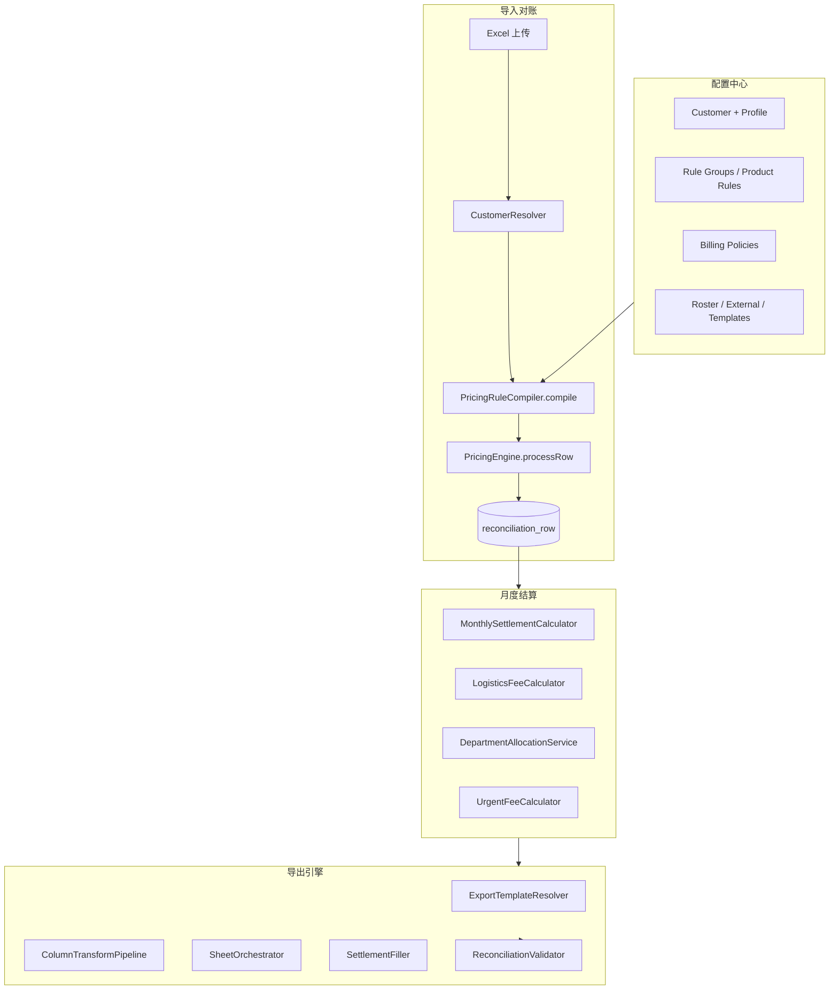

# 特色账单系统 — 升级规划方案

## 文档信息

| 项目 | 内容 |
|------|------|
| **文档名称** | 特色账单系统 — 升级规划方案 |
| **版本** | v1.0 |
| **编制日期** | 2026-07-17 |
| **编制依据** | `docs/7.17特色账单系统功能需求说明书.md`、`docs/特色账单系统-医院功能需求通用登记表（模板）.md`、`铂康/特色账单规则.txt`、`docs/逐院需求登记表/`（42 家样例） |
| **关联文档** | `system-docs/特色账单升级开发规划.md`（技术细化版）、`system_docs/hardcoded-business-data-audit.md` |
| **适用范围** | 铂康医疗 42 家医院（含院区拆分）特色账单全流程：导入 → 计价 → 对账 → 月度结算 → 多格式导出 |
| **读者** | 产品经理、架构师、前后端开发、测试、账单业务员 |

---

## 1. 现状评估

### 1.1 现有架构概览

系统采用 **Spring Boot 后端 + Vue3 前端 + MySQL** 架构，Docker Compose 生产部署，GitHub Actions CI/CD 自动构建镜像并执行 SQL 迁移。

```
┌─────────────────────────────────────────────────────────────────────────┐
│  前端 (Vue3 + Element Plus)                                              │
│  customers/index.vue ─ 客户/规则/策略配置                                │
│  reconciliation/index.vue ─ 账单导入、对账、导出触发                     │
│  pricing-rules/index.vue ─ 通用 hospital_pricing_rule JSON 编辑          │
└───────────────────────────────┬─────────────────────────────────────────┘
                                │ REST API
┌───────────────────────────────▼─────────────────────────────────────────┐
│  后端 (Spring Boot)                                                      │
│  CustomerResolver ─ 客户/别名解析                                        │
│  PricingRuleCompiler ─ 编译 base rules + 客户规则/策略 → enriched JSON   │
│  PricingEngine ─ 单行计价（唯一定价逻辑源）                               │
│  LogisticsFeeCalculator / MonthlySettlementCalculator ─ Job 级结算       │
│  HospitalReconciliationServiceImpl ─ 导入、对账 Job/Row、模板导出          │
└───────────────────────────────┬─────────────────────────────────────────┘
                                │
┌───────────────────────────────▼─────────────────────────────────────────┐
│  MySQL                                                                   │
│  customer / customer_alias / customer_product_rule / customer_discount   │
│  customer_billing_policy / hospital_pricing_rule                          │
│  hospital_reconciliation_job / hospital_reconciliation_row                │
│  product / product_match_rule / product_variant（部分贯通）                │
└─────────────────────────────────────────────────────────────────────────┘
```

**数据流（当前）：**

```
上传 Excel → CustomerResolver 解析医院名
          → PricingRuleCompiler.compile(hospitalName)
          → PricingEngine.processRow（逐行）
          → 写入 hospital_reconciliation_job / row
          → LogisticsFeeCalculator + MonthlySettlementCalculator（Job 级）
          → 模板导出（POI / HTML）
```

### 1.2 已实现能力矩阵（对照 M1–M14 / INT / CFG / NFR）

> 状态说明：**已实现** = 可配置且链路贯通；**部分** = 后端或 UI 单侧可用、或未覆盖全部 FRD 子项；**未实现** = 无对应模块；**不适用** = FRD 标注 Out of Scope 或该医院不需要。

| 模块 | 优先级 | 现状 | 关键实现位置 | 主要剩余差距 |
|:----:|:------:|:----:|--------------|--------------|
| **M1** 特色账单开关与客户档案 | P0 | **部分** | `Customer.billingEnabled`、`billingPricingMode`、`pathOverride`；`CustomerResolver`；`customers/index.vue` | 结款函合并客户组（FR-M1-08）、导出名称替换规则未配置化 |
| **M2** 折扣体系 | P0 | **部分** | `CustomerBillingPolicy`（DISCOUNT）；`CustomerDiscount` 迁移；`PricingRuleCompiler.applyBillingPolicies` | 结款函独立折扣（FR-M2-03）、导出阶段折扣（太平，FR-M2-03/05）、按把数分段折扣 |
| **M3** 特殊计费规则引擎 | P0 | **部分** | `CustomerProductRule` + `PricingEngine` + `PricingRuleCompiler` | SPLIT_ROW 拆行、科室条件、原价匹配、0 元覆盖完整链路、导出列变换 |
| **M4** 多报价与对账提示 | P0 | **部分** | `acceptedPrices`、`matchMode=any_price`、`matchedRuleId`/`matchedPriceOption` | 对账 UI 折扣链展示、未命中时列出全部报价的交互优化 |
| **M5** 低消/封顶 | P1 | **部分** | `MonthlySettlementCalculator`；`customer_billing_policy` MONTHLY_SETTLEMENT | 结款函低消展示行、独立收费项不计入低消基数（呼兰中医） |
| **M6** 物流独立计费与均摊 | P1 | **部分** | `LogisticsFeeCalculator`（按日期计趟 + 客户 feePerTrip） | 独立导入、科室比例分摊、跨院/跨客户同日合并、按星期计费 |
| **M7** 物流卡额度 | P1 | **未实现** | — | 全模块 greenfield |
| **M8** 账单/结款函/汇总导出 | P0 | **部分** | `HospitalReconciliationServiceImpl`（bill/settlement/department_summary/anomalies） | 医院差异化模板、多 Sheet、汇总表、汽轮机算法、设备抵扣行 |
| **M9** 加急收费与减免 | P2 | **未实现** | — | 行级加急标记、125%/102.5%、加急物流、结款函独立行 |
| **M10** 科室借调与费用调整 | P2 | **未实现** | — | 市五院全链路 greenfield |
| **M11** 花名册管理 | P2 | **未实现** | — | greenfield |
| **M12** 外来器械计价 | P2 | **未实现** | — | greenfield |
| **M13** 器械量表/把数表 | P3 | **未实现** | — | greenfield |
| **M14** 日结拆分 | P3 | **未实现** | — | greenfield |
| **INT** 流程集成 | P0 | **部分** | 导入/对账/基础导出已通 | 月度结算 → 导出勾稽、外来器械通道、物流独立导入 |
| **CFG** 配置管理 UI | P0 | **部分** | `customers/index.vue`、`CustomerProductRuleForm.vue` | 策略面板拆分、规则试算、批量导入、花名册/模板/物流卡页 |
| **NFR** 非功能 | — | **部分** | 导出日志、部分 row 追溯字段 | 规则变更审计、性能基准、权限细分 |

### 1.3 逐院需求登记表 gap 模式（抽样 4 家）

| 医院 | 级别 | 高频 gap 模式 | 配置 vs 代码 |
|------|:----:|---------------|--------------|
| 黑龙江省第二医院（南岗） | L1 | M8 结款函/列结构；M6 物流已可 per-客户配置 | **配置为主**（规则、折扣、物流 policy） |
| 太平人民医院 | L2 | M2 导出阶段折扣 + 小数位；M6 不收物流 | **配置 + 导出引擎扩展**（export-stage discount） |
| 哈尔滨市第五医院 | L3 | M10/M11/M12 全未实现；M8 总汇总/分科室/外来器械 | **新模块开发** + 大量配置 |
| 黑龙江省远东心脑血管医院 | L4 | M14 日结拆分；M2 结款函 9 折 | **代码扩展**（日结）+ 配置 |

**42 家横向规律：**

- **L1（~8 家）**：M1–M4 + 基础 M8 即可上线，约 70% 工作为**规则录入与验收**。
- **L2（~12 家）**：额外需要 M5/M6 增强、导出阶段折扣、低消。
- **L3（~6 家）**：市五院、市二院、省医院、国药总院等，依赖 M10–M12 + 复杂 M8。
- **L4（~4 家）**：维多利亚/九州分温结款函、远东日结、中医三院器械量表审计。

### 1.4 主要缺口 Top 5（按业务影响 × 覆盖医院数）

| 排名 | 缺口 | 影响模块 | 说明 |
|:----:|------|----------|------|
| 1 | **医院差异化导出引擎** | M8、INT-15~20 | 现有模板导出为通用 POI 逻辑，无法支撑分科室汇总、多 Sheet、结款函独立收费行、列删增例外（省医院）等 42 院差异 |
| 2 | **科室借调 / 费用调整 / 花名册** | M10、M11 | 市五院等 L3 医院核心手工流程，完全 greenfield |
| 3 | **外来器械独立维护与计价** | M12 | 市五院、国药总院等，需独立表 + 导入 + 总结款函勾稽 |
| 4 | **物流高级策略** | M6、M7 | 科室比例分摊、跨院同日合并、独立导入、物流卡 — 祖研/市五院/仁胜/国药 |
| 5 | **导出阶段折扣与分段折扣** | M2、M3 | 太平人民「原价导入、导出打折」、按把数 1/2/3+ 不同精度 — 引擎与导出双层逻辑 |

### 1.5 已知技术债（必须在升级中持续偿还）

| 编号 | 问题 | 位置 | 优先级 |
|:----:|------|------|:------:|
| TD-01 | `saveProductRules` 批量保存对无 productId 的 FOLD/EXTRA_FEE silent skip | `CustomerServiceImpl` | P0 |
| TD-02 | `PricingEngine` 单体过大（~1500 行），条件评估与策略应用未拆分 | `PricingEngine.java` | P1 |
| TD-03 | `product_variant` / `variantId` 未贯通编译与引擎 | 全链路 | P2 |
| TD-04 | 导出逻辑与计价逻辑耦合在 `HospitalReconciliationServiceImpl` | 后端 | P1 |
| TD-05 | 规则配置 UI 集中在客户编辑弹窗，缺少试算与批量工具 | 前端 | P1 |

---

## 2. 目标架构

### 2.1 升级后模块划分

```
特色账单域
├── 配置中心 (Configuration Hub)
│   ├── 客户计费档案 (Customer Billing Profile)
│   ├── 产品规则 / 规则组 (Product Rules → Rule Groups)
│   ├── 计费策略 (Billing Policies: DISCOUNT / LOGISTICS / MONTHLY / URGENT / DEDUCTION)
│   ├── 花名册 (Roster)
│   ├── 外来器械 (External Instruments)
│   ├── 物流卡 (Logistics Card)
│   └── 导出模板 (Export Templates)
│
├── 规则引擎 (Rule Engine)
│   ├── PricingRuleCompiler — 编译 enriched rules_json v3
│   ├── BillingConditionEvaluator — 条件匹配（新拆）
│   ├── PricingEngine — 行级计价
│   ├── BillingPolicyApplier — 折扣/加急/路径覆盖（新拆）
│   └── RowSplitter — FOLD/SPLIT_ROW 拆行（新拆）
│
├── 对账域 (Reconciliation)
│   ├── 导入解析 + 客户解析
│   ├── Job/Row 持久化 + 版本管理
│   └── 人工操作（加急标记、科室 override、复核）
│
├── 月度结算域 (Monthly Settlement)
│   ├── 低消/封顶
│   ├── 物流计费与分摊
│   ├── 物流卡扣减
│   ├── 科室借调/费用调整
│   └── 加急费与设备抵扣
│
└── 导出域 (Export Engine)
    ├── 模板注册表 (按客户 + 类型)
    ├── 列变换管道 (删列/插列/保留例外)
    ├── Sheet 编排器 (多 Sheet / 分科室 / 调整表)
    ├── 结款函填充器 (Excel/Word/HTML)
    └── 汇总勾稽校验器
```

### 2.2 前后端分层

| 层 | 职责 | 主要包/目录 |
|----|------|-------------|
| **Controller** | REST API、导出流响应 | `controller/CustomerController`、`HospitalReconciliationController`；新增 `RosterController`、`ExternalInstrumentController`、`ExportTemplateController` |
| **Service** | 业务编排 | `service/impl/*`；新增 `ExportEngineService`、`DepartmentAllocationService`、`RosterService` |
| **Domain/Engine** | 纯计算、无 IO | `PricingEngine`、`LogisticsFeeCalculator`、`MonthlySettlementCalculator`；新增 evaluator/applier |
| **Repository** | MyBatis Mapper | `mapper/*`、`resources/mapper/*` |
| **Frontend Views** | 页面级工作流 | `views/master-data/`、`views/hospital/reconciliation/`；新增 `views/billing-config/` |
| **Frontend Components** | 可复用配置组件 | `components/business/customers/`；新增 `CustomerBillingPolicyPanel`、`RuleSimulator`、`ExportTemplateEditor` |

### 2.3 规则引擎演进方向

**短期（Phase 1–4，已基本落地）**：在 `customer_product_rule` 上扩展字段，`PricingRuleCompiler` 编译进 `specialRules` + `billingPolicies`，`PricingEngine` 增强匹配。

**中期（Phase 5–6）**：

1. 引入 `customer_billing_rule_group`（条件 JSON + 动作 JSON + `match_mode`），与 `customer_product_rule` 双写过渡。
2. 拆分 `BillingConditionEvaluator`（keywords/exclude/temperature/material/count/department/originalPrice）。
3. 行级输出标准化：`ProcessedResult` 增加 `matchedRuleId`、`matchedPriceOption`、`policyTraces[]`、`discountChain[]`。

**长期（Phase 7+）**：

1. 废弃扁平 `customer_product_rule` 多义字段，统一 rule_group。
2. `ProductMatchResolver` 与特色规则合并为「产品解析 → 规则组匹配 → 策略叠加」流水线。
3. 支持规则版本快照与对账 Job 绑定规则 revision（已有 `HospitalPricingRuleRevision` 可扩展）。

### 2.4 目标数据流



---

## 3. 分阶段升级路线图

> 工期为 **开发人周**（1 人周 ≈ 1 名全职开发 1 周），含联调不含全量 42 院 UAT。  
> **Phase 0–4** 与 `system-docs/特色账单升级开发规划.md` 对齐，其中 Phase 0–4 核心后端**已部分实现**，下列标注「续建/验收」表示以配置录入和导出补全为主。

### Phase 0：基线修复与回归（0.5 人周）— 续建

| 项 | 内容 |
|----|------|
| **目标** | 消除已知 silent bug，建立黄金样例行 CI |
| **范围** | TD-01 修复；`PricingEngineTest` / `PricingRuleCompilerIntegrationTest` 扩充；`hospital-billing-golden-rows.json` |
| **依赖** | 无 |
| **交付** | CI 绿；批量保存 FOLD 规则不丢失 |

### Phase 1：P0 计价核心闭环（2–3 人周）— ** largely 已实现，验收为主**

| 项 | 内容 |
|----|------|
| **目标** | G1 特色开关 + G4 多报价 + 排除关键词 + 对账追溯 |
| **范围** | `excludeKeywords`、`acceptedPrices`、`matchMode`；`matched_rule_id` 等字段；对账 UI 多报价展示 |
| **关键文件** | `PricingEngine.java`、`PricingRuleCompiler.java`、`CustomerProductRuleForm.vue`、`reconciliation/index.vue` |
| **依赖** | Phase 0 |
| **验收医院** | 省二院（南岗/松北）、红十字妇产、九州（方盘） |
| **工期** | 0.5–1 人周（剩余 UI 抛光 + 省二院规则种子数据） |

### Phase 2：P0/P1 策略层（2 人周）— ** largely 已实现，验收为主**

| 项 | 内容 |
|----|------|
| **目标** | 分温折扣、温度条件、客户级物流单价、低消/封顶 |
| **范围** | `customer_billing_policy`；`MonthlySettlementCalculator`；`LogisticsFeeCalculator`；`customers/index.vue` 策略字段 |
| **关键文件** | `PricingRuleCompiler.applyBillingPolicies`、`customers/index.vue`（logistics/monthly/discount） |
| **依赖** | Phase 1 |
| **验收医院** | 维多利亚（分温+封顶）、呼兰红十字/悦美（低消）、省二院（物流 80.5） |
| **工期** | 0.5–1 人周（结款函低消展示待 Phase 3 导出联动） |

### Phase 3：P0 导出引擎 v2（4–5 人周）— **核心缺口**

| 项 | 内容 |
|----|------|
| **目标** | 可配置导出模板 + 列变换 + L1/L2 医院「已改账单」「结款函」验收 |
| **范围** | 新增 `export_template` 表；`ExportEngineService` 从 `HospitalReconciliationServiceImpl` 拆出；列删增/插列；客户模板绑定；结款函独立折扣行 |
| **依赖** | Phase 1–2 |
| **验收医院** | 省二院、呼兰一院、冰城医美、道外人民（列结构）、工程大学/九院/东大/先锋路（结款函独立折扣） |
| **工期** | 4–5 人周 |

### Phase 4：P1 高级计价与导出折扣（3 人周）

| 项 | 内容 |
|----|------|
| **目标** | 太平人民导出阶段折扣；武警 0 元覆盖；SPLIT_ROW 拆行；special_only 完整 |
| **范围** | `ExportStageDiscountApplier`；`RowSplitter`；`PricingEngine` 原价条件；`pathOverride` 0 元分支 |
| **关键 FRD** | FR-M2-03/05/06、FR-M3-04/15/17、FR-M3-20 |
| **依赖** | Phase 3 |
| **验收医院** | 太平人民、武警总队、祖研（排针凑数）、道外人民 |
| **工期** | 3 人周 |

### Phase 5：P1 物流增强 + 物流卡（3 人周）

| 项 | 内容 |
|----|------|
| **目标** | 物流独立导入、科室比例分摊、跨客户同日合并；仁胜/国药物流卡 |
| **范围** | `logistics_import` 表；`LogisticsAllocationService`；`logistics_card` + 扣减记录；`CustomerGroup` 合并结款 |
| **依赖** | Phase 3（导出展示物流分摊） |
| **验收医院** | 市五院（分摊）、祖研三院（跨院合并）、仁胜/国药（物流卡） |
| **工期** | 3 人周 |

### Phase 6：P2 加急与设备抵扣（2 人周）

| 项 | 内容 |
|----|------|
| **目标** | 行级加急标记 → 125%/102.5% → 结款函独立行；新发红十字设备抵扣 -3270 |
| **范围** | `urgent` 行字段；`UrgentFeeCalculator`；`DEDUCTION` policy；对账 UI 批量加急 |
| **依赖** | Phase 3 |
| **验收医院** | 新发红十字 |
| **工期** | 2 人周 |

### Phase 7：P2 科室借调 + 花名册 + 外来器械（6–8 人周）— **最大 greenfield**

| 项 | 内容 |
|----|------|
| **目标** | 市五院级 M10/M11/M12 全流程 |
| **范围** | `roster_entry`、`external_instrument`、`department_allocation_job`；`DepartmentAllocationService`；多 Sheet 导出编排 |
| **依赖** | Phase 3、Phase 5 |
| **验收医院** | 哈尔滨市第五医院 + 二门诊 |
| **工期** | 6–8 人周 |

### Phase 8：P2/P3 配置中心与规则组重构（4 人周）

| 项 | 内容 |
|----|------|
| **目标** | 规则组模型、试算器、批量导入、审计日志 |
| **范围** | `customer_billing_rule_group`；`/billing-rules/simulate`；Excel 批量导入；`RuleChangeAudit` |
| **依赖** | Phase 1–4 稳定 |
| **工期** | 4 人周 |

### Phase 9：P3 审计报表与日结（3 人周）

| 项 | 内容 |
|----|------|
| **目标** | 器械量表/把数表、灭菌包装表；远东日结拆分 |
| **范围** | `InstrumentAuditReportService`；按 `deliveryDate` 拆 Job；日结导出模板 |
| **依赖** | Phase 3、Phase 8 |
| **验收医院** | 中医三院（电力）、远东心脑血管 |
| **工期** | 3 人周 |

### 路线图总览

| Phase | 主题 | 人周 | 累计 | 可上线医院级别 |
|:-----:|------|:----:|:----:|:--------------:|
| 0 | 基线修复 | 0.5 | 0.5 | — |
| 1 | 计价核心 | 1 | 1.5 | L1 部分 |
| 2 | 策略层 | 1 | 2.5 | L1 大部分 |
| 3 | 导出引擎 v2 | 4.5 | 7 | **L1 完整** |
| 4 | 高级计价/导出折扣 | 3 | 10 | L2 |
| 5 | 物流增强/物流卡 | 3 | 13 | L2+ |
| 6 | 加急/抵扣 | 2 | 15 | L2（新发） |
| 7 | M10–M12 | 7 | 22 | **L3** |
| 8 | 配置中心/规则组 | 4 | 26 | 运维效率 |
| 9 | 审计/日结 | 3 | 29 | **L4** |

**建议里程碑：**

- **M1（+7 人周）**：L1 共 8 家可生产验收
- **M2（+10 人周）**：L2 共 12 家
- **M3（+22 人周）**：L3 市五院等 6 家
- **M4（+29 人周）**：L4 全量能力（不含 O3/O4/O5 Out of Scope 项）

---

## 4. 后端升级清单（按模块）

### 4.1 M1 客户档案

| 变更类型 | 内容 | 文件/表 |
|----------|------|---------|
| Entity | 已有 `billingEnabled`、`billingPricingMode`、`pathOverride` | `Customer.java` |
| **新增** | `customer_group` + `customer_group_member`（结款函合并） | 新表 + `CustomerGroupService` |
| **新增** | `export_name_mapping` JSON on customer 或 `customer_alias` type=export | `Customer.java` / migration |
| API | `GET/PUT /customers/{id}/billing-profile` | `CustomerController` |
| Service | 导出时名称替换 | `ExportEngineService.applyNameMapping()` |

### 4.2 M2 折扣

| 变更类型 | 内容 | 文件/表 |
|----------|------|---------|
| 已有 | `CustomerBillingPolicy` DISCOUNT + scope.temperature | `PricingRuleCompiler` |
| **新增** | `applyStage`: `bill_detail` / `settlement_only` / `export_only` | policy.params |
| **新增** | `ExportStageDiscountApplier` | `service/ExportStageDiscountApplier.java` |
| **新增** | 按把数分段规则 `pieceTierDiscounts[]` | policy.params + 引擎 |
| Engine | 结款函灭菌费独立打折，不影响 row expected | `SettlementCalculator` |

### 4.3 M3 规则引擎

| 变更类型 | 内容 | 文件/表 |
|----------|------|---------|
| 已有 | FIXED/FOLD/MULTIPLIER/EXTRA_FEE + exclude + temperature | `PricingEngine` |
| **新增** | `BillingConditionEvaluator` 拆分 | 新类 |
| **新增** | `RowSplitter` — FOLD 不可整除时多行输出 | 新类 + `HospitalReconciliationServiceImpl` |
| **新增** | `originalUnitPrice` 条件 | `CustomerProductRule` + 引擎 |
| **新增** | `department` 条件 | rule conditions JSON |
| **新增** | ZERO_PRICE 分支完善 | `PricingEngine` + `pathOverride.zeroPriceMode` |
| DB | `customer_billing_rule_group` | Phase 8 migration |

### 4.4 M4 多报价

| 变更类型 | 内容 | 文件/表 |
|----------|------|---------|
| 已有 | `acceptedPrices`、`matchedPriceOption` | 实体 + 引擎 |
| **增强** | 未命中时 `candidatePrices[]` 写入 `billing_notes` | `PricingEngine.processRow` |
| **增强** | `discountChain` 序列化 | `billing_notes` JSON schema |

### 4.5 M5 低消/封顶

| 变更类型 | 内容 | 文件/表 |
|----------|------|---------|
| 已有 | `MonthlySettlementCalculator` | 已实现 |
| **新增** | `excludeCategories[]` 不计入低消基数 | policy.params |
| **新增** | `job.monthly_breakdown` 写入结款函 | 导出填充 |
| DB | `hospital_reconciliation_job.monthly_breakdown` | `SchemaMigrationRunner`（若缺失则补） |

### 4.6 M6/M7 物流

| 变更类型 | 内容 | 文件/表 |
|----------|------|---------|
| 已有 | 客户 feePerTrip + 日期计趟 | `LogisticsFeeCalculator` |
| **新增** | `logistics_import` 表（job_id, trip_date, route, count） | migration |
| **新增** | `LogisticsAllocationService.allocateByDeptRatio()` | 新 Service |
| **新增** | `LogisticsMergeService.mergeSameDayCrossCustomer()` | 新 Service |
| **新增** | `logistics_card` + `logistics_card_transaction` | migration + CRUD |
| API | `/customers/{id}/logistics-imports`、`/logistics-cards` | 新 Controller |

### 4.7 M8 导出

| 变更类型 | 内容 | 文件/表 |
|----------|------|---------|
| **重构** | 从 `HospitalReconciliationServiceImpl` 拆出 `ExportEngineService` | 新 Service |
| **新增** | `export_template`（customer_id, type, file_path, column_mapping JSON, sheet_config JSON） | migration |
| **新增** | `ColumnTransformPipeline`（delete/insert/keep 规则） | 新类 |
| **新增** | `SheetOrchestrator`（低温敷料分 Sheet、调整表、外来器械） | 新类 |
| **新增** | `SettlementTemplateFiller` — 独立收费行、低消行、加急行、抵扣行 | 新类 |
| **新增** | `GuoyaoQuantityAlgorithm` — 汽轮机核算 | 新类 |
| 已有 | `HospitalReconciliationExportLog` | 保留 |

### 4.8 M9 加急

| 变更类型 | 内容 | 文件/表 |
|----------|------|---------|
| **新增** | `hospital_reconciliation_row.is_urgent` | migration |
| **新增** | `UrgentFeeCalculator` + URGENT policy | 新类 |
| API | `PATCH /reconciliations/{jobId}/rows/urgent` | Controller |

### 4.9 M10–M12

| 变更类型 | 内容 | 文件/表 |
|----------|------|---------|
| **新增** | `roster_entry`（customer_id, doctor_name, department） | migration |
| **新增** | `external_instrument`（customer_id, category_no, pack_name, price, ...） | migration |
| **新增** | `DepartmentAllocationService` — 费用调整/花名册分配/供应室借调 | 新 Service |
| **新增** | `allocation_result` JSON on job | `hospital_reconciliation_job` |

### 4.10 M13–M14

| 变更类型 | 内容 | 文件/表 |
|----------|------|---------|
| **新增** | `InstrumentAuditReportService` | 新 Service |
| **新增** | `DailySplitService.splitJobByDate()` | 新 Service |
| API | `/reconciliations/{jobId}/export-instrument-audit`、`/split-daily` | Controller |

---

## 5. 前端升级清单

### 5.1 设计原则

1. **工作流优先于功能堆砌**：按角色（业务员 / 配置员 / 审核）设计主路径，减少跨页跳转。
2. **可解释性**：对账行默认展示「期望价 ← 规则 ← 策略」折叠面板，差异行高亮。
3. **配置即所见即所算**：规则编辑页内置试算，保存前预览 3 条样例行。
4. **渐进披露**：L1 医院仅展示必要字段；L3 医院展开 M10–M12 高级面板。
5. **批量与复用**：支持「从相似医院复制规则」、Excel 批量导入。

### 5.2 页面/组件清单

| 页面/组件 | 路径 | Phase | 能力 |
|-----------|------|:-----:|------|
| 客户管理（增强） | `views/master-data/customers/index.vue` | 1–2 | 已有：开关、规则、折扣、物流、低消；**待增**：客户组、复制规则 |
| 特色规则表单 | `components/business/customers/CustomerProductRuleForm.vue` | 1 | 已有较完整；**待增**：科室条件、原价条件、拆行预览 |
| **计费策略面板** | `components/business/customers/CustomerBillingPolicyPanel.vue` | 2 | 分温折扣、物流、低消、加急、抵扣分 Tab |
| **规则试算器** | `components/business/customers/RuleSimulator.vue` | 8 | 输入样例行 → 命中链 + 价格 |
| 对账工作台 | `views/hospital/reconciliation/index.vue` | 1–7 | **UX 重点**，见 5.3 |
| **花名册管理** | `views/billing-config/roster/index.vue` | 7 | CRUD + Excel 导入 |
| **外来器械** | `views/billing-config/external-instruments/index.vue` | 7 | 独立维护 + 与 Job 关联 |
| **物流导入** | `views/billing-config/logistics-import/index.vue` | 5 | 市五院路线/次数 |
| **物流卡** | `views/billing-config/logistics-card/index.vue` | 5 | 余额/充值/扣减 |
| **导出模板** | `views/billing-config/export-templates/index.vue` | 3 | 上传模板 + 列映射可视化 |
| 版本管理 | `views/hospital/version-management/index.vue` | 1 | 展示 matched 字段、月度/物流 breakdown |

### 5.3 重点 UX 改进

#### 5.3.1 对账工作台（`reconciliation/index.vue`）

| 工作流步骤 | 现状 | 目标 UX |
|------------|------|---------|
| 上传 | 多文件拖拽 | 保留；**增加**客户自动识别预览（别名命中高亮） |
| 校对 | 表格 + 状态筛选 | **三路视图**：全部 / 差异 / 多报价；行展开面板显示 `matchedPriceOption`、规则名、折扣链 |
| 加急 | 未实现 | 行勾选 + 批量「标记加急」；结款预览区显示加急费 |
| 花名册 | 未实现 | 包名命中医生时侧边提示「建议科室：XX」+ 一键确认 |
| 月度摘要 | 部分有 monthlyBreakdown | Job 顶栏固定展示：灭菌费 / 低消调整 / 物流 / 合计 |
| 导出 | 多个分散按钮 | **导出向导**：Step1 选类型 → Step2 预览 Sheet 列表 → Step3 下载 + 写 export_log |

#### 5.3.2 规则配置（`customers/index.vue` + 新组件）

| 改进 | 说明 |
|------|------|
| 规则列表卡片化 | 按类型分组（固定价 / 凑数 / 倍率 / 加收），显示匹配条件摘要 |
| 优先级拖拽 | CFG-03：拖拽排序后批量更新 priority |
| 冲突检测 | 保存前调用 `hasSameMatchSignature` 高亮冲突项 |
| 从模板创建 | 「省二院标准包」「太平导出折扣」等内置模板一键填充 |
| 分温折扣可视化 | HT/LT 两列进度条展示折扣率 |

#### 5.3.3 导出与物流

| 改进 | 说明 |
|------|------|
| 模板绑定 | 客户编辑页「导出模板」区：账单/结款函/汇总各选模板 |
| 导出前校验 | 弹窗列出勾稽项（行差异数、低消是否触发、物流是否导入） |
| 物流分摊预览 | 表格展示各科室分摊金额，合计 = 月物流费 |

#### 5.3.4 花名册 / 外来器械

| 改进 | 说明 |
|------|------|
| Excel 导入向导 | 列映射 → 预览 → 确认；未匹配医生列表导出 |
| 外来器械 | 与常规账单分 Tab；总结款函预览含外来分项 |

---

## 6. 数据模型与配置中心

### 6.1 现有表（已用）

| 表 | 用途 | 状态 |
|----|------|------|
| `customer` | 客户主数据 + billing 开关/模式/pathOverride | 已用 |
| `customer_alias` | 发货表名称解析 | 已用 |
| `customer_product_rule` | 特色产品规则 | 已用，Phase 8 迁移至 rule_group |
| `customer_discount` | 旧折扣表 | 已迁移至 billing_policy |
| `customer_billing_policy` | DISCOUNT / LOGISTICS / MONTHLY_SETTLEMENT | 已用 |
| `hospital_reconciliation_job/row` | 对账任务与行 | 已用 |
| `hospital_reconciliation_export_log` | 导出审计 | 已用 |
| `product` / `product_match_rule` / `product_variant` | 结构化产品 | 部分贯通 |

### 6.2 规划新表

```sql
-- Phase 3: 导出模板
CREATE TABLE export_template (
  id BIGINT PRIMARY KEY AUTO_INCREMENT,
  customer_id BIGINT NULL COMMENT 'NULL=全局默认',
  template_type VARCHAR(40) NOT NULL COMMENT 'bill|settlement|dept_summary|price_summary|instrument_audit|daily',
  name VARCHAR(120) NOT NULL,
  storage_path VARCHAR(500) NOT NULL,
  column_mapping JSON NULL,
  sheet_config JSON NULL,
  is_active TINYINT DEFAULT 1,
  created_at DATETIME DEFAULT CURRENT_TIMESTAMP
);

-- Phase 5: 物流
CREATE TABLE logistics_import (...);
CREATE TABLE logistics_card (...);
CREATE TABLE logistics_card_transaction (...);

-- Phase 5: 客户组（合并结款函）
CREATE TABLE customer_group (...);
CREATE TABLE customer_group_member (...);

-- Phase 7: 花名册与外来器械
CREATE TABLE roster_entry (...);
CREATE TABLE external_instrument (...);

-- Phase 8: 规则组
CREATE TABLE customer_billing_rule_group (...);

-- Phase 8: 规则审计
CREATE TABLE billing_rule_change_log (...);
```

### 6.3 配置中心信息架构

```
客户管理
└── [客户] 黑龙江省第二医院（南岗）
    ├── 基础信息（编码、别名、开关、计价模式）
    ├── 计费策略
    │   ├── 折扣（整单 / 分温 / 结款函 / 导出阶段）
    │   ├── 物流（单价 / 分摊策略 / 物流卡）
    │   ├── 月度（低消 / 封顶 / 排除品类）
    │   ├── 加急（费率 / 减免）
    │   └── 抵扣（固定月减）
    ├── 特色规则（列表 / 规则组）
    ├── 花名册
    ├── 外来器械
    └── 导出模板（账单 / 结款函 / 汇总）
```

### 6.4 配置 vs 代码扩展决策树

```
新医院需求
├── 规则可用现有 action 类型表达？ ──是──► 仅配置（CustomerProductRule + Policy）
├── 需新条件维度（如科室）？ ──是──► Phase 4/8 扩展 conditions JSON + 引擎
├── 需新导出版式？ ──是──► 上传 export_template + column_mapping
├── 需跨行/跨 Sheet 逻辑（市五院）？ ──是──► Phase 7 DepartmentAllocationService
└── 需新算法（汽轮机）？ ──是──► 专用 Calculator + 客户 policy 开关
```

---

## 7. 42 家医院落地策略（L1–L4）

### 7.1 分级定义与代表医院

| 级别 | 家数 | 代表医院 | 上线 Phase | 主要工作 |
|:----:|:----:|----------|:----------:|----------|
| **L1** | 8 | 省二院南岗/松北、呼兰一院、红十字妇产、冰城医美 | Phase 3 后 | 规则录入 + 导出模板 + UAT |
| **L2** | 12 | 呼兰中医、祖研三院、太平人民、新发红十字、呼兰红十字 | Phase 4–6 | 低消/物流/导出折扣/加急 |
| **L3** | 6 | 市五院、市二院、省医院、国药总院、中医大二院 | Phase 7 | M10–M12 开发 + 复杂导出 |
| **L4** | 4+ | 维多利亚、九州、远东、中医三院（电力） | Phase 9 | 分温结款函/日结/审计（部分 Out of Scope） |

### 7.2 落地批次建议

| 批次 | 时间（相对 M1） | 医院清单 | 动作 |
|:----:|-----------------|----------|------|
| Batch-A | M1 | 省二院×2、呼兰一院、红十字妇产、冰城医美 | 配置种子规则 + 2 月样例 UAT |
| Batch-B | M2 | 道外、华夏、三精、武警、工程/九院/东大/先锋路 | 路径覆盖 + 结款函独立折扣模板 |
| Batch-C | M2+ | 呼兰中医、太平、呼兰红十字、悦美、祖研×3 | 低消 + 物流分摊 + 导出折扣 |
| Batch-D | M3 | 市五院+二门诊 | M10–M12 专项 |
| Batch-E | M4 | 国药×3、市二院、省医院×2、中医大二院×2 | 汇总表 + 物流卡 + 名称替换 |
| Batch-F | M4+ | 维多利亚、远东、中医三院 | L4 能力 + 业务确认 Out of Scope 项 |

### 7.3 配置交付物（每家）

1. 填写完整的 `docs/逐院需求登记表/{医院}.md`
2. 系统内：客户档案 + 别名 + 规则 JSON 导出备份
3. 至少 2 个月 MAT-01/MAT-02 对账通过记录
4. 结款函（MAT-03）金额勾稽截图/文件

### 7.4 院区拆分约定

- **42 文件夹 = 42 独立客户**，不开发院区自动匹配。
- 合并结款函（市五院+二门诊、香坊中医+三辅社区）通过 `customer_group` 实现，账单仍独立 Job。

---

## 8. 风险与依赖

### 8.1 技术风险

| 风险 | 影响 | 缓解措施 |
|------|------|----------|
| `PricingEngine` 持续膨胀 | 维护困难、回归成本高 | Phase 4 起拆分 Evaluator/Applier；黄金样例 CI |
| 导出模板碎片化（42 院 × 多类型） | 模板维护爆炸 | `export_template` 继承：全局默认 → 客户覆盖；模板版本号 |
| 市五院 M10 规则未完全书面化 | 返工 | Batch-D 前完成视频/样表评审；先支持 80% 自动化 + 人工 override |
| 多报价与折扣叠加语义 | 对账误判 | 文档固定：any_price 先比账单价，折扣仅影响展示期望（可配置） |
| Excel 版式差异大 | POI 渲染偏差 | 每模板自动化 diff 测试（列头 hash + 合计行） |

### 8.2 业务确认项（阻塞开发）

| 编号 | 事项 | 影响 Phase |
|:----:|------|:----------:|
| BC-01 | 呼兰中医低消 10000 基数是否含备包科室 | 4 |
| BC-02 | 工大医院「口腔类」产品边界 | 4 或暂缓 |
| BC-03 | 市五院费用调整关键词完整清单 | 7 |
| BC-04 | 外来器械包类别号录入规范 | 7 |
| BC-05 | 维多利亚/九州分温结款函是否纳入本规划 | 9（当前 O3） |
| BC-06 | 九州物流减免 4 次/低消 3000 | 5（当前 O4） |

### 8.3 测试策略

| 层级 | 内容 | 工具/位置 |
|------|------|-----------|
| 单元测试 | 引擎条件、多报价、分摊算法 | `PricingEngineTest`、`LogisticsAllocationTest` |
| 集成测试 | 编译 + 计价 + Job 结算 | `PricingRuleCompilerIntegrationTest` |
| 黄金样例 | ≥20 院 × ≥5 行/院 | `backend/src/test/resources/hospital-billing-golden-rows.json` |
| 导出 diff | 模板输出 vs MAT-02/MAT-03 | 脚本 `scripts/compare_export.py`（待建） |
| UAT | 业务员按逐院登记表验收 | `docs/逐院需求登记表/` |
| 回归 | 关闭特色开关回退标准计价 | 每 Phase 必测 |

### 8.4 外部依赖

- MySQL 8.0 JSON 列（已有）
- Apache POI（已有，导出引擎继续使用）
- 无新增 mandatory 第三方库
- 业务侧：42 院参考 Excel 样表完整性（部分医院文件夹为空，见逐院登记表）

---

## 9. 验收标准

### 9.1 「完全支持」功能需求的判定

对任意医院，当且仅当满足以下全部条件，方认定系统**完全支持**该医院 FRD 范围内需求：

1. **配置完备**：`docs/逐院需求登记表/{医院}.md` 中所有「是否启用=是」的 FR 项，均在系统中有对应配置且保存成功。
2. **对账一致**：使用 MAT-01 未改账单导入，**≥99% 行**（金额、状态）与 MAT-02 已改账单一致；其余行有明确规则解释。
3. **结款勾稽**：MAT-03 结款函灭菌费 / 物流 / 低消 / 加急 / 抵扣与系统导出 **误差 ≤0.01 元**。
4. **汇总勾稽**：若启用 MAT-04~07，各分项之和 = 结款函合计。
5. **可追溯**：任意差异行可查看 `matchedRuleId`、`matchedPriceOption`、`billing_notes`、policy traces。
6. **无代码发版**：L1/L2 医院规则变更仅通过配置完成（在已支持规则类型范围内）。

### 9.2 分模块验收要点

| 模块 | 验收命令/操作 | 通过标准 |
|------|---------------|----------|
| M1 | 客户编辑开关 toggled | 关闭后不 merge 特色规则 |
| M2 | 配置 7 折 + 导入样例 | 期望价 = 原价 ×0.7（skipDiscount 行除外） |
| M3 | 配置 xx钉 exclude 空心钉 | 空心钉不匹配；其他钉命中 |
| M4 | 配置 prices=[71,76.5] | 账单价 71 或 76.5 均为 unchanged |
| M5 | minCharge=10000，月合计 8000 | Job monthlyBreakdown.adjustment=2000 |
| M6 | feePerTrip=80.5，3 个发货日 | logisticsFee=241.5 |
| M8 | 导出 bill + settlement | 列结构、Sheet 名、合计与样表一致 |
| M10 | 市五院全量 UAT | 手术室净额 + 调整表 + 科室 Sheet = 原总额 |
| INT | 端到端：配置→导入→对账→导出 | 单会话 ≤15 分钟完成（L1 医院） |

### 9.3 Phase 完成门禁

| Phase | 门禁 |
|:-----:|------|
| 3 | Batch-A 至少 3 家 L1 医院 MAT-02/MAT-03 验收通过 |
| 4 | 太平人民导出样例 diff 通过 |
| 7 | 市五院 1 个完整账期 UAT 通过 |
| 9 | 远东日结之和 = 月账；中医三院把数表 = 账单把数 |

---

## 10. 与现有 CI/CD、Docker 部署的衔接

### 10.1 现有流水线

| 环节 | 实现 | 路径 |
|------|------|------|
| CI 触发 | push `main` / workflow_dispatch | `.github/workflows/deploy.yml` |
| 前端 sanity build | pnpm + vite build | workflow step |
| 镜像构建推送 | Docker buildx → ghcr.io | backend / frontend |
| DB 迁移清单校验 | `scripts/check-migrate-manifest.sh` | CI step |
| 生产部署 | SSH + docker compose pull + force-recreate backend | deploy job |
| 容器内 SQL | `docker-entrypoint.sh` 读 `/app/db/migrate_manifest.txt` | backend 镜像 |
| 列级幂等迁移 | `SchemaMigrationRunner` Spring 启动时 | Java |

### 10.2 升级期 DB 变更规范

1. 每个 Phase 新增 `backend/src/main/resources/db/schema_00X_*.sql`
2. **必须**更新 `migrate_manifest.txt`（CI 会校验）
3. 同步更新 `SchemaMigrationRunner` 中 `addColumnIfMissing` / `createTableIfMissing`（双保险）
4. 生产部署命令（已有）：

```bash
docker compose -f docker-compose.prod.yml pull
docker compose -f docker-compose.prod.yml up -d mysql
docker compose -f docker-compose.prod.yml up -d --no-deps --force-recreate backend
docker compose -f docker-compose.prod.yml up -d --no-deps --force-recreate frontend
```

### 10.3 配置数据迁移

| 场景 | 方式 |
|------|------|
| 新列默认值 | SQL migration + SchemaMigrationRunner |
| 折扣 → billing_policy | 已有自动 INSERT 迁移 |
| billing_enabled 回填 | 已有：有 product_rules 的客户置 1 |
| 省二院拆院区 | 运维脚本 `scripts/split_customer_branch.sql`（待建） |
| 种子规则 | `HardcodedRulesMigrationRunner` 或 Excel 导入工具 |

### 10.4 发布策略

- **Phase 0–2**：可频繁发布，feature flag = `customer.billing_enabled`
- **Phase 3+ 导出变更**：模板文件随 frontend/public 或 backend/storage 挂载；`backend-storage` volume 持久化
- **回滚**：`billing_enabled=0` 回退计价；新表独立可停用编译分支；docker 镜像 tag 回滚

### 10.5 环境变量（无变更）

现有 `docker-compose.prod.yml` 环境变量满足升级需求；加急/物流卡无新增 mandatory env。

---

## 11. FRD 能力 → 代码变更速查表

| FRD 能力 | 状态 | 目标 Phase | 主要代码变更 |
|----------|:----:|:----------:|--------------|
| FR-M1-01 特色开关 | 已实现 | — | `Customer.billingEnabled` |
| FR-M1-04 计价模式 | 已实现 | — | `billingPricingMode` + 引擎 |
| FR-M1-05 路径覆盖 | 已实现 | — | `pathOverride` |
| FR-M1-08 结款合并组 | 未实现 | 5 | `customer_group` + 导出 |
| FR-M2-02 分温折扣 | 已实现 | — | `CustomerBillingPolicy.scope` |
| FR-M2-03 结款函独立折扣 | 部分 | 3 | `ExportEngineService` |
| FR-M2-05 导出阶段折扣 | 未实现 | 4 | `ExportStageDiscountApplier` |
| FR-M3-02 excludeKeywords | 已实现 | — | `PricingEngine` |
| FR-M3-04 凑数拆行 | 部分 | 4 | `RowSplitter` |
| FR-M3-21 导出列删增 | 未实现 | 3 | `ColumnTransformPipeline` |
| FR-M4-01 多报价 | 已实现 | — | `acceptedPrices` |
| FR-M5-01 低消 | 已实现 | — | `MonthlySettlementCalculator` |
| FR-M6-01 物流单价 | 已实现 | — | `LogisticsFeeCalculator` |
| FR-M6-05 科室分摊 | 未实现 | 5 | `LogisticsAllocationService` |
| FR-M7 物流卡 | 未实现 | 5 | `logistics_card` 表 |
| FR-M8-04 分科室汇总 | 部分 | 3/7 | 模板 + M10 |
| FR-M8-12 汽轮机算法 | 未实现 | 3 | `GuoyaoQuantityAlgorithm` |
| FR-M9 加急 | 未实现 | 6 | `UrgentFeeCalculator` |
| FR-M10 科室借调 | 未实现 | 7 | `DepartmentAllocationService` |
| FR-M11 花名册 | 未实现 | 7 | `roster_entry` + UI |
| FR-M12 外来器械 | 未实现 | 7 | `external_instrument` |
| FR-M13 器械量表 | 未实现 | 9 | `InstrumentAuditReportService` |
| FR-M14 日结 | 未实现 | 9 | `DailySplitService` |
| CFG-04 规则试算 | 未实现 | 8 | `RuleSimulator.vue` |
| NFR-01 行级追溯 | 部分 | 1 | `matched_*` 字段 + UI 增强 |

---

## 12. 附录

### A. 关键源码索引

| 职责 | 绝对路径 |
|------|----------|
| 规则编译 | `backend/src/main/java/com/hospital/backend/service/PricingRuleCompiler.java` |
| 计价引擎 | `backend/src/main/java/com/hospital/backend/service/PricingEngine.java` |
| 对账服务 | `backend/src/main/java/com/hospital/backend/service/impl/HospitalReconciliationServiceImpl.java` |
| 物流计算 | `backend/src/main/java/com/hospital/backend/service/LogisticsFeeCalculator.java` |
| 月度结算 | `backend/src/main/java/com/hospital/backend/service/MonthlySettlementCalculator.java` |
| 客户 CRUD | `backend/src/main/java/com/hospital/backend/service/impl/CustomerServiceImpl.java` |
| Schema 迁移 | `backend/src/main/java/com/hospital/backend/config/SchemaMigrationRunner.java` |
| 客户管理 UI | `frontend/src/views/master-data/customers/index.vue` |
| 规则表单 | `frontend/src/components/business/customers/CustomerProductRuleForm.vue` |
| 对账 UI | `frontend/src/views/hospital/reconciliation/index.vue` |
| 规则工具 | `frontend/src/utils/customerProductRule.ts` |
| CI/CD | `.github/workflows/deploy.yml` |
| 生产 Compose | `docker-compose.prod.yml` |

### B. 文档修订记录

| 版本 | 日期 | 说明 |
|------|------|------|
| v1.0 | 2026-07-17 | 初稿：基于 FRD、42 院登记表、代码库 medium-thoroughness 调研 |

---

*本文档为产品/研发共用升级规划；技术任务拆解详见 `system-docs/特色账单升级开发规划.md`。*
