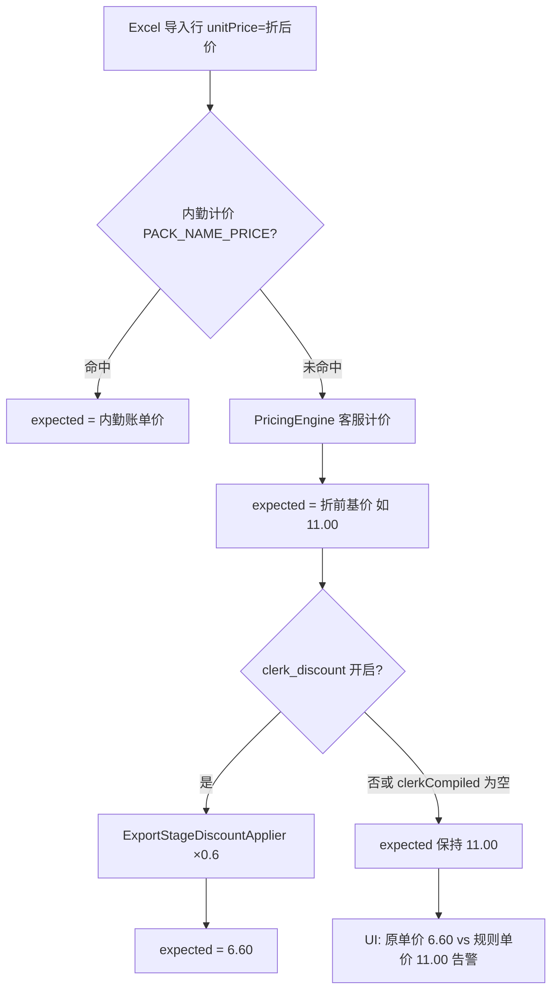

# 黑龙江省医院（南岗院区）内勤折扣未生效分析报告

**报告日期：** 2026-10-09  
**客户代码：** `SHENG-YY-NG`  
**问题来源：** 生产环境对账实测（规则单价与原单价长期不一致）  
**关联材料：** 用户截图、`clerk-rules/baseline/SHENG-YY-NG.json`、`billing-rules/baseline/SHENG-YY-NG.json`、`docs/内勤规则架构与迁移方案.md`  
**代码基线：** `main` @ `21862e02`（含 `ReconciliationPricingOrchestrator`、内勤 v2 baseline、导出前落库提醒）

---

## 1. 问题现象（截图还原）

对账明细表典型行（包数均为 1）：

| 字段（UI） | 后端字段 | 截图取值 A | 截图取值 B |
|------------|----------|------------|------------|
| 原单价 | `unitPrice` | **6.60** | **4.80** |
| 规则单价 | `expectedUnitPrice` | **11.00**（红色 `!`） | **8.00**（红色 `!`） |

数值关系：

- `6.60 ÷ 11.00 = 0.60`
- `4.80 ÷ 8.00 = 0.60`

与客户内勤 Excel「**标准价格六折**」完全一致：客户账单已是折后价，而系统「规则单价」仍停留在**客服标准计价（折前基价）**，未叠加上 `rate = 0.6` 的内勤导出折扣。

业务期望：对账页「规则单价」应与折后账单一致（或与「折扣前基价 × 0.6」一致），不应再对整表刷出「原单价 ≈ 规则单价 × 60%」的批量价差告警。

---

## 2. 核心结论（Executive Summary）

| 维度 | 结论 |
|------|------|
| 规则是否已配置 | **是**。`SHENG-YY-NG` 内勤 baseline 含唯一活跃规则「标准价六折」：`DISCOUNT_OVERLAY` + `stage=bill_export` + `params.rate=0.6`。 |
| 客服计价是否正常 | **基本正常**。`11.00` / `8.00` 符合标准高温/包材阶梯等客服引擎输出，属于**折前基价**。 |
| 为何像「折扣没生效」 | 对账列 `expectedUnitPrice` **未写入折后价**，表现为「只跑了第 2 层客服计价、第 3 层内勤折扣未落到该字段」。 |
| 最可能根因（生产） | ① **任务行数据为编排器上线前导入或未「重定价 + 落库」**；② **`customerCode` 未解析**导致 `clerkCompiled=null`；③ 任务级 **`clerk_discount` 总开关被关闭**；④ 运行包版本早于内勤 v2 / 对账编排接入。 |
| 与导出关系 | 账单导出仍走 `ClerkRuleExportService` → `ExportStageDiscountApplier`，**有可能导出已是六折、对账页仍显示折前规则价**（双通道不一致），需用同一 job 对比导出 Excel。 |
| 规则完整性缺口 | Excel 原文还有「低温器械最高 180 元」封顶，当前 baseline **仅录入 `rate: 0.6`**，未建模 `maxCharge`/`fixedPriceOverrides`——属另一类问题，**不解释**本次「完全未乘 0.6」的主现象。 |

---

## 3. 权威规则：Excel → 系统内勤 baseline

### 3.1 内勤 Excel 口径（账单规则 · 黑龙江省医院（南岗/香坊））

- 包类型/摘要：**标准价格六折**
- 业务含义：在标准计价结果上按 **60%** 计费；低温相关包型另有「超过 180 元统一 180」描述（见 `sourceText`）

### 3.2 系统落库（`clerk-rules/baseline/SHENG-YY-NG.json`）

```json
{
  "ruleType": "DISCOUNT_OVERLAY",
  "name": "标准价六折",
  "stage": "bill_export",
  "isActive": true,
  "params": { "rate": 0.6 },
  "priority": 10
}
```

编译后进入 `billingPolicies[]`：`policyType=DISCOUNT`，`params.applyStage=export_only`，温区 `scope.temperature=ANY`（见 `ClerkRuleCompiler.toDiscountPolicy`）。

### 3.3 客服规则层（`billing-rules/baseline/SHENG-YY-NG.json`）

南岗特色规则（门皮手术包、`/双` 等）多带 `skipDiscount: true`，**只影响命中特色行的客服路径**；截图类行走**标准计价**时，折前价 `11` / `8` 合理，**不应**在客服层直接乘 0.6——六折归属内勤层（架构文档已明确拆分）。

---

## 4. 系统设计：对账三层计价与折扣落点



优先级（`ReconciliationPricingOrchestrator`）：

1. 内勤账单价（`clerk_price`）
2. `PricingEngine`（特色 &gt; 标准）
3. 内勤导出折扣（`clerk_discount` → `ExportStageDiscountApplier.apply`）

**对账页「规则单价」= 编排器最终写入的 `ProcessedResult.expectedUnitPrice`**，不是单独的「折扣前」列；折前价仅作为 `billingNotes.priceBeforeDiscount` 供详情抽屉展示。

---

## 5. 源码链路（为何会出现 11 vs 6.6）

### 5.1 编排器：折扣应改写 `expectedUnitPrice`

```84:110:backend/src/main/java/com/hospital/backend/service/ReconciliationPricingOrchestrator.java
        if (!clerkDiscountDisabled
                && clerkCompiled != null
                && result.expectedUnitPrice != null
                && result.expectedUnitPrice > 0) {
            BillRowItem discountRow = toBillRowItem(rowMap);
            discountRow.setExpectedUnitPrice(result.expectedUnitPrice);
            discountRow.setUnitPrice(result.expectedUnitPrice);
            List<BillRowItem> discounted = exportStageDiscountApplier.apply(clerkCompiled, List.of(discountRow));
            if (!discounted.isEmpty()) {
                BillRowItem after = discounted.get(0);
                if (after.getExpectedUnitPrice() != null
                        && Math.abs(after.getExpectedUnitPrice() - result.expectedUnitPrice) > 0.001) {
                    clerkDiscountRuleName = extractDiscountRuleName(after);
                    priceAfterDiscount = after.getExpectedUnitPrice();
                    result.expectedUnitPrice = priceAfterDiscount;
                    // billingNotes: clerkDiscountRuleName, priceBeforeDiscount, priceAfterDiscount
```

对南岗典型行：客服层 `expected=11` → 折扣层 `11×0.6=6.6` → **若本段执行成功，UI 不应再报 11 vs 6.6**。

### 5.2 折扣应用器：六折条件

`ExportStageDiscountApplier.applyToRow` 对「标准价六折」路径：

- 从 `billingPolicies` 取 `export_only` 的 `DISCOUNT`
- `rate` 须满足 `0 < rate < 1`（`0.6` 合法）
- 南岗规则无 `skipWhenAlreadyDiscounted`，编排器传入的 `unitPrice`/`expectedUnitPrice` 已设为折前基价，**不会因「账单已是 6.6」而跳过乘率**

单元测试已覆盖「客服基价 + clerk 折扣 policy → expected 折后」（`ReconciliationPricingOrchestratorTest#appliesClerkDiscountAfterBasePrice`），逻辑与南岗配置同型。

### 5.3 内勤编译：南岗仅折扣规则也会生成 compiled

`ClerkRuleCompiler.compileForCustomer("SHENG-YY-NG")` 产出 `billingPolicies` + `clerkRules` + `customerCode`，**不会**因「没有内勤计价条」而返回 `null`（`compiled.size() <= 1` 才返回 null）。

### 5.4 导入 / 重定价入口

| 入口 | 是否走编排器 | 是否默认落库 |
|------|----------------|--------------|
| `importAndProcess` | 是（`processRowWithOrchestrator`） | **是**（`saveReconciliationRows`） |
| `POST .../reprice` | 是 | **否**（仅返回 `rows`，需前端再 `PUT` 保存） |
| `POST .../rows/{id}/reprice` | 是 | **是**（单行） |
| 内勤开关面板「应用」 | reprice + `updateHospitalReconciliationRows` | **是** |

因此：**生产上若只打开任务、未重新导入、也未「一键修正/应用规则并保存」**，库内 `expectedUnitPrice` 可能仍是旧版「仅 PricingEngine」写入的折前价——与截图高度吻合。

### 5.5 客户解析失败 → 整层内勤跳过

`processRowWithOrchestrator` 内：

```java
String customerCode = customer.map(Customer::getCode).orElse(null);
JsonNode clerkCompiled = customerCode != null
        ? clerkRuleCompiler.compileForCustomer(customerCode)
        : null;
```

`customerCode == null` 时 **不会**应用内勤折扣，但客服引擎仍可能算出 `11.00`。导入时若解析失败，任务会带 `reviewComment`：`customerUnresolved: 未能解析到系统客户「…」`（`importAndProcess`）。

任务 `hospitalName` 须与主数据规范名 **「黑龙江省医院（南岗院区）」** 一致，或通过 `CustomerAlias` 命中；名称漂移会导致「特色 + 内勤」同时失效或部分失效。

### 5.6 任务级关闭内勤折扣

`pricing_rule_overrides` 中 `disabledCategories` 含 `clerk_discount` 时，编排器跳过第 3 层。对账页「内勤规则」面板可配置；关闭后 `billingNotes.disabledClerkLayers` 含「内勤折扣」。

### 5.7 前端展示口径

- 列表「规则单价」：直读 `expectedUnitPrice`（`ReconciliationRowDetailDialog` / 异常检测 `hasUnitPriceMismatch`）
- **不是** `billingNotes.priceBeforeDiscount`；若折扣已生效，详情里应同时看到「折扣前 11 / 折扣后 6.6 / 规则名 标准价六折」

---

## 6. 根因假设与判别（按优先级）

### H1 — 行数据未经过（或未完成）编排器落库【高】

**机理：** 任务创建于 `ReconciliationPricingOrchestrator` 或生产部署内勤 baseline 之前；或用户仅调用 `reprice` 预览未保存。

**判别：**

- 打开行详情 / `billingNotes`：无 `clerkDiscountRuleName`、`priceAfterDiscount`，`calculationSteps` 无「内勤折扣：标准价六折」
- 对任务执行：**重新导入** 或 **一键修正（reprice + PUT rows）** 后，同类行 `expectedUnitPrice` 应变为 `6.60`

### H2 — `SHENG-YY-NG` 未解析（`clerkCompiled=null`）【中高】

**机理：** `CustomerResolver.resolveByName(job.hospitalName)` 失败。

**判别：**

- `GET /api/hospital-reconciliations/{jobId}/pricing-rules` → `customerCode` 为空或 `toggles` 中内勤折扣 `ruleCount=0` 且 `available=false`
- 任务 `reviewComment` 含 `customerUnresolved`
- 修正主数据别名后重导入

### H3 — `clerk_discount` 总开关关闭【中】

**判别：**

- `pricing-rules` 接口返回 `disabledCategories` 含 `clerk_discount`，或面板显示内勤折扣已关
- `billingNotes.disabledClerkLayers` 含「内勤折扣」

### H4 — 生产运行包早于内勤 v2 / 编排接入【中】

**判别：**

- `GET /api/v1/base/version` 的 `version` 早于 `2a06730a`（`feat(reconciliation): 对账接入三层内勤计价`）或 jar 内无 `clerk-rules/baseline/SHENG-YY-NG.json`
- 升级至 `21862e02` 或更高后 **必须重导入或重定价落库**

### H5 — 对账与导出双通道「观感不一致」【低～中】

**机理：** 库内 `expectedUnitPrice=11`，但 `ClerkRuleExportService.applyBillExportRules` 在导出阶段仍可能对行再乘 0.6。

**判别：** 同一 job 导出账单，看单价是否已为 `6.60`；若导出正确而对账仍 11，属于 **展示/落库字段未同步**，而非 clerk baseline 缺失。

### H6 — 规则建模不完整（180 元低温封顶）【独立缺口】

**机理：** 即使六折生效，部分低温大行也可能与客户 Excel「超 180 收 180」不符。

**判别：** 仅影响「折后仍 &gt;180」的低温行，**不能**解释「规则价 = 折前标准价、比例恰为 60%」的批量现象。

---

## 7. 生产环境核查清单（建议按序执行）

1. **版本**  
   `GET /api/v1/base/version` → 确认 `version` ≥ `21862e02`，且 `rulesVerifyStatus=true`。

2. **内勤 baseline 可读**  
   `GET /api/v1/clerk-rules/customers/SHENG-YY-NG/compiled` → `billingPolicies` 中含 `name=标准价六折`、`rate=0.6`、`applyStage=export_only`。

3. **任务客户绑定**  
   `GET .../hospital-reconciliations/{jobId}/pricing-rules` → `customer_code=SHENG-YY-NG`，内勤折扣 toggle `ruleCount=1`、`enabled=true`。

4. **抽样行 `billingNotes`**（问题行）  
   期望（折扣生效后）：
   - `pricingLayer`: `standard`（或 `special`，视行而定）
   - `clerkDiscountRuleName`: `标准价六折`
   - `priceBeforeDiscount`: `11`
   - `priceAfterDiscount`: `6.6`
   - `calculationSteps` 含 `内勤折扣：标准价六折`

5. **修复动作验证**  
   - 新建导入同一 Excel → 抽查 `expectedUnitPrice` 是否已为折后价；或  
   - 现有 pending 任务：**一键修正**（确认提示后保存）→ 再查同一行。

6. **导出对照**  
   同一 job 导出账单 Excel，对比单价与对账 `expectedUnitPrice`，判断是否存在 H5 双通道差异。

---

## 8. 修复与产品建议

### 8.1 运维 / 业务侧（立即可做）

| 动作 | 说明 |
|------|------|
| 确认生产版本与内勤索引 | 版本过低则先部署再测 |
| 对问题任务 **重导入** 或 **reprice + 保存行** | 避免只看历史落库 |
| 检查医院名称与 `customerUnresolved` | 对齐「黑龙江省医院（南岗院区）」或补别名 |
| 确认内勤折扣开关开启 | 规则面板两项开关均为启用 |

### 8.2 研发侧（降低复发）

1. **导入完成后的可观测性**：若 `clerkCompiled` 非空且存在 `bill_export` 折扣，但整单无任何行写入 `clerkDiscountRuleName`，在 job 级打 `warning`（类似 `customerUnresolved`）。
2. **列表 UI**：当 `priceBeforeDiscount` 存在时，可在规则单价旁展示「折后」标签或默认展示折后价，折前价进详情（减少「以为没打折」误解）。
3. **规则补齐**：将 Excel「低温 180 封顶」从 `sourceText` 落实为 `params`（如 `maxUnitPrice` / 温区 scope + 封顶），与香坊共用 sheet 时分院验证。
4. **文档**：在《内勤规则架构与迁移方案》中强调 **`reprice` 非持久化**，与「一键修正」区别（后端注释已写，易漏操作）。

---

## 9. 与相关文档的关系

| 文档 | 关系 |
|------|------|
| `docs/对账规则单价与导出不一致分析报告-20261004.md` | 同类「规则价 vs 账单价」分裂；本报告聚焦 **南岗六折未写入 expected** |
| `docs/森海医院咬骨钳双计价异常分析报告-20261008.md` | 特色规则 / 修正列不同步；南岗本案以 **标准价 + 内勤折扣** 为主 |
| `docs/内勤规则架构与迁移方案.md` | 三层编排与 `clerk_discount` 开关的权威说明 |

---

## 10. 附录：逻辑自洽的数值推演

设客服标准计价折前单价 \(P_0 = 11.00\)，内勤 `rate = 0.6`：

\[
P_{\text{expected}} = \text{round}(P_0 \times 0.6) = 6.60
\]

客户账单 `unitPrice = 6.60` 时，编排器成功 → `status` 多为 `unchanged`，**不应**出现规则单价告警。  
当前截图说明 **`P_{\text{expected}}` 仍停留在 \(P_0\)**，即第 3 层未生效或未落库。

---

**报告人：** 代码库静态分析 + 生产现象对齐（未绑定具体 `jobId` 时，请以第 7 节清单在现网任务上闭合证据链）。

---

## 11. 研发修复记录（2026-10-09）

| 项 | 改动 |
|----|------|
| 对账折扣落库 | `ReconciliationPricingOrchestrator` 改用 `tryApplyDiscount`，清空 `original` 避免导出折扣器误用账单单价作基价；折扣后 `syncCorrectionTotals` 同步 `correctedTotalPrice` / `difference` / `status`。 |
| 客户解析回退 | `ClerkRuleIndex.resolveCustomerCodeByHospitalName` + `processRowWithOrchestrator` 在 `CustomerResolver` 未命中时按内勤 baseline `customerName` 解析（如「黑龙江省医院（南岗院区）」→ `SHENG-YY-NG`）。 |
| 回归测试 | `ShengYyNgClerkDiscountOrchestratorTest`；本地验证：`./scripts/verify_sheng_yy_ng_clerk_discount.sh` |
| 上线后操作 | 已有任务须 **重新导入** 或 **重新定价并保存** 后，`expectedUnitPrice` 才会变为折后价。 |
