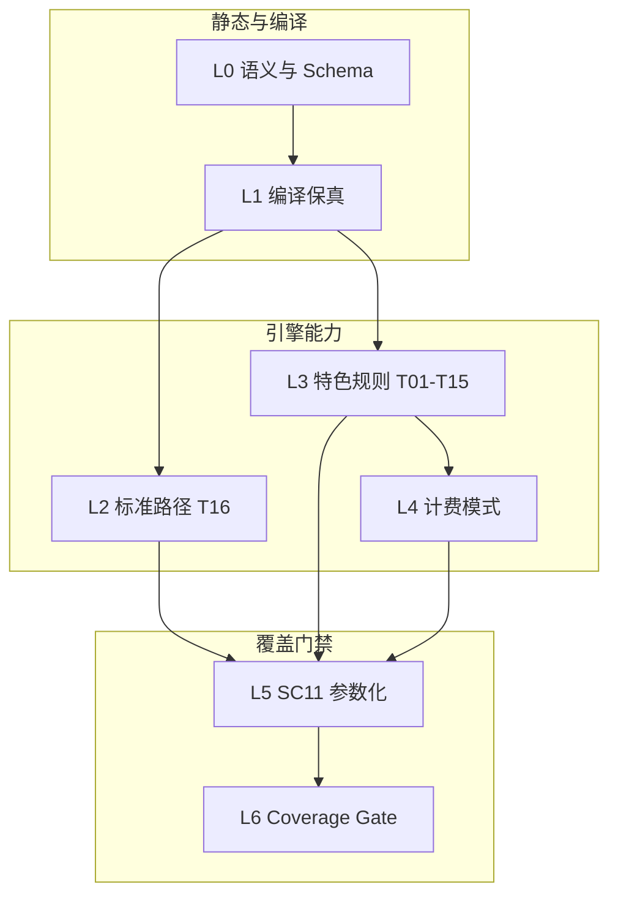

# 计价规则引擎测试验证方案

| 属性 | 值 |
|------|-----|
| 版本 | v1.0 |
| 日期 | 2026-08-14 |
| 适用范围 | `PricingEngine` / `PricingRuleCompiler` 单元测试与 fixture 验收 |
| 规则语义 SSOT | [`docs/source/特殊收费(11).xlsx`](source/特殊收费(11).xlsx) |
| 机器可读索引 | [`backend/src/test/resources/pricing-engine/rule-type-registry.json`](../backend/src/test/resources/pricing-engine/rule-type-registry.json) |
| 实现落库 | [`billing-rules-manifest.json`](../backend/src/main/resources/billing-seeds/billing-rules-manifest.json) + `phase-*-20260814.json` seed |
| 解析脚本 | [`scripts/parse_special_charge_11.py`](../scripts/parse_special_charge_11.py) |

---

## 1. 目的与范围

### 1.1 目的

本方案为**规则引擎单元测试**提供可执行、无歧义的验收规格，确保：

1. **录入语义一致**：运营在后台录入 `CustomerProductRule` 时，字段组合与 Excel 业务口径一一对应；
2. **引擎行为可证**：`PricingEngine.processRow()` 对每类 SC11 规则产出可复现的 `expectedUnitPrice`、`status`、`pricingRule`；
3. **回归可门禁**：CI 通过 `RuleTypeCoverageGateTest` 阻断「有类型、无用例」的发布。

### 1.2 真值优先级（7 月口径）

| 优先级 | 来源 | 用途 |
|--------|------|------|
| **P0** | `docs/source/特殊收费(11).xlsx` | 规则**语义**唯一真值（SSOT） |
| **P1** | 7 月 `billing-seeds` + manifest | 引擎**实现**落库真值 |
| **P1.5** | `测试用例/**/期待价格校正清单.csv` + 814/v8 严格对账 | **账单实践验证**：fixture 标注 `billingEvidence=confirmed` 须有前后账单行；无则 `valid:false`（见 [`docs/sc11-billing-evidence-audit.md`](sc11-billing-evidence-audit.md)）。严格对账月份口径为「主月份无 raw+proc 成对时按 7→5→4→8→3 自动 fallback」，字段一致性警告伴随计价偏差单列不计「多报」，详见 [`docs/对账术语与状态约定.md`](对账术语与状态约定.md) |
| **P2** | `rule-type-registry.json` | 测试索引与覆盖率门禁 |
| **不采用（作单测 golden）** | 无 confirmed 标记的合成 fixture | 不得作为 `SpecialCharge11CoverageTest` pass 条件 |
| **不采用** | 6 月旧口径（如冰城 `环钻27.5`） | 仅作文档历史说明，**不作为 pass 条件** |

> **7 月口径示例**：冰城医美环钻包 7 件/包 → `7×5.5+3 = 41.5`（v8 按件 + 无纺布加价）；10 件/2 包 → `33.5`（见 `RuleFidelityRegressionTest`）。**非** 6 月固定价 27.5。

### 1.3 覆盖范围

| 维度 | 纳入 | 不纳入 |
|------|------|--------|
| Excel Sheet | 各医院特殊收费（53 条）、通用特殊收费（22 条文本）、环氧与低温通用收费（阶梯表） | 其他未归档 Excel |
| 规则类型 | SC11-T01～T16 + T03b/T04b 子类型 | 与 SC11 无关的逐院物流/低消策略（另案） |
| 测试形态 | JUnit 参数化 + JSON fixture | E2E 导入账单、前端 UI |
| 引擎入口 | `PricingEngine.processRow(Map)` | 对账 Job 批处理（由集成测试另测） |

### 1.4 不在本方案内

- 不扫描 `测试用例/` 生成 golden；
- 不修改 `.cursor/plans/` 计划文件；
- 不替代 FRD（[`docs/7.17特色账单系统功能需求说明书.md`](7.17特色账单系统功能需求说明书.md)）中的业务流程验收。

---

## 2. 全局计价合同

所有 SC11 单测与 fixture **必须先满足**下列全局契约，再断言类型专属公式。

### 2.1 行输入契约（`processRow` 必填）

| 字段 | 类型 | 说明 |
|------|------|------|
| `hospitalName` | string | 与 manifest 医院显示名一致 |
| `type` | string | 灭菌类型标签（高温/低温/敷料包/ZSD 等） |
| `packName` | string | 包名称，关键词匹配主字段 |
| `packageMaterial` | string | 包材描述，影响袋宽检测与包装路径 |
| `instrumentCount` | int | 器械总件数 |
| `packCount` | int | 包数，默认 ≥1 |
| `unitPrice` | double | 账单原单价 |
| `totalPrice` | double | 账单原总价 |

可选：`department`、`matchedVariantId`（结构化匹配）、`customerCode`（编译阶段，非引擎入参）。

### 2.2 行输出契约

| 字段 | 合法值 | 含义 |
|------|--------|------|
| `status` | `unchanged` | 规则价与账单价一致（容差内），或保留原价且无需告警 |
| `status` | `warning` | 规则价与账单价存在需人工复核的差额 |
| `status` | `corrected` | 用户一键修正后（单测一般不直接断言） |
| `status` | `skipped` | 无法自动计价，需人工核定 |
| `expectedUnitPrice` | double / null | 引擎建议单价 |
| `correctedTotalPrice` | double | 建议总价（通常 `expectedUnitPrice × packCount`） |
| `difference` | double | `correctedTotalPrice - totalPrice` |
| `pricingRule` | string | 命中规则链描述（可含 ` + ` 连接多段） |
| `notes` | string[] | 折算、加价、模式说明等人读备注 |

### 2.3 `status` 判定规则

```
IF billingProfile.enabled == false
  → unchanged, pricingRule="特色账单已关闭", 保留原价

ELSE IF 无法识别包装/无法计价
  → skipped（或 requiresReview + 保留原价）

ELSE IF specialPrice.anyPriceMode 且 unitPrice 命中候选价
  → unchanged, difference=0

ELSE IF preserveOriginalOnMiss 且单价未变
  → unchanged（hybrid/special_only 未命中不误报 warning）

ELSE IF |difference| > 0.001 且超出 DISPLAY_PRICE_TOLERANCE(0.05)
  → warning

ELSE IF 0 元导入且规则给出期望价
  → warning

ELSE
  → unchanged
```

**单测要点**：

- 账单价与规则价相差 ≤ **0.05 元** → `unchanged`（展示精度容差）；
- `requiresReview=true` 但单价未变 → 仍 `unchanged`（避免 special_only 未命中误报）。

### 2.4 `billingPricingMode` 与未命中行为

| 模式 | `billingEnabled` | 未命中特色规则时 | `status` 期望 |
|------|------------------|------------------|---------------|
| `standard` | true | 走标准价表（高温/低温阶梯） | 按差额判定 |
| `hybrid` | true | **走标准价表**（高温/低温/敷料阶梯，含 `standardPricingOverride`） | 按差额判定 |
| `special_only` | true | **保留原价**，`pricingRule` 含 `special_only 未命中特色规则` | 通常 `unchanged` |
| 任意 | **false** | 不跑特色逻辑，原样返回 | `unchanged` |

**参考用例**：`RuleFidelityRegressionTest.guoyao2HybridUsesStandardPathWhenSpecialRuleMisses`、`jiuzhouBillingDisabledKeepsOriginalPrice`。

### 2.5 `EXTRA_FEE` 叠加契约

当基础单价已算出（标准路径或 `PRICE_PER_INSTRUMENT` / `FIXED_PRICE` 命中）后：

1. `computeSpecialExtraFees()` 扫描 `specialRules.extraFees[]`；
2. **所有**匹配规则（关键词 + 医院 + 件数区间 + 袋宽）的 `fee` **累加**到 `expectedUnitPrice`；
3. `pricingRule` 追加 ` + {ruleName}`，每条 `notes` 记录加收金额。

**典型组合（SC11-T01）**：

```
expectedUnitPrice = round(件数 × 5.5) + EXTRA_FEE(3或5)
pricingRule = "冰城环钻包按件5.5 + 冰城环钻包无纺布加价3"
```

**单测必须覆盖**：

- 仅命中 `PRICE_PER_INSTRUMENT`、未命中 `EXTRA_FEE` → 不加价；
- 两条 `EXTRA_FEE` 同关键词不同 `minInstrumentCount` 区间 → 仅命中一条；
- `skipPackaging=true` 时基础价不含包材，但 `EXTRA_FEE` 仍叠加。

### 2.6 编译优先级

`PricingRuleCompiler` 将客户 `productRules` **prepend** 到 `specialRules.*` 数组前端，客户规则优先于模板默认规则。单测编译路径应与生产一致（`PricingEngineTestSupport` 目标态）。

---

## 3. SC11 规则类型规格表（T01～T16 + 子类型）

> **列说明**：「最低用例数」指该 `sc11Type` 在 `pricing-engine/*.json` + 参数化测试中至少通过的独立场景数（含边界值）。

| ID | 语义 | Excel 示例 | 录入 Schema 必填字段 | 计算公式 | 引擎路径 | seed `ruleType` | 最低用例数 |
|----|------|-----------|---------------------|----------|----------|-----------------|-----------|
| **SC11-T01** | 器械包按件×单价 + 无纺布固定加价 | 冰城：环钻/整形 `件数*5.5＋3元`；脂充 `＋5元` | `ruleType=PRICE_PER_INSTRUMENT`：`price`, `keywords`, `skipPackaging=true`；配对 `ruleType=EXTRA_FEE`：`fee`, 同 `keywords` | `round(n×5.5) + fee`；ZSD 类型按单包件数 `n` | `findSpecialFixedPrice` → PER_INSTRUMENT；再 `computeSpecialExtraFees` | `PRICE_PER_INSTRUMENT` + `EXTRA_FEE` | **≥3** |
| **SC11-T02** | 缝合针等：固定 1 件×5.5 + 标准包材 | 电机厂 `1*5.5+2.5=8`；通用缝合针 `1*5.5＋标准包材` | `PRICE_PER_INSTRUMENT`：`price=5.5`, `keywords`, `maxInstrumentCount` 可空；或 `FIXED_PRICE`+`skipPackaging=false` | `5.5 + packaging(bagSize)` 或一口价 8 | 标准高温纸塑 + 小件固定 1 件；或 FIXED | `PRICE_PER_INSTRUMENT` / `FIXED_PRICE` | **≥2** |
| **SC11-T03** | 「双」包：按件×5.5 + 标准包材（件数少） | 电机厂「双」`＜3`：`5.5*件数＋标准包材` | 两条 `PRICE_PER_INSTRUMENT`：`maxInstrumentCount=2` 含包材；`minInstrumentCount=3` 走内层纸塑 | `n×5.5 + packaging` | `applySpecialFoldRules` 或分层 PER_INSTRUMENT | `PRICE_PER_INSTRUMENT` ×2 | **≥4** |
| **SC11-T03b** | 通用低温「双」：不论件数固定 35 | 通用 Sheet2：`固定收费35元`（市二院除外） | `FIXED_PRICE`：`price=35`, `temperature=LT`, `keywords=["双"]` | `35`（`skipPackaging=true`） | `findSpecialFixedPrice` | `FIXED_PRICE` | **≥2** |
| **SC11-T04** | 小件 N 合 1（÷5 向上取整）+ 标准包材，≤10 件 | 指针/克氏针 `包内件数/5…*5.5＋标准包材` | `FOLD`：`threshold=5`, `foldRatio=5`, `maxInstrumentCount=10`, `skipPackaging=false` | `ceil(n/5)×5.5 + packaging` | `applySpecialFoldRules` → 标准路径 + `computePackagingCharge` | `FOLD` | **≥4** |
| **SC11-T04b** | T04 变体：折算单价非 5.5 | 东北农大根管锉 `*5.6＋标准包材` | `FOLD` + `price=5.6`（覆盖默认 5.5） | `ceil(n/5)×5.6 + packaging` | `applySpecialFoldRules` + `foldUnitPriceOverride` | `FOLD` | **≥2** |
| **SC11-T05** | 小件 N 合 1，＞10 件免包材 | 通用克氏针 `＞10`：`…*5.5`（无包材字样） | `FOLD`：`minInstrumentCount=11`, `skipPackaging=true` | `ceil(n/5)×5.5` | `applySpecialFoldRules`，`foldSkipPackaging=true` | `FOLD` | **≥4** |
| **SC11-T06** | 10 合 1 + 包材（除数 10） | 祖研排针 `包内件数/10…*5.5＋标准包材` | `FOLD`：`foldRatio=10`, `maxInstrumentCount=20` | `ceil(n/10)×5.5 + packaging` | `applySpecialFoldRules` | `FOLD` | **≥2** |
| **SC11-T07** | 敷料包无纺布：按 W 码固定单价 | 棉球/纱布 `W60/W70→25, W90→30, W120/W150→35` | 引擎内置 `dressingPack.nonWoven` 阶梯；或 `FIXED_PRICE`+`keywords`+`materials` | 由包名/包材解析 W 码 → 查表 | `resolveDressingNonWovenPrice` / 敷料分支 | 模板配置 / `FIXED_PRICE` | **≥3** |
| **SC11-T08** | 包级固定单价（与件数无关） | 九州方盘 5.5；博尚 44/66；基准氩氦刀 150；康复盒 16.5/22/44 | `FIXED_PRICE`：`price`, `keywords`, `skipPackaging=true`, `skipDiscount` 按需 | `price`（`any_price` 多候选价可选） | `findSpecialFixedPrice` | `FIXED_PRICE` | **≥4** |
| **SC11-T09** | 纸塑袋宽度 ≥20cm 固定价 | 工程大学孔巾 4 元；通用敷料 `≥20CM→4元` | `FIXED_PRICE` + `bagSizeEquals` 或 `minBagSize=20` | `4` | 袋宽检测 + FIXED | `FIXED_PRICE` | **≥2** |
| **SC11-T10** | 纸塑袋宽度 ＜20cm 固定价 | 通用 `＜20CM→2.5元` | `FIXED_PRICE` + `maxBagSizeExclusive=20` | `2.5` | 袋宽检测 + FIXED | `FIXED_PRICE` | **≥2** |
| **SC11-T11** | 低温小件 ≤5 按 1 件 + 低温标准包材 | 海员胶帽、省妇幼/监狱密封件 | `FOLD`：`maxInstrumentCount=5`, `temperature=LT`, `skipPackaging=false` | `1件低温包装价(bagWidth)` | FOLD 后 `computePackagingCharge` 低温分支 | `FOLD` | **≥3** |
| **SC11-T12** | 低温/ETO：强制 1 件一包按标准低温包材 | 春语塑料管 `按一件一包…标准低温包材` | `FIXED_PRICE` 或 `PRICE_PER_INSTRUMENT`+`price=0`+强制包装；`temperature=LT` | `ltPackaging(bagSize)` | 低温 per-pack 包装路径 | `FIXED_PRICE` / 包装表 | **≥2** |
| **SC11-T13** | 在标准价基础上加收 | 总工会 `12°镜头`：`标准价上加8元`；空文本镜头行由 seed 补 | `EXTRA_FEE`：`fee=8`, `keywords`；或 `MULTIPLIER` | `standardPrice + fee` | 标准价算出后 `computeSpecialExtraFees` | `EXTRA_FEE` | **≥3** |
| **SC11-T14** | 双层袋不另收费 + 按件×5.5 | 索菲面吸针 `双层袋不额外收费，件数*5.5` | `PRICE_PER_INSTRUMENT`：`price=5.5`, `minInstrumentCount=3`, `skipPackaging=true` | `n×5.5` | PER_INSTRUMENT，跳过包装 | `PRICE_PER_INSTRUMENT` | **≥2** |
| **SC11-T15** | 不论件数一口价 | 软镜 ETO/低温各 `固定收费300元` | `FIXED_PRICE`：`price=300`, `temperature` 分 ETO/LT 两条 | `300` | `findSpecialFixedPrice` | `FIXED_PRICE` | **≥2** |
| **SC11-T16** | 环氧/低温通用件数阶梯 + 纸塑宽度 addon | Sheet3：1～33 件对称阶梯；≤10cm→22 … 无纺布/双层袋 35 | `DefaultPricingTemplate` 内置；客户一般**不录** productRule | `tierTable(n)` + `widthAddon(cm)` | 标准低温/EO 路径，`standard` 模式 | （模板） | **≥8** |

### 3.1 边界值清单（各类型至少选 1 个写入 fixture）

| 类型 | 推荐边界 |
|------|----------|
| T04/T05 | n=5,10,11,12（ceil 行为切换） |
| T06 | n=10,11,20,21 |
| T07 | W60, W90, W120, W150 |
| T11 | n=5,6 |
| T16 | n=1,5,10,21,33；袋宽 10/15/20/25/30 cm |
| T01 | n=1,7；packCount=2（ZSD 单包件数折算） |

### 3.2 Excel 未单列、但单测必须覆盖的 DB 能力

| 能力 | 最低用例数 | 说明 |
|------|-----------|------|
| `MULTIPLIER` | ≥1 | 标准价 × 倍率 |
| `ZERO_PRICE_OVERRIDE` | ≥1 | 0 元导入覆盖 |
| `billingPolicies.DISCOUNT` | ≥1 | 折后价；`skipWhenFixedPrice` |
| `departments` 条件 | ≥1 | 科室限定规则 |
| `temperature` HT/LT | ≥2 | 同关键词不同温区 |
| `exportApply` / `settlement_only` | ≥1 | 不参与 export 计价（Compiler 测试） |

---

## 4. 20 院 × 53 条映射说明

### 4.1 统计摘要

| 指标 | 值 |
|------|-----|
| 医院数 | 20 |
| 院级规则条数 | 53 |
| 通用规则文本 | 22 |
| 阶梯表条目 | 32 |
| Registry 总条目 | 107 |
| 生成命令 | `python3 scripts/parse_special_charge_11.py` |

### 4.2 院级规则一览

> 完整字段见 `rule-type-registry.json` → `entries.hospital[]`。下表为测试规划用摘要。

| # | 医院名称 | customerCode | 条数 | 主要 SC11 类型 | 备注 |
|---|----------|--------------|------|----------------|------|
| 1 | 冰城医美 | BINGCHENG-YM | 3 | T01×3 | v8 按件+加价；7 月口径 |
| 2 | 电机厂医院 | GUOYAO-2 | 5 | T02,T03,T04,T07×2 | hybrid 模式 |
| 3 | 方南南医院 | FNN-YY | 4 | T04×4 | P钻/根管锉/光滑针/机扩针 |
| 4 | 东北农业大学 | NEAU-YY | 4 | T04×3, T04b×1 | 根管锉 5.6 变体 |
| 5 | 哈尔滨工程大学 | HRB-HEU | 1 | T09 | 孔巾 ≥20cm |
| 6 | 松电慢病 | SONGDIAN-MB | 1 | T04 | 机扩针 |
| 7 | 航天风华 | HRB-HTFH | 1 | T04 | 镍钛锉 |
| 8 | 市五院（二门诊） | HRB-WY-EM | 1 | T07 | 驱血带含 W50 |
| 9 | 九州医院 | JIUZHOU-FK | 1 | T08 | 方盘 5.5；billing 关闭 |
| 10 | 博尚医院 | BOSHANG-YY | 3 | T08×3 | 旋切器 44/66 |
| 11 | 黑龙江省海员总医院（松北） | HAIYUAN-SB | 1 | T11 | 胶帽 ≤5 |
| 12 | 黑龙江省妇幼保健院（人口） | HLJ-FY-RK | 1 | T11 | 密封件 |
| 13 | 祖研-黑龙江省中医医院（南岗院区） | ZUYAN-NG | 1 | T06 | 排针 10 合 1 |
| 14 | 黑龙江省社会康复医院 | SHKF-YY | 14 | T08×14 | 多档固定 16.5/22/44 |
| 15 | 哈尔滨市道里区妇幼保健院 | DL-FUCHAN | 2 | T04×2 | 棉花针/洗髓针 |
| 16 | 春语医疗美容医院 | CHUNYU-YL | 1 | T12 | 塑料管低温 |
| 17 | 黑龙江总工会医院 | HL-ZGH | 5 | T13×5 | **规则文本为空**，语义由 seed 补 |
| 18 | 哈尔滨基准生物有限公司 | JZSW-BIO | 2 | T08×2 | 氩氦刀 150（LT+ETO） |
| 19 | 索菲医疗美容门诊 | SUOFEI-YL | 1 | T14 | 面吸针 ≥3 |
| 20 | 省监狱管理局医院 | HLJ-JYGLJ-YY | 1 | T11 | 密封件 |

### 4.3 通用规则（Sheet2）与阶梯表（Sheet3）

**通用 22 条**（`entries.generic[]`）：12 组关键词，每组含 ≤10（T04）与 ＞10（T05）分支；外加 T02 缝合针、T03b 双低温、T15 软镜×2、T09/T10 纸塑宽度。

**阶梯 32 条**（`entries.tier[]`）：SC11-T16，含 `lt_eo_piece_tier_left/right`（1～33 件）与 `paper_plastic_width_addon`（宽度段 + 无纺布/双层袋）。

### 4.4 Registry 维护约定

1. Excel 变更 → 更新 `docs/source/特殊收费(11).xlsx` → 重跑解析脚本；
2. `sc11Type` 由 `classify_rule()` 启发式分类，新增句式需同步更新脚本；
3. `hospitalToCustomerCode` 与 manifest `customers.*.code` 必须一致，否则院级 fixture 无法 `compileForCustomerCode`；
4. CI 校验：`RuleTypeCoverageGateTest` 读取 `sc11TypeCounts` 与 fixture 分布比对。

---

## 5. Excel → 引擎对照表

### 5.1 列 → 行输入映射

| Excel 列（各医院 Sheet） | `processRow` 字段 | 转换说明 |
|--------------------------|-------------------|----------|
| 医院名称 | `hospitalName` | 与 registry `hospitalName` 一致 |
| 包名称（或包名中特殊信息） | `packName` | 关键词匹配源 |
| 包类型 | `type` / `packageMaterial` | 「器械包」→ `type=器械包(ZSD)`；「敷料包」→ 敷料路径 |
| 包内器械件数 | 断言边界 | 写入 fixture `instrumentCount`；对应 `min/maxInstrumentCount` |
| 收费规则 | 期望公式 | 解析为 `expect.formula` 与 `expectedUnitPrice` |
| 备注 | 测试说明 | 进入 fixture `note` |

### 5.2 语义 → seed → 编译 JSON 路径

| Excel 语义片段 | seed `ruleType` | 编译后 `rules` 路径 | 引擎处理函数 |
|----------------|-----------------|---------------------|--------------|
| `件数*5.5＋N元` | PRICE_PER_INSTRUMENT + EXTRA_FEE | `specialRules.fixedPrices[]` + `extraFees[]` | `findSpecialFixedPrice` + `computeSpecialExtraFees` |
| `1*5.5` / 固定收 X 元 | FIXED_PRICE / PRICE_PER_INSTRUMENT | `specialRules.fixedPrices[]` | `findSpecialFixedPrice` |
| `包内件数/5…*5.5` | FOLD | `specialRules.foldRules[]` | `applySpecialFoldRules` |
| `标准价上加N` | EXTRA_FEE | `specialRules.extraFees[]` | `computeSpecialExtraFees` |
| `标准包材价格` | （模板） | `packaging.*` / `DefaultPricingTemplate` | `computePackagingCharge` |
| `W60/W90…` 敷料 | （模板） | `dressingPack.nonWoven` | 敷料专用分支 |
| 1～33 件阶梯 | （模板） | `lowTemp.*` / `eo.*` | 标准计价主路径 |
| 纸塑袋宽度 | FIXED + bagSize | `specialRules.fixedPrices[]` | `detectBagSize` + FIXED |

### 5.3 公式速查

| 语义 | 公式 | 示例 |
|------|------|------|
| 按件 + 加价 | `round(n×p) + f` | 冰城 7 件/包：41.5 |
| 5 合 1 含包材 | `ceil(n/5)×p + pkg` | 12 件指针：3×5.5+pkg |
| 5 合 1 免包材 | `ceil(n/5)×p` | 12 件克氏针>10：3×5.5 |
| 10 合 1 | `ceil(n/10)×p + pkg` | 祖研 15 件排针：2×5.5+pkg |
| 低温 ≤5 按 1 件 | `fold→1 + ltPkg` | 胶帽 4 件 |
| 固定价 | `price` | 方盘 5.5 |
| 阶梯 | `tier(n)` | 低温 7 件：132 |

---

## 6. 测试分层（L0～L6）



| 层级 | 测试类（规划名） | 职责 | 依赖资源 |
|------|------------------|------|----------|
| **L0** | `RuleEntrySemanticsTest` | manifest/seed 字段完整；`ruleType` 合法；T13 空文本医院有 seed 兜底 | manifest, registry |
| **L1** | `PricingRuleCompilerSemanticTest` | `EXTRA_FEE`/`FOLD` 的 min/max、`temperature` 编译后不丢失；prepend 顺序 | DB 或 manifest mock |
| **L2** | `PricingEngineStandardPathTest` | SC11-T16 阶梯、纸塑宽度 addon、高温标准价 | `DefaultPricingTemplate` |
| **L3** | `PricingEngineSpecialRulesTest` | T01～T15 各取代表场景；FOLD ceil；`any_price`；MULTIPLIER | fixture JSON |
| **L4** | `PricingEngineBillingModeTest` | hybrid/special_only 未命中；`billingEnabled=false`；容差 0.05 | 现有 `RuleFidelityRegressionTest` 扩展 |
| **L5** | `SpecialCharge11CoverageTest` | **参数化**：registry 每条院级规则 ≥1 场景；通用规则每组 ≥1 | `rule-type-registry.json` + fixtures |
| **L6** | `RuleTypeCoverageGateTest` | 每个 `sc11Type` 在 L3/L5 中 ≥ 最低用例数且全绿 | registry `sc11TypeCounts` |

**与现有测试关系**：

- 保留 `RuleFidelityRegressionTest`、`RuleFidelityExcelGoldenTest` 作 seed 回归；
- 新套件与之**互补**，不替代 S5 纠错场景（`PricingEngineS5ErrorCorrectionTest`）。

### 6.1 Fixture 文件规范

路径：`backend/src/test/resources/pricing-engine/{sc11Type}/{id}.json`

```json
{
  "id": "sc11_t01_bingcheng_huanzuan_5pc",
  "sc11Type": "SC11-T01",
  "source": "特殊收费(11).xlsx#冰城医美#①",
  "registryId": "hospital_001",
  "customerCode": "BINGCHENG-YM",
  "input": {
    "hospitalName": "哈尔滨冰城医疗美容医院",
    "type": "器械包(ZSD)",
    "packName": "环钻包",
    "packageMaterial": "无纺布-90×90-50g",
    "instrumentCount": 5,
    "packCount": 1,
    "unitPrice": 27.5,
    "totalPrice": 27.5
  },
  "expect": {
    "expectedUnitPrice": 30.5,
    "formula": "5*5.5+3",
    "status": "warning",
    "pricingRuleContains": ["冰城环钻包按件5.5", "无纺布加价3"]
  }
}
```

---

## 7. 验收标准

### 7.1 文档与资产

| # | 验收项 | 通过条件 |
|---|--------|----------|
| D1 | 本方案落地 | `docs/计价规则引擎测试验证方案.md` 含第 1～7 章 |
| D2 | Excel 归档 | `docs/source/特殊收费(11).xlsx` 存在且可解析 |
| D3 | Registry 同步 | `rule-type-registry.json` 计数：53+22+32=107 |
| D4 | 无未分类 | `sc11TypeCounts` 无 `SC11-UNCLASSIFIED` |

### 7.2 测试覆盖

| # | 验收项 | 通过条件 |
|---|--------|----------|
| T1 | SC11 全类型 | T01～T16 + T03b/T04b 均有 ≥ 最低用例数 |
| T2 | 20 院映射 | 每家医院 ≥1 条 L5 参数化用例 |
| T3 | 全局合同 | L4 覆盖 hybrid/special_only/billingEnabled/EXTRA 叠加/容差 |
| T4 | 7 月口径 | 冰城 T01：7 件/包 = **41.5**；10 件/2 包 = **33.5**；均 **非** 6 月 27.5 |
| T5 | Coverage Gate | `RuleTypeCoverageGateTest` 绿 |
| T6 | 回归不回归 | 现有 `RuleFidelity*`、`PricingEngineTest` 仍绿 |

### 7.3 CI 命令

```bash
# 解析刷新
python3 scripts/parse_special_charge_11.py

# 引擎测试套件
cd backend && mvn test -Dtest=SpecialCharge11*,RuleTypeCoverage*,PricingEngine*,RuleFidelity*,PricingRuleCompiler*
```

### 7.4 发布检查单（人工）

- [ ] Excel 变更已重跑 `parse_special_charge_11.py`
- [ ] 受影响 `customerCode` 的 seed 已更新且 manifest 已合并
- [ ] 新增 SC11 句式已更新 `classify_rule()` 并补充 fixture
- [ ] 总工会 T13 空文本规则已在 seed 中补全 `EXTRA_FEE` 或 `MULTIPLIER`
- [ ] 产品/运营确认 7 月口径与 Excel 一致

---

## 附录 A：版本历史

| 版本 | 日期 | 说明 |
|------|------|------|
| v1.0 | 2026-08-14 | 首版：基于特殊收费(11) 全量类型与 7 月 manifest 口径 |

## 附录 B：相关文件索引

| 文件 | 作用 |
|------|------|
| `PricingEngine.java` | 计价唯一逻辑源 |
| `PricingRuleCompiler.java` | DB seed → 引擎 JSON |
| `BillingConditionEvaluator.java` | 条件匹配 |
| `DefaultPricingTemplate.java` | T16 标准阶梯模板 |
| `SaveCustomerProductRuleRequest.java` | 后台录入 Schema |
| `phase-special-v8-rules-20260814.json` | v8 规则合并 seed |
| `RuleFidelityTestSupport.java` | 测试编译支撑（待升级 `PricingEngineTestSupport`） |
