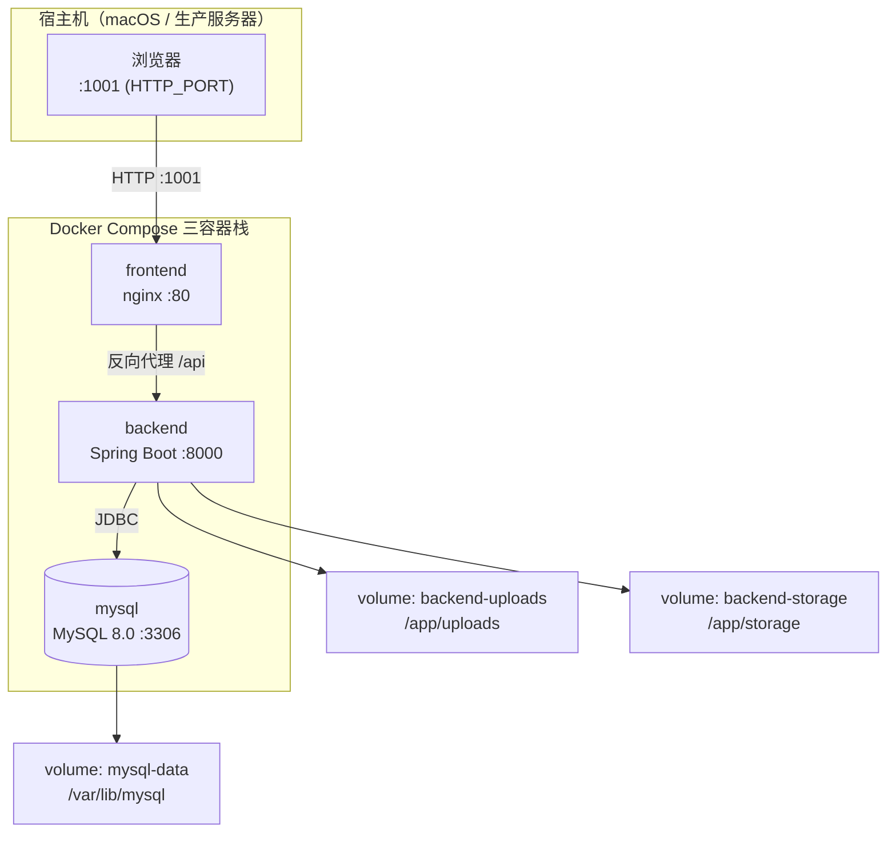
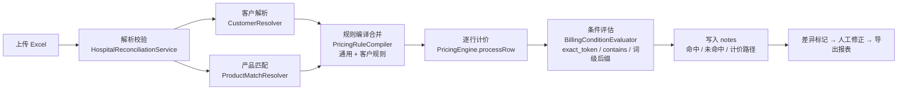

# 医院消毒灭菌计费管理系统 · 项目交接文档

> 面向 22 家医院特殊计价客户的灭菌计费规则引擎与对账平台。本文档面向即将接手的同事，说明项目现状、核心文件路径、调试方法与历史数据存储位置，帮助你快速上手并进行调整。
>
> - 技术栈：Spring Boot 3.2.5 + Java 17 / Vue 3 + Vite + TypeScript / MySQL 8.0 / Docker Compose
> - 交接日期：2026-08-30
> - 仓库快照：Git `main@3195a7f5`

## 目录

1. [项目概览与背景](#01项目概览与背景)
2. [技术栈](#02技术栈)
3. [整体架构与运行拓扑](#03整体架构与运行拓扑)
4. [目录结构总览](#04目录结构总览)
5. [核心文件路径](#05核心文件路径)
6. [核心业务链路](#06核心业务链路)
7. [本地调试方法](#07本地调试方法)
8. [历史记录与数据存储位置](#08历史记录与数据存储位置)
9. [数据库与迁移机制](#09数据库与迁移机制)
10. [部署与升级](#10部署与升级)
11. [测试与验证](#11测试与验证)
12. [常见任务操作手册](#12常见任务操作手册)
13. [易踩坑与注意事项](#13易踩坑与注意事项)

---

## 01 项目概览与背景

这是一套为医院消毒供应中心（CSSD）提供灭菌计费与对账的垂直业务系统。核心工作是把医院上传的灭菌发货 Excel 明细，按每家医院各自的「特殊计价规则」重新计算单价与总价，与原始金额比对后输出差异，供财务复核并导出账单、结款函等报表。

系统的业务根基是**双规则体系**：一套**通用计价规则**（`hospital_pricing_rule`，对所有医院生效）叠加一套**客户特殊计价规则**（`customer_product_rule`，仅对指定医院生效）。当前生产环境收敛到**恰好 22 家特殊计价医院**，其余医院统一走通用计价规则。计价引擎在运行时把两层规则合并后逐行结算。

**核心能力**

- Excel 多文件、多 Sheet 解析与表头自动识别
- 高温/低温（HT/LT）灭菌分流与袋型识别
- 小件折算、阶梯套价、折扣、包材费、运费分摊
- 客户特殊规则的可视化配置与冲突检测
- 账单/结款函/分科室汇总等多种导出

**关键业务约束**

- 特殊计价客户 = 22 家，且全部启用特色账单（`billing_enabled=1`）
- 未解析 / 未启用客户一律走通用计价，不再提示「特色账单已关闭」
- 所有医院统一为 `hybrid` 计价模式
- 计价结果写入 `notes` 字段，逐条记录命中/未命中与计价路径，供追溯

## 02 技术栈

| 层 | 技术 | 版本 / 说明 |
|---|---|---|
| 后端语言 | Java | **17**（JDK 26 会编译失败，见 §13） |
| 后端框架 | Spring Boot | 3.2.5（Web / Security 6.x） |
| 持久层 | MyBatis | 3.0.3，Mapper XML 位于 `resources/mapper/` |
| 数据库 | MySQL | 8.0，库名 `hospital`（Docker）/ `hospital_backend`（IDE dev） |
| 认证 | JWT（jjwt） | 0.12.5，双令牌 access + refresh |
| Excel | Apache POI | 5.2.5 |
| API 文档 | SpringDoc OpenAPI | 2.5.0，Swagger 于 `/docs` |
| 前端框架 | Vue 3 + Vite 7 | TypeScript，组合式 API |
| UI 库 | Element Plus | 2.11.4 |
| 样式 | Tailwind CSS 4 + SCSS | — |
| 国际化 | vue-i18n | 语言包在 `src/locales/langs/` |
| 状态 / 路由 | Pinia + vue-router | 动态菜单由后端驱动 |
| 构建 / 部署 | Maven + pnpm + Docker | 三容器栈，见 §3 |

## 03 整体架构与运行拓扑

系统是一个**三容器栈**，由 `docker-compose.yml` 编排：`mysql`（数据库）、`backend`（Spring Boot 后端）、`frontend`（nginx 托管 Vue 静态产物）。后端通过 JDBC 连 MySQL，前端静态资源在镜像构建阶段打包进 nginx，通过反代把 `/api` 转发给后端。



| 容器 | 容器内端口 | 宿主机端口（环境变量） | 镜像构建来源 |
|---|---|---|---|
| frontend | 80 | `${HTTP_PORT:-1001}` | `frontend/Dockerfile` |
| backend | 8000 | `${BACKEND_PORT:-8088}` | `backend/Dockerfile` |
| mysql | 3306 | 默认不暴露（dev 用 `MYSQL_PUBLISH_PORT`） | `mysql:8.0` 官方镜像 |

## 04 目录结构总览

仓库根目录 `hospital_longservice/` 下，业务代码集中在 `backend/` 与 `frontend/`，其余为文档、脚本与测试基线。

```
hospital_longservice/
├── backend/                      # Spring Boot 后端（Maven）
│   ├── src/main/java/com/hospital/backend/
│   ├── src/main/resources/       # application*.yml、schema.sql、mapper/、db/、billing-seeds/
│   ├── src/test/java/            # 单元测试
│   ├── scripts/generate_golden_rows.py
│   └── Dockerfile / pom.xml / docker-entrypoint.sh
├── frontend/                     # Vue 3 前端（pnpm）
│   ├── src/views/  src/components/  src/api/  src/router/  src/store/
│   ├── src/locales/langs/        # zh.json / en.json 国际化
│   ├── src/types/api/api.d.ts    # 全局类型
│   └── Dockerfile / vite.config.ts / package.json
├── docs/                         # 需求文档、UAT 清单、逐院需求登记表（本文档也在此）
├── deploy/                       # 生产部署脚本、SQL、备份、恢复手册
├── scripts/                      # 大量 Python 对账/导入/校验脚本
├── system_docs/                  # 项目规划、升级方案、导入方案
├── 测试用例/                     # golden rows、对账基线、导出样例
├── bin/hospital-cli              # 统一 CLI 入口
├── docker-compose.yml            # 本地/开发三容器栈
├── docker-compose.dev.yml        # 宿主机直连 MySQL
├── docker-compose.prod.yml       # 生产（预构建镜像）
└── .env.example / DEPLOY.md / README.md
```

## 05 核心文件路径

掌握下面这些文件，就能定位绝大部分「计价不对 / 规则不生效」的问题。路径均为相对 `backend/src/main/java/com/hospital/backend/` 或 `frontend/src/`。

### 后端核心（计价引擎链路）

| 文件 | 职责 |
|---|---|
| `service/PricingEngine.java` | **灭菌计费规则引擎**，逐行结算的唯一入口 `processRow()`。高温/低温分流、袋型识别、阶梯套价、小件折算、折扣都在这里。 |
| `service/BillingConditionEvaluator.java` | **规则条件评估**。关键词匹配（`exact_token`/`contains`/词级 `@contains`、`@exact` 后缀）、token 边界、袋型/温度/件数/科室判断。 |
| `service/PricingRuleCompiler.java` | **规则编译**，把 DB 里的通用规则 + 客户规则合并成引擎可执行的 `rules_json`。 |
| `service/DefaultPricingTemplate.java` | **通用规则模板**（内置硬编码规则）。含「车针」「克氏针」「银质针」等小件关键词与默认计价配置。 |
| `service/CustomerResolver.java` | 按医院名/别名解析出对应的特殊计价客户。 |
| `service/ProductMatchResolver.java` | 把包名匹配到产品/变体，输出结构化产品与计价路径（如 `SMALL_ITEM`）。 |
| `service/BillingPolicyApplier.java` | 应用客户计费策略（折扣、路径覆盖等）。 |
| `service/RowSplitter.java` | 行拆分（如「克氏针」按数量拆包）。 |
| `service/HospitalReconciliationService.java` | **对账核心业务**：上传、解析、处理、分页查询、导出。 |
| `service/impl/CustomerServiceImpl.java` | 客户规则 CRUD，含 `keywordMatchMode` 归一化。 |

### 后端配置与迁移（种子/建表）

| 文件 | 职责 |
|---|---|
| `config/SchemaMigrationRunner.java` | Java 启动迁移（补列），与 SQL 清单并存。 |
| `config/MasterDataInitializer.java` | 启动时确保客户种子数据（已去除 22 家之外的客户）。 |
| `config/HardcodedRulesMigrationRunner.java` | 硬编码规则的落库迁移。 |
| `config/BillingSeedMigrationRunner.java` | 特色账单种子迁移，含 `STRICT_KEEP_CODES`（22 家白名单）。 |
| `config/BillingRulesManifestReconciler.java` | 规则清单新鲜度校验（hash 比对）。 |
| `resources/schema.sql` | 空库首次建表 DDL。 |
| `resources/db/migrate_manifest.txt` + `db/*.sql` | 增量迁移清单与 SQL（幂等）。 |
| `resources/billing-seeds/*.json` | 历史批次计费规则种子（大量 phase-*.json）。 |

### 前端核心

| 文件 | 职责 |
|---|---|
| `views/hospital/pricing-rules/index.vue` | **计价规则配置页**，含「小件识别面板」（关键词 + 默认匹配模式）。 |
| `views/hospital/reconciliation/index.vue` | **对账页**：上传、处理、异常标记、导出。 |
| `views/master-data/customers/index.vue` | 特殊计价客户管理。 |
| `components/business/customers/CustomerProductRuleForm.vue` | 客户规则表单（含 FOLD 规则、`keywordMatchMode` 下拉）。 |
| `components/business/pricing-rules/*.vue` | 规则字段组件（关键词、数字、袋型表、阶梯价等）。 |
| `api/hospital/pricingRules.ts` | 计价规则 API 与 `keywordMatchMode` 归一化。 |
| `utils/customerProductRule.ts` | 客户规则草稿/保存/记录的转换。 |
| `utils/reconciliationBillingNotes.ts` / `reconciliationPricingPath.ts` | 对账计价说明与路径的展示文案。 |
| `types/api/api.d.ts` | 全局 TypeScript 类型（含 `keywordMatchMode` 字段）。 |
| `locales/langs/zh.json` / `en.json` | 国际化文案。 |

## 06 核心业务链路

一次对账的完整生命周期：上传 → 解析 → 客户解析与产品匹配 → 规则编译合并 → 逐行计价 → 差异标记 → 人工修正 → 导出。



### 关键词匹配模式（重要）

小件计价的关键词匹配支持三种粒度，这是近期功能升级的核心，接手后理解这一点能少走很多弯路：

| 写法 | 含义 |
|---|---|
| `车针`（无后缀） | 沿用规则「默认匹配模式」 |
| `车针@contains` | 该词含关键词即触发（宽松子串包含） |
| `车针@exact` / `车针@exact_token` | 该词严格对齐（精确 token 边界，两侧须为串首/串尾或非中文字符） |

默认匹配模式为 `exact_token`（严格对齐）。「车针」作为通用小件规则已被单独拆出并设为 `contains`，因此「车针组件-5/个」能命中「车针小件5合1」，而「克氏针折弯钳」不会命中「通用小件5合1」。实现位于 `BillingConditionEvaluator.parseKeywordList()` 与 `matchesKeywordsByMode()`。

## 07 本地调试方法

### 一键起完整栈

```bash
# 首次需准备环境变量
cp .env.example .env   # 填写 MYSQL_*、APP_JWT_SECRET、HTTP_PORT 等
docker compose up -d --build
# 查看状态与日志
docker compose ps
docker compose logs -f backend
docker compose logs -f frontend
```

起好后：前端 `http://localhost:1001`，后端健康检查 `http://localhost:8088/api/v1/base/health`，Swagger `http://localhost:8088/docs`。

### 后端本地开发（IDE）

```bash
# 关键：必须 JDK 17
export JAVA_HOME=/opt/homebrew/opt/openjdk@17/libexec/openjdk.jdk/Contents/Home
cd backend
mvn spring-boot:run          # 或 mvn clean package -DskipTests 后 java -jar
# 跑单个测试
mvn test -Dtest=KeywordMatchModeTest
# 仓库内也提供了切 JDK 的脚本 scripts/use_jdk17.sh
```

### 前端本地开发

```bash
cd frontend
pnpm install
pnpm dev                     # Vite 热更新，端口见 vite.config.ts
```

### CLI 验证（替代逐页点检）

```bash
./bin/hospital-cli smoke            # 冒烟
./bin/hospital-cli deploy-check     # 部署 + billing 计数
./bin/hospital-cli s8 -H 太平人民医院 --mode direct --api http://HOST:8853
./bin/hospital-cli verify --profile prod --level full --hospitals 太平,工程大学
```

## 08 历史记录与数据存储位置

接手后排查「这条数据是怎么来的」时，按下面几处查找。

### 数据库（运行时业务数据）

| 表 | 存什么 |
|---|---|
| `hospital_reconciliation_job` | 每次对账任务（上传批次）的元信息。 |
| `hospital_reconciliation_row` | **对账明细行**，含原始金额、计价结果、`notes`、异常标记，是历史对账的核心。 |
| `hospital_pricing_rule` | 通用计价规则（含 JSON 化的规则体）。 |
| `hospital_pricing_rule_revision` | 通用规则的**历史版本**。 |
| `billing_rule_change_log` | **规则变更日志**（谁在何时改了什么）。 |
| `customer_product_rule` | 客户特殊计价规则（含 `keyword_match_mode` 列）。 |
| `customer` / `customer_alias` | 特殊计价客户及别名。 |
| `product` / `product_variant` / `product_match_rule` | 产品主数据与匹配规则。 |
| `hospital_reconciliation_export_log` | 导出操作日志。 |
| `sys_user` / `sys_role` / `sys_menu` | 用户、角色、菜单权限。 |

完整建表清单见 `backend/src/main/resources/schema.sql` 与 `backend/src/main/resources/db/schema_*.sql`。

### 文件存储（Docker volumes）

| Volume | 容器内路径 | 内容 |
|---|---|---|
| `mysql-data` | `/var/lib/mysql` | MySQL 数据文件 |
| `backend-uploads` | `/app/uploads` | 用户上传的对账 Excel 等 |
| `backend-storage` | `/app/storage` | 后端生成的导出文件等 |

### 版本历史（Git）与备份

- **Git 历史**：仓库当前 `main` 分支，最新提交 `3195a7f5`。关键节点：`3195a7f5` 收敛 22 家客户、`74134565` 未启用统一走通用计价、`eb99340a` 审计扩展。
- **规则种子**：`backend/src/main/resources/billing-seeds/*.json` 保存了历次批次规则的 JSON 快照。
- **备份**：`deploy/backups/` 下保存过 `hospital-pricing-rule-prod-backup-*.json` 等规则备份；MySQL 全量备份用 `docker exec hospital-mysql mysqldump ...`（见 DEPLOY.md §6）。
- **文档**：`docs/` 含需求说明书、UAT 清单、`docs/逐院需求登记表/` 逐院需求明细；`system_docs/` 含升级方案与导入方案。
- **测试基线**：`测试用例/` 含 golden rows（`job*_golden.xlsx` 等）与对账基线 JSON，是「系统计价正确性」的参照。

### 测试路径约定（重要，防混淆）

项目有两套**不同**的验收口径，详见 [`docs/测试路径约定.md`](测试路径约定.md)（对 AI 助手由 `.cursor/rules/billing-test-paths.mdc` 强制生效）：

| 路径 | 用途 | 医院清单 | 材料/账期 | 入口 |
|------|------|----------|-----------|------|
| **A. 特殊计价医院逐家严格测试** | 验证「算价与客户处理后 Excel 是否一致」、升级前后能力对比 | `STRICT_KEEP_CODES` 22 家 + 正式新引入院（当前 +4） | 锁定 2026-08-27 基线报告的 raw+proc 账期（`测试用例/特殊计价严格测试-材料锁定.json`） | `scripts/special_v8_strict_excel_audit.py` |
| **B. 规则/billing-seed 同步检查** | 验证「种子/规则是否完整落库、与 manifest 一致」 | `verify-billing-seed.sh` EXPECTED 26 + 铂康参考 42 | 不涉及 Excel 对账材料 | `verify-billing-seed.sh`、`hospital-cli rules compare` |

**禁止混用**：路径 B 的 26 院清单（含二院、省医院等铂康扩展院）不是特殊计价严格测试的对象；`billing-seed-26*` 报告不能作为路径 A 的能力结论。


## 09 数据库与迁移机制

数据库迁移分三层，新增字段时要按下面顺序操作：

| 层级 | 机制 | 说明 |
|---|---|---|
| 初始化 | `schema.sql` → `/docker-entrypoint-initdb.d/` | 仅空数据卷首次启动时建表 |
| SQL 清单 | `db/migrate_manifest.txt` + entrypoint | 容器每次启动按清单执行（幂等） |
| Java | `SchemaMigrationRunner` | 启动后补列，与 SQL 清单并存 |

新增增量 SQL 的步骤：文件放到 `backend/src/main/resources/db/`（命名 `schema_*migration*.sql`）→ 按顺序写入 `migrate_manifest.txt` → 本地校验 `bash scripts/check-migrate-manifest.sh` → 重启 backend。调试跳过 SQL 清单可用 `SKIP_DB_MIGRATE=1`（勿用于生产）。

## 10 部署与升级

### 本地/开发（源码 build）

```bash
git pull
docker compose up -d --build --no-deps backend frontend
# 改了 frontend 源码必须 rebuild（静态资源在 build 阶段打入，不能只 restart）
docker compose build frontend && docker compose up -d frontend
```

### 生产（预构建镜像）

```bash
docker compose -f docker-compose.prod.yml pull
docker compose -f docker-compose.prod.yml up -d mysql
docker compose -f docker-compose.prod.yml up -d --no-deps --force-recreate backend
docker compose -f docker-compose.prod.yml up -d --no-deps --force-recreate frontend
```

生产进库：`docker exec -it hospital-mysql mysql -u root -p`。生产不暴露 3306。更多细节见根目录 `DEPLOY.md` 与 `deploy/README.md`、`deploy/PRODUCTION-RECOVERY.md`。

## 11 测试与验证

- **后端单测**：`cd backend && mvn test`（JDK 17）。关注 `KeywordMatchModeTest`、`GenericSmallItemFoldPricingTest` 等计价相关用例。
- **对账验证**：`./bin/hospital-cli verify` 或 `deploy/run-prod-verify.sh full`。
- **已知基线**：`NeedleKeywordExactMatchTest` 中有 **8 个先前已存在的失败**（改动前就存在，非回归），接手后评估是否需要修复。
- **前端类型检查**：`cd frontend && pnpm build`（存在一些历史 `vue-tsc` 告警，与业务无关）。

## 12 常见任务操作手册

### 给某个关键词改成「含词即触发」

后端无需改代码：在「计价规则」页的小件识别面板，或「特殊计价客户」的规则表单里，直接在关键词后加后缀即可，例如把 `车针` 写成 `车针@contains`；也可在「默认匹配模式」下拉把整条规则切到 `contains`。若改动通用内置规则（如 `DefaultPricingTemplate.java`），需同步更新对应测试并重建 backend 镜像。

### 新增一家特殊计价医院

在「特殊计价客户」管理页录入客户 + 规则，并确认其 `billing_enabled` 开启。注意生产约束是特殊客户恰好 22 家，新增前需与业务确认是否替换现有某家。

### 排查「某行计价不对」

先看该行 `notes` 字段的计价路径与命中信息 → 对照 `PricingEngine.processRow()` 与 `BillingConditionEvaluator` 的匹配逻辑 → 必要时用 `PricingEngine` 单测复现 → 用 `./bin/hospital-cli s4/s8` 定点验证。

### 新增数据库字段

按 §9 的三层迁移机制：写增量 SQL → 加入 `migrate_manifest.txt` → 实体/Mapper/DTO 同步 → 前端类型与表单同步 → 本地 `check-migrate-manifest.sh` 校验 → 重启 backend。

## 13 易踩坑与注意事项

> ⚠️ **JDK 版本**
> 系统要求 **Java 17**，用系统默认的 JDK 26 编译会直接失败。始终通过 `JAVA_HOME` 或 `scripts/use_jdk17.sh` 切换到 17。

> ⚠️ **前端改源码要 rebuild 镜像**
> 前端静态资源在镜像构建阶段打包进 nginx，`docker compose restart frontend` 不会生效，必须 `docker compose build frontend && docker compose up -d frontend`。

> ⚠️ **特殊客户必须是 22 家**
> 生产已收敛到恰好 22 家特殊计价医院、全部 `billing_enabled=1`；未解析/未启用客户统一走通用计价。不要随意恢复会「复活」被删客户的旧种子（`MasterDataInitializer`/`HardcodedRulesMigrationRunner` 已清理非 22 家来源）。

> ℹ️ **关键词匹配不是一刀切**
> 单个关键词可通过 `@contains`/`@exact` 后缀覆盖规则级默认模式，同一文本框内可混排。修改匹配逻辑时务必同步 `KeywordMatchModeTest`。

> ℹ️ **测试基线**
> `NeedleKeywordExactMatchTest` 的 8 个失败是历史遗留，勿当作本次改动引入的回归。

---

*本文档为项目交接文档，内容基于 2026-08-30 的仓库快照（Git `main@3195a7f5`）。所有路径均为仓库内相对路径；涉及环境变量的默认值（端口、密码等）以 `.env` 实际配置为准。*
