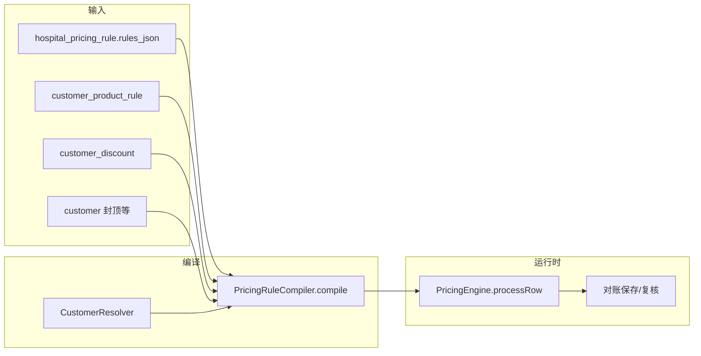

# 特色账单升级开发规划

> 面向研发与产品 | 编制日期：2026-07-13  
> 需求来源：[`特色账单规则.txt`](../../特色账单规则.txt)（L1–L56）  
> 关联文档：[`system_docs/客户升级计划说明.md`](../system_docs/客户升级计划说明.md)、[`system_docs/development-todo.md`](../system_docs/development-todo.md)

---

## 一、文档目的

本文档在「客户主数据 + `customer_product_rule` + `PricingRuleCompiler` + `PricingEngine`」现有架构基础上，给出**可支撑任意医院配置全部特色账单规则类型**的升级路线，包括：

- 现状与缺口对照（逐院、逐能力）
- 目标技术方案（数据模型、引擎、编译器、前端）
- 分阶段开发任务、接口、表结构、验收标准
- 风险、兼容性与本阶段不做项

**不在本文档范围：** 结款函分温导出、器械量表月度审计（单独立项，见 Phase 5）。

**业务约定（2026-07-13）：** 一家医院的多个院区（如省二院南岗、松北）**按两家独立医院处理**——在客户管理中分别建档、分别配置折扣/特色规则/物流费，**不开发院区/分院区匹配、院区策略等额外能力**。

---

## 二、业务目标

| 编号 | 需求（来自需求文档） | 优先级 |
|------|----------------------|--------|
| G1 | 任意医院可在客户管理中**显式启用**「特色账单」模式 | P0 |
| G2 | 每家医院可配置折扣（含后续分温折扣） | P0 |
| G3 | 按关键词/包材/袋型/件数等配置计费规则 | P0（已基本具备，需增强） |
| G4 | **同一商品多报价**：账单价与任一报价折算后一致即通过；详情提示命中哪条报价 | P0 |
| G5 | 覆盖需求清单医院 A–I 的全部**本阶段约定**规则组合 | P0 |
| G6 | 规则配置「所见即所算」，减少隐式逻辑与批量保存丢规则 | P1 |

**本阶段明确不做（需求文档已标注）：**

- 单行内「监测/检测」等附加服务的单独计价（200 元报价的构成拆解）
- 小腔包/工具包多报价的「内容差异」语义（仅记录多报价均可接受）
- 结款函高低温分栏导出
- 九州妇科医院：物流费减免、最低消费 3000（Phase 4 再评估）
- 哈尔滨工业大学医院「口腔类」（语义不清，暂缓）
- 呼兰中医「低效 10000」（待业务确认后纳入 Phase 4）

---

## 三、现状架构（基线）

### 3.1 数据流



### 3.2 已具备能力（2026-07-13 基线）

| 能力 | 实现位置 | 说明 |
|------|----------|------|
| 客户解析 | `CustomerResolver` | 规范名 + 别名 contains/exact |
| 特色规则类型 | `customer_product_rule` | FIXED_PRICE、PRICE_PER_INSTRUMENT、MULTIPLIER、FOLD、EXTRA_FEE |
| 规则编译 | `PricingRuleCompiler` | prepend 到 `specialRules.*`，客户优先于通用 JSON |
| 匹配维度 | `PricingEngine` | keywords（子串 OR）、materials（fixed 时）、袋型、件数区间、productId |
| 客户折扣 | `customerOverrides.discountRate` | **仅第一条**有效折扣 |
| 客户管理 UI | `customers/index.vue` + 弹窗 | 特色账单规则列表 + 弹窗 CRUD |
| 产品变体表 | `product_variant` | **DB 有，编译/引擎/UI 未贯通** |

### 3.3 引擎计价顺序（摘要）

固定价预匹配 → fold 折算 → needle/小件 → 基础高/低温阶梯 → 倍率 → 加收 → 包装 → 客户折扣 → 差额判定。

**关键互斥：** 命中固定价后跳过 fold、基础阶梯、倍率；加收可叠加；折扣受 `skipHospitalDiscount` 控制。

### 3.4 已知缺陷（必须在升级中修复）

1. **`saveProductRules` 批量保存**：无 `productId` 的 FOLD/EXTRA_FEE 会被 **silent skip**（`CustomerServiceImpl` L217–225），与单条 API 行为不一致。
2. **`skipWhenFixedPrice`**：编译写入 `customerOverrides`，**引擎未读取**。
3. **`CustomerDiscount.applyStage` / `categoryFilter`**：DB 有字段，编译器/引擎未用。
4. **`variantId`**：`customer_product_rule` 有列，未参与编译与计价。
5. **多报价**：每规则单一 `price`，first-match 定唯一期望价，无法「任一报价通过」。

---

## 四、需求适配矩阵（逐院）

| 医院 | 关键规则 | 当前 | 目标阶段 |
|------|----------|------|----------|
| **A 省二院** | 南岗、松北各为独立客户；各 7折、物流 80.5；独立项固定价；xx钉除空心钉；多报价；辅料包分材料 | 折扣/固定价/材料分支 ✅；排除词 ❌；多报价 ❌；客户级物流 ❌ | P1 + P3 |
| **B 呼兰一院** | 7折 | ✅ | — |
| **C 红十字** | 低温1件22；湿化瓶2件22；镜类300/件；T型管25 | ✅（关键词+件数） | P1 增强条件 |
| **D 中医三院** | 等离子镜36低温；小件盒25高温；器械量表 | 固定价 ⚠️（无温度条件）；量表 ❌ | P2 + Phase 5 |
| **E 呼兰中医** | 包类固定价；物流185/次 | 固定价 ✅；物流 ❌ | P3 |
| **F 维多利亚** | 高温5折低温7折；月合计≤8000收8000 | ❌ | P2 + P4 |
| **G 九州妇科** | 分温折扣；方盘5.5 | 方盘 ✅；分温 ❌ | P2 |
| **H 工大医院** | 口腔类 | 暂缓 | — |
| **I 道外人民** | 无低温；高温3元/件；敷料正常 | ❌ 路径覆盖 | P4 |

---

## 五、目标技术方案

### 5.1 设计原则

1. **向后兼容**：保留 `customer_product_rule` 与 `specialRules` 编译路径；新模型可渐进迁移。
2. **条件与动作分离**：匹配条件可组合，动作可扩展，避免继续堆叠单表字段。
3. **显式计费档案**：客户级 `billing_profile` 控制是否启用特色账单、基础方案、计价模式。
4. **可观测**：对账行记录 `matched_rule_id`、`matched_price_option`、`policy_traces`（JSON notes）。
5. **院区即独立客户**：多院区不引入 `branchAlias`、院区作用域等模型；通过**多条客户档案 + 别名**覆盖发货表中的不同院区名称（如「省二南岗」「省二松北」各建一条客户，规则与物流分别维护）。

### 5.2 目标数据模型

#### 5.2.1 表：`customer_billing_profile`（1:1 客户）

| 字段 | 类型 | 说明 |
|------|------|------|
| `customer_id` | BIGINT PK | 客户 ID |
| `enabled` | TINYINT | 是否启用特色账单（G1） |
| `base_rule_id` | BIGINT NULL | 通用 `hospital_pricing_rule.id` |
| `pricing_mode` | VARCHAR(20) | `standard` / `special_only` / `hybrid` |
| `path_override` | JSON NULL | 如 `{ "disableLowTemp": true, "forceHighTempUnitPrice": 3 }` |
| `created_at` / `updated_at` | DATETIME | |

#### 5.2.2 表：`customer_billing_rule_group`

| 字段 | 类型 | 说明 |
|------|------|------|
| `id` | BIGINT PK | |
| `customer_id` | BIGINT | |
| `name` | VARCHAR(100) | 规则组名称 |
| `priority` | INT | 越小越优先 |
| `match_mode` | VARCHAR(20) | `first`（默认）/ `any_price`（G4） |
| `enabled` | TINYINT | |
| `conditions` | JSON | 见 5.2.4 |
| `action` | JSON | 见 5.2.5 |
| `explain_template` | VARCHAR(255) NULL | 命中展示模板 |

**与现有表关系：** 初期可将 `customer_product_rule` 行 **视图化/迁移** 为 `rule_group`；长期废弃单表多义字段。

#### 5.2.3 表：`customer_billing_policy`

| 字段 | 类型 | 说明 |
|------|------|------|
| `id` | BIGINT PK | |
| `customer_id` | BIGINT | |
| `policy_type` | VARCHAR(30) | `DISCOUNT` / `LOGISTICS` / `MONTHLY_SETTLEMENT` |
| `scope` | JSON | `{ "temperature": "HT|LT|ANY" }`（**不含院区**；院区由独立客户承担） |
| `params` | JSON | `{ "rate": 0.7, "feePerTrip": 80.5, "maxCap": 8000 }` |
| `priority` | INT | |
| `enabled` | TINYINT | |

**迁移：** `customer_discount` 首条记录 → `DISCOUNT` policy；多条折扣不再 break 第一条。

#### 5.2.4 条件 JSON Schema（`conditions`）

```json
{
  "keywords": ["钉"],
  "excludeKeywords": ["空心钉"],
  "materials": ["无纺布"],
  "materialsMode": "all",
  "temperature": "LT",
  "bagSizeEquals": 20,
  "maxBagSizeExclusive": 20,
  "minInstrumentCount": 1,
  "maxInstrumentCount": 1,
  "productId": 123,
  "variantId": 456
}
```

| 字段 | 引擎语义 |
|------|----------|
| `keywords` | 合并文本（type+packName+material）子串 OR 命中 |
| `excludeKeywords` | 任一命中则**排除** |
| `materials` + `materialsMode` | `all`：全部命中；`any`：任一命中（默认 any，与现网 fixed 一致） |
| `temperature` | `HT` / `LT` / `ANY`，由行 type 判定 |

> **院区说明：** 不在 `conditions` 中区分院区。发货表若写「南岗院区」，应通过 `CustomerResolver` 匹配到「黑龙江省第二医院（南岗）」等**独立客户**及其别名，该院区的折扣、物流、特色规则均在该客户下配置。

#### 5.2.5 动作 JSON Schema（`action`）

```json
{
  "type": "FIXED",
  "price": 38,
  "prices": [71, 76.5],
  "pricePerInstrument": false,
  "multiplier": 1,
  "fee": 0,
  "threshold": 5,
  "foldRatio": 5,
  "skipPackaging": true,
  "skipDiscount": true
}
```

| type | 说明 |
|------|------|
| `FIXED` | 固定单价或固定包价；`prices[]` 用于多报价 |
| `PER_INSTRUMENT` | 按件单价 × effectiveCount |
| `MULTIPLIER` | 基础价 × 倍率 |
| `FOLD` | 件数折算（threshold/foldRatio） |
| `EXTRA_FEE` | 加收 fee |

**多报价（G4）逻辑：**

- `match_mode = any_price` 且 `action.prices` 非空时：
  - 对账时若 `unitPrice`（或折算后单价）∈ `acceptedPrices`（含折扣后价格集合）→ `status = unchanged`
  - `notes` 写入：`多报价命中：规则「小腔包」/ 报价 76.5 元（候选：71, 76.5）`
  - 持久化 `matched_price_option`、`matched_rule_id` 到 `hospital_reconciliation_row`

#### 5.2.6 编译输出（`rules_json` v3 扩展）

在现有 `specialRules` 上增加可选节点（兼容 v2）：

```json
{
  "version": "v3.0",
  "billingProfile": { "enabled": true, "pricingMode": "hybrid" },
  "specialRules": { "...": "保持" },
  "billingPolicies": [ "..."]
}
```

`PricingRuleCompiler` 职责扩展：

1. 读取 `customer_billing_profile` + `rule_group` + `policy`
2. 生成 v3 enriched JSON
3. **兼容层**：仍将 rule_group 编译为 `specialRules.*`（供旧引擎路径使用），直至引擎完全切换

### 5.3 引擎改造要点

#### 5.3.1 行级：`PricingEngine.processRow`

新增/调整步骤：

```
① 读取 billingProfile.pricingMode
② 若 special_only：跳过基础高/低温阶梯（仅特色+敷料等保留项可配置）
③ 遍历 billingRuleGroups（priority ASC）
   - evaluateConditions(row, conditions)
   - match_mode=any_price → 校验 prices 集合
   - match_mode=first → 现有 fixed/fold/multiplier/fee 行为
④ applyScopedDiscounts（按 temperature 匹配 policy）
⑤ 返回 matchedRuleId, matchedPriceOption, policyTraces
```

#### 5.3.2 任务级：`HospitalReconciliationServiceImpl`

在 job 保存后聚合：

- **物流 policy**：按客户 + 日期去重计趟次 × 该客户的 `feePerTrip`（南岗、松北为两条客户记录，各配 80.5）
- **月度 policy**：`sum(sterilize)` 与 `minCharge` / `maxCap` 比较，写 `job.settlement_adjustment`

### 5.4 前端改造要点

| 模块 | 路径（规划） | 能力 |
|------|--------------|------|
| 计费档案 | `customers/index.vue` | 启用特色账单、基础方案、计价模式 |
| 规则组编辑器 | `CustomerBillingRuleGroupDialog.vue`（新） | 条件构建器 + 动作面板 + 多报价 |
| 策略面板 | `CustomerBillingPolicyPanel.vue`（新） | 折扣/物流/月度 |
| 规则模拟 | `CustomerBillingRuleSimulator.vue`（新） | 输入样例行预览命中链 |
| 对账详情 | `reconciliation/index.vue` | 展示多报价命中、policy traces |
| 版本记录 | `version-management/index.vue` | 同步展示 matched 字段 |

### 5.5 API 规划

| 方法 | 路径 | 说明 |
|------|------|------|
| GET | `/api/v1/customers/{id}/billing-profile` | 获取计费档案 |
| PUT | `/api/v1/customers/{id}/billing-profile` | 保存档案 |
| GET | `/api/v1/customers/{id}/billing-rule-groups` | 规则组列表 |
| POST | `/api/v1/customers/{id}/billing-rule-groups` | 新增规则组 |
| PUT | `/api/v1/customers/{id}/billing-rule-groups/{gid}` | 更新 |
| DELETE | `/api/v1/customers/{id}/billing-rule-groups/{gid}` | 删除 |
| GET/POST/PUT/DELETE | `/api/v1/customers/{id}/billing-policies` | 策略 CRUD |
| POST | `/api/v1/customers/{id}/billing-rules/simulate` | 单行模拟 |
| POST | `/api/v1/pricing/compile-preview` | 编译预览 JSON |

**兼容期：** 保留现有 `/customers/{id}/product-rules` API；写入时双写 `customer_product_rule` + `rule_group`（适配器层）。

---

## 六、分阶段开发计划

### Phase 0：基线修复（0.5 周）

**目标：** 不改变模型，修复现网坑，避免升级前数据丢失。

| 任务 ID | 任务 | 文件/模块 | 验收 |
|---------|------|-----------|------|
| 0.1 | 修复 `saveProductRules` 对无 productId 规则的 silent skip | `CustomerServiceImpl.saveProductRules` | FOLD/EXTRA_FEE 经客户整单保存不丢失 |
| 0.2 | 统一 `hasSameMatchSignature` 含 `ruleType`（前后端已部分完成，补测试） | 后端 + `customerProductRule.ts` | 同条件不同类型可共存 |
| 0.3 | 补充 `PricingRuleCompilerIntegrationTest` 覆盖 FOLD/EXTRA_FEE 客户规则 | 测试 | CI 绿 |
| 0.4 | 文档化 foldRatio 语义（除数非比例）并在 UI hint 中说明 | `CustomerProductRuleForm.vue`、i18n | 业务可理解 |

---

### Phase 1：多报价 + 排除关键词 + 显式开关（2–3 周）— **P0**

**目标：** 满足 G1、G4；覆盖 A 院多报价与「除空心钉」、C/G 固定价场景。

#### 1.1 数据库

```sql
-- migration: schema_00x_billing_profile.sql

ALTER TABLE customer
  ADD COLUMN billing_enabled TINYINT NOT NULL DEFAULT 0 COMMENT '特色账单开关' AFTER default_rule_id;

ALTER TABLE customer_product_rule
  ADD COLUMN exclude_keywords JSON NULL COMMENT '排除关键词' AFTER keywords,
  ADD COLUMN accepted_prices JSON NULL COMMENT '多报价候选 [71,76.5]' AFTER price,
  ADD COLUMN match_mode VARCHAR(20) NOT NULL DEFAULT 'first' AFTER rule_type;

ALTER TABLE hospital_reconciliation_row
  ADD COLUMN matched_rule_id BIGINT NULL,
  ADD COLUMN matched_price_option DECIMAL(12,2) NULL,
  ADD COLUMN billing_notes JSON NULL;
```

> 说明：Phase 1 先在 `customer_product_rule` 上扩展字段，降低迁移成本；Phase 2 再引入 `rule_group` 表。

#### 1.2 后端任务

| 任务 ID | 任务 | 验收 |
|---------|------|------|
| 1.1 | DTO/实体/Mapper 扩展 `excludeKeywords`、`acceptedPrices`、`matchMode` | API 读写正确 |
| 1.2 | `PricingRuleCompiler` 编译 `excludeKeywords`、`acceptedPrices` 进 fixedPrice 节点 | 编译 JSON 含新字段 |
| 1.3 | `PricingEngine.matchFixedPriceRule` 支持 exclude；新增 `matchAnyAcceptedPrice` | 单元测试：71/76.5 均 unchanged |
| 1.4 | `processRow` 输出 `matchedRuleId`、`matchedPriceOption`；对账持久化 | 详情页可读 |
| 1.5 | `CustomerServiceImpl` 校验：`acceptedPrices` 至少 2 个价格；exclude 与 keywords 不冲突 | 非法配置拒绝 |
| 1.6 | 编译入口：若 `customer.billing_enabled=false`，**不 merge** 客户 product rules | 开关生效 |

#### 1.3 前端任务

| 任务 ID | 任务 | 验收 |
|---------|------|------|
| 1.7 | 客户编辑：特色账单开关 `billingEnabled` | 保存后编译行为变化 |
| 1.8 | 规则弹窗：排除关键词、多报价（动态价格列表）、matchMode 选择 | A 院 xx钉/小腔包可配置 |
| 1.9 | 对账行详情：展示「多报价命中：xxx」 | 业务可辨认 |
| 1.10 | i18n zh/en | 文案完整 |

#### 1.4 Phase 1 医院验收用例

| 医院 | 配置示例 | 期望 |
|------|----------|------|
| A | keywords=[钉], exclude=[空心钉], prices=[200,50] | 空心钉不匹配；其他钉 200 或 50 均通过 |
| A | 小腔包 prices=[71,76.5] | 两价均 unchanged |
| A | 手术衣+无纺布 38 / 纸塑袋 40 | 两规则分 materials |
| C | 湿化瓶 min=max=2, price=22 | 2件包价 22 |
| G | 方盘 5.5 | 固定价命中 |

---

### Phase 2：分温折扣 + 温度条件（2 周）— **P0/P1**

**目标：** F、G 高温5折/低温7折；D 等离子镜/小件盒按温度区分。

| 任务 ID | 任务 | 验收 |
|---------|------|------|
| 2.1 | `customer_billing_policy` 表 + CRUD；迁移 `customer_discount` | 可多折扣 |
| 2.2 | `conditions.temperature` 字段；引擎 `resolveTemperature(row)` | LT/HT 判定一致 |
| 2.3 | `PricingRuleCompiler` 输出 `billingPolicies`；引擎按 scope 应用折扣 | 同包 HT 5折、LT 7折 |
| 2.4 | 废弃「只取第一条折扣」逻辑 | 维多利亚场景通过 |
| 2.5 | 前端策略面板：分温折扣 UI | 可配置 F/G |
| 2.6 | 规则条件 UI：温度 HT/LT/ANY | 中医三院场景可配 |

---

### Phase 3：客户级物流策略（1.5–2 周）— **P1**

**目标：** 每个客户可配置独立物流单价（如省二南岗客户 80.5/趟、省二松北客户 80.5/趟、呼兰中医 185/次）。**不开发院区分支逻辑**，院区通过独立客户实现。

| 任务 ID | 任务 | 验收 |
|---------|------|------|
| 3.1 | `LOGISTICS` policy：`feePerTrip`（客户级，无 scope.branch） | 编译进 job 计算 |
| 3.2 | `HospitalReconciliationServiceImpl` 物流聚合：客户 policy 覆盖全局 `rules_json.logistics` | 南岗/松北各客户 80.5/趟 |
| 3.3 | 前端物流策略配置（客户维度） | 每客户一条物流费 |
| 3.4 | job 响应增加 `logisticsBreakdown` JSON | 可追溯 |

**主数据操作建议：** 将「黑龙江省第二医院」拆为至少两条客户，例如：

| 客户编码（示例） | 规范名称 | 别名（示例） |
|------------------|----------|--------------|
| `HEBSEY-NG` | 黑龙江省第二医院（南岗） | 省二南岗、二院南岗 |
| `HEBSEY-SB` | 黑龙江省第二医院（松北） | 省二松北、二院松北 |

两家客户可共享相同特色规则（复制配置），折扣与物流各自维护。

---

### Phase 4：月度结算 + 路径覆盖（2–3 周）— **P1**

**目标：** F 月封顶 8000；I 道外无低温强制高温 3 元；E 低消（确认后）。

| 任务 ID | 任务 | 验收 |
|---------|------|------|
| 4.1 | `MONTHLY_SETTLEMENT` policy：`minCharge`、`maxCap` | 月合计调整后金额正确 |
| 4.2 | `billing_profile.path_override`：`disableLowTemp`、`forceHighTempUnitPrice` | 道外场景 |
| 4.3 | 引擎 `pricing_mode=special_only` 完整实现 | 不走高/低温阶梯 |
| 4.4 | 对账 job 摘要展示月度调整 | 财务可核对 |

---

### Phase 5：规则组模型 + 审计（独立立项，3–4 周）

| 任务 ID | 任务 | 说明 |
|---------|------|------|
| 5.1 | 引入 `customer_billing_rule_group`，迁移工具 | 替代扁平 product_rule |
| 5.2 | 规则模拟器 API + UI | 上线前自测 |
| 5.3 | **器械量表审计**（D 院） | 科室×月器械汇总报表 |
| 5.4 | 结款函分温导出 | 与 export 模块联动 |
| 5.5 | `variantId` 全链路贯通 | 与 `product_variant` 对齐 |

---

## 七、测试策略

### 7.1 单元测试

| 类 | 覆盖点 |
|----|--------|
| `PricingEngineTest` | excludeKeywords、any_price、temperature 条件、path_override |
| `PricingRuleCompilerIntegrationTest` | billing_enabled 开关、policy 编译、prepend 顺序 |
| `CustomerBillingServiceTest` | 规则组 CRUD、校验、迁移 |

### 7.2 集成测试（医院样例）

从 [`HardcodedRulesMigrationRunner`](../../backend/src/main/java/com/hospital/backend/config/HardcodedRulesMigrationRunner.java) 与需求文档抽取 **至少 20 条** 样例行（包名、材料、件数、账单价），建 `hospital-billing-golden-rows.json`：

- 每行：`input` + `expectedStatus` + `expectedPriceOption`
- CI 跑 `PricingEngine.processRow` 全绿

### 7.3 手工验收

1. 客户管理：启用特色账单 → 配置省二南岗客户全量规则 → 保存  
2. 对账上传：南岗院区样例 Excel（医院名匹配南岗客户别名）→ 多报价行显示命中提示  
3. 松北客户独立配置/对账，与南岗互不影响  
4. 关闭特色账单 → 回退通用方案计价  
5. Docker 部署后数据迁移幂等

---

## 八、迁移与兼容

### 8.1 数据迁移步骤

1. `SchemaMigrationRunner` 增加 Phase 1 列  
2. 脚本：现有 `customer_product_rule` 默认 `match_mode=first`  
3. 已配置省二院等种子规则：人工补 `accepted_prices`（小腔包、工具包、xx钉）  
4. `customer.billing_enabled`：已有 `product_rules` 的客户默认置 `1`  
5. **院区拆分**：原「省二院」若合并为一条客户，迁移时拆为南岗/松北两条（或仅补别名并由业务确认是否拆表）；**不在系统内做院区字段**

### 8.2 API 兼容

- 旧前端仅调 `product-rules`：Phase 1 扩展字段可选，不破坏旧客户端  
- `rules_json` v2 无 `billingPolicies` 时引擎走现逻辑

### 8.3 回滚

- 列新增可空；`billing_enabled=0` 即回退旧行为  
- 新表（Phase 2+）独立，可停用编译分支

---

## 九、风险与依赖

| 风险 | 缓解 |
|------|------|
| 多报价与折扣叠加语义不清 | 文档定义：先定期望价（含 any_price），再比账单价；折扣仅影响「期望」不参与通过判定（可配置） |
| foldRatio UI 与引擎语义不一致 | Phase 0 统一文案；Phase 5 表单校验 |
| 批量保存丢规则 | Phase 0 修复；Phase 1 后弃用 bulk save 特色规则 |
| 引擎单体过大 | Phase 2 起抽取 `BillingConditionEvaluator`、`BillingPolicyApplier` |
| 需求「低效10000」不明 | 业务确认前不开发 |

**外部依赖：** 无新第三方库；需 MySQL JSON 列支持（已有）。

---

## 十、里程碑与排期（建议）

| 里程碑 | 内容 | 建议完成 |
|--------|------|----------|
| M0 | Phase 0 基线修复 | 2026-07-18 |
| M1 | Phase 1 上线（多报价+排除+开关） | 2026-08-08 |
| M2 | Phase 2 分温折扣 | 2026-08-22 |
| M3 | Phase 3 物流策略 | 2026-09-05 |
| M4 | Phase 4 月度/路径覆盖 | 2026-09-26 |
| M5 | Phase 5 规则组+审计（单独立项） | 2026-10+ |

---

## 十一、交付物清单

| 交付物 | 路径/形式 |
|--------|-----------|
| 本规划文档 | `system-docs/特色账单升级开发规划.md` |
| SQL 迁移 | `backend/src/main/resources/db/schema_00x_*.sql` + `SchemaMigrationRunner` |
| API 文档 | OpenAPI / `system-docs/特色账单API说明.md`（Phase 1 后补） |
| 黄金样例集 | `backend/src/test/resources/hospital-billing-golden-rows.json` |
| 业务验收表 | `system-docs/特色账单验收用例.md`（Phase 1 后补） |

---

## 十二、附录

### A. 关键源码索引

| 职责 | 路径 |
|------|------|
| 规则编译 | `backend/.../service/PricingRuleCompiler.java` |
| 计价引擎 | `backend/.../service/PricingEngine.java` |
| 客户规则 CRUD | `backend/.../service/impl/CustomerServiceImpl.java` |
| 对账集成 | `backend/.../service/impl/HospitalReconciliationServiceImpl.java` |
| 客户解析 | `backend/.../service/CustomerResolver.java` |
| 前端规则工具 | `frontend/src/utils/customerProductRule.ts` |
| 客户管理 | `frontend/src/views/master-data/customers/index.vue` |
| 需求原文 | `特色账单规则.txt` |

### B. `customer_product_rule` → 目标模型字段对照

| 现字段 | Phase 1 | 目标 rule_group |
|--------|---------|-----------------|
| rule_type | 保留 | action.type |
| price | 保留 | action.price |
| — | **accepted_prices** | action.prices |
| keywords | 保留 | conditions.keywords |
| — | **exclude_keywords** | conditions.excludeKeywords |
| materials | 保留 | conditions.materials |
| min/max_instrument_count | 保留 | conditions |
| bag_size_* | 保留 | conditions |
| multiplier/fee/threshold/fold_ratio | 保留 | action |
| variant_id | 未用 | conditions.variantId（Phase 5） |
| priority | 保留 | group.priority |

### C. 修订记录

| 版本 | 日期 | 说明 |
|------|------|------|
| v1.0 | 2026-07-13 | 初稿：基于需求文档 L1–56 与代码库现状 |
| v1.1 | 2026-07-13 | 业务约定：多院区按独立医院处理，移除 branchAlias/院区策略相关设计 |
| v1.2 | 2026-07-13 | Phase 0–4 已实现：月度结算、路径覆盖、pricing_mode、job 月度调整摘要 |

---

*文档版本：v1.2 | 2026-07-13*
