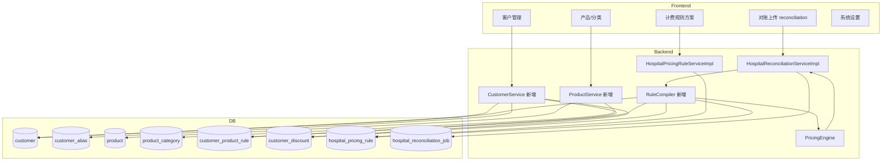

# 医院计费系统迭代重构计划

> 基于 [`hardcoded-business-data-audit.md`](./hardcoded-business-data-audit.md) 审计结论，并结合 [`bokang-legacy-analysis.md`](./bokang-legacy-analysis.md) 对 `铂康/` 生产转储的深度分析，针对本仓库（`hospital-all-master`）制定的分阶段重构方案。  
> 文档性质：**规划文档**，不含完整实现；各 Phase 需单独评审后开工。  
> 编制日期：2026-07-08

---

## 1. 背景与目标

### 1.1 背景

当前系统为**医院灭菌发货表对账 + 计费规则校正**平台，核心链路为：

1. 用户上传 Excel 发货表（`HospitalReconciliationServiceImpl`）
2. 按 `hospital_pricing_rule.rules_json` 实例化 `PricingEngine` 逐行计价
3. 导出账单 / 异常表 / 结款函

审计发现：计费采用 **「DB JSON + Java 硬编码兜底」双轨架构**。约 **15 家医院**（代码硬编码）、**22 条 fixedPrices**、**7 条 foldRules** 等特例写在 `PricingEngine.java` L25-399、L475-480、L692-704、L943-949；前端 `pricingRules.ts` 与 `pricing-rules/index.vue` 另有一套部分同步的默认值，存在**三处重复**与**展示/计算不一致**风险。

铂康生产转储（见 [`bokang-legacy-analysis.md`](./bokang-legacy-analysis.md)）进一步确认：**实际生产客户约 18+ 家**（市五院、哈工大、胸科医院等未出现在 Engine 硬编码中），**58 万行**真实计价样本可用于回归；`rules_json` 含 `settlementLetter`、`exportOptions`、`freeBagFeeThreshold` 及客户级 needle 扩展（克氏针、种植盒）等审计遗漏项。

### 1.2 重构目标

| 维度 | 目标 |
|------|------|
| **A. 客户管理** | 独立客户主数据（按医院/客户隔离），支持别名、折扣系数、封顶模式、按客户/产品/分类的特殊规则，互不干扰 |
| **B. 产品管理** | 产品分类（小件/敷料/高温/低温等）驱动不同计价路径；固定价、封顶、阶梯等可配置；为子产品预留扩展点 |
| **C. UI 重组** | 按「对账作业 → 主数据 → 规则配置 → 系统设置」重组信息架构，缩短功能查找路径 |
| **D. 引擎单一数据源** | `PricingEngine` 只解释配置，删除 `List.of(Map.of(...))` 兜底；算法常量可版本化 |
| **E. 可运维** | 与现有 `docker-compose.prod.yml` + `db/migrate_manifest.txt` 增量迁移衔接；双轨并行验证后切换 |

### 1.3 非目标（本迭代不做）

- 子产品（SKU 级 BOM）完整建模与 UI（仅预留表结构与 API 扩展点）
- 多租户 SaaS 化
- 替换 Excel 上传为 API 对接（保持现有上传流程）

---

## 2. 现状问题摘要

> 详细条目见审计报告，此处仅摘要高影响项并标注代码位置。

### 2.1 架构层

| 问题 | 证据 | 影响 |
|------|------|------|
| 双轨兜底 | `PricingEngine.java` L328-399：JSON 未命中时回退 Java defaults | 运维无法从 UI/DB 得知真实生效规则 |
| 永远硬编码 | 敷料包 L196-231、0.7 折扣 L274-281、`contains` 封顶 L692-704 | 规则 UI 无法修改 |
| 三处默认规则 | Engine / `pricingRules.ts` L93-113 / `index.vue` L796+ | 前端 fixedPrices 仅 3 条，后端 22 条，**展示与计算漂移** |
| 无客户/产品 CRUD | 仅 `hospital_pricing_rule` JSON blob | 医院名散落字符串匹配，别名需多处维护 |

### 2.2 数据层

- `schema.sql`：9 张表，**无业务种子数据**；`hospital_pricing_rule` 含 `hospital_name` 但非 FK
- `hospital_reconciliation_job.hospital_name`：字符串，未关联客户 ID
- 别名变体（`（松北）` vs `(松北)`）在 foldRules defaults 中重复列出

### 2.3 配置与运维

- `HospitalReconciliationServiceImpl.java` L219-224：银行账号默认值 **168995238437** 写入 Java
- `application-dev.yml`：JWT/DB 弱密钥；xlsx 模板路径指向仓库内**缺失文件**
- `DataInitializer.java`：菜单 4 项全在「追踪系统」下，无「主数据/系统设置」分组
- `docker-compose.prod.yml`：已具备 MySQL 健康检查、backend 挂载 `/app/db` 增量 SQL、`SchemaMigrationRunner` 列级迁移

### 2.4 审计数量速查

| 类别 | 数量 |
|------|------|
| 硬编码医院（去重） | ~15 |
| fixedPrices 兜底 | 22 |
| foldRules 兜底 | 7 |
| extraFees 兜底 | 1 |
| 引擎内不可 JSON 配置算法块 | ~10 |
| 前端重复默认规则文件 | 2 |

---

## 3. 目标架构

### 3.1 领域划分

```
┌─────────────────────────────────────────────────────────────┐
│                        前端 (Vue)                            │
│  对账作业 │ 客户管理 │ 产品/分类 │ 规则方案 │ 系统设置        │
└──────────────────────────┬──────────────────────────────────┘
                           │ REST /api/v1/...
┌──────────────────────────▼──────────────────────────────────┐
│                   Spring Boot Backend                        │
│  ReconciliationService │ PricingRuleService │ CustomerService│
│  ProductService │ RuleCompiler │ PricingEngine (纯解释器)     │
└──────────────────────────┬──────────────────────────────────┘
                           │
┌──────────────────────────▼──────────────────────────────────┐
│  MySQL: customer*, product*, pricing_rule*, reconciliation* │
└─────────────────────────────────────────────────────────────┘
```

### 3.2 ER 关系（文字描述）

- **customer**（客户/医院）：1 客户 → N **customer_alias**（别名，用于 Excel 医院名解析）
- **customer**：1 → N **customer_discount**（折扣规格，如省二院 0.7 倍，可设生效条件）
- **product_category**（分类树）：小件、敷料、高温纸塑、低温纸塑、器械包等；**product** 归属分类
- **customer_product_rule**：客户 × 产品/关键词 × 规则类型（固定价、按件价、加减价、分类倍率等）
- **pricing_rule_template** / 改造后 **hospital_pricing_rule**：存**通用**袋型/阶梯/needle 等 JSON；通过 **customer_id** 或 **rule_assignment** 绑定客户
- **hospital_reconciliation_job**：增加 `customer_id`（可空，兼容历史）；计价时 `resolveCustomer(excelHospitalName)` → 加载合并规则

### 3.3 模块关系（Mermaid）



### 3.4 规则加载顺序（目标态）

1. 解析 Excel 行 `hospitalName` → **customer_id**（别名表 + 模糊匹配策略可配置）
2. 加载客户级 **cap_mode**、**discount_rate**、**customer_product_rule** 列表
3. 加载绑定的 **hospital_pricing_rule.rules_json**（通用参数：袋型、阶梯、needle、packaging）
4. **RuleCompiler** 合并为 `CompiledPricingContext`（内存结构，非持久化）
5. **PricingEngine** 仅读取 `CompiledPricingContext`，**无 Java defaults**

---

## 4. 数据模型设计（表结构草案）

> 命名与现有 `hospital_*` / `sys_*` 风格一致；DDL 放入 `backend/src/main/resources/db/schema_00x_*.sql` 并登记 `migrate_manifest.txt`。

### 4.1 customer（客户主表）

```sql
CREATE TABLE customer (
    id              BIGINT AUTO_INCREMENT PRIMARY KEY,
    code            VARCHAR(64)  NOT NULL UNIQUE COMMENT '稳定业务编码，如 ERYY-NG',
    canonical_name  VARCHAR(200) NOT NULL COMMENT '规范名称',
    status          VARCHAR(20)  NOT NULL DEFAULT 'active',
    cap_mode        VARCHAR(20)  NULL COMMENT 'none|standard，覆盖高温纸塑封顶策略',
    charge_double_bag_when_capped TINYINT(1) DEFAULT 0,
    default_rule_id BIGINT NULL COMMENT '默认绑定的 hospital_pricing_rule.id',
    notes           TEXT NULL,
    created_at      DATETIME NOT NULL DEFAULT CURRENT_TIMESTAMP,
    updated_at      DATETIME NOT NULL DEFAULT CURRENT_TIMESTAMP ON UPDATE CURRENT_TIMESTAMP,
    INDEX idx_customer_name (canonical_name)
) ENGINE=InnoDB DEFAULT CHARSET=utf8mb4;
```

**迁移映射示例：**

| canonical_name | code | 特殊字段 |
|----------------|------|----------|
| 黑龙江省第二医院（南岗区） | ERYY-NG | discount 见 customer_discount |
| 黑龙江省第二医院（松北区） | ERYY-SB | 同上 |
| 五常市人民医院 | WCSRMYY | cap_mode=none |
| 予美医疗整形医院 | YMYXZX | charge_double_bag_when_capped=1 |

### 4.2 customer_alias（别名）

```sql
CREATE TABLE customer_alias (
    id          BIGINT AUTO_INCREMENT PRIMARY KEY,
    customer_id BIGINT NOT NULL,
    alias       VARCHAR(200) NOT NULL,
    match_type  VARCHAR(20) NOT NULL DEFAULT 'exact' COMMENT 'exact|contains|regex',
    source      VARCHAR(20) NOT NULL DEFAULT 'manual' COMMENT 'engine|bokang_job|manual',
    priority    INT NOT NULL DEFAULT 100,
    is_active   TINYINT(1) DEFAULT 1,
    FOREIGN KEY (customer_id) REFERENCES customer(id) ON DELETE CASCADE,
    UNIQUE KEY uk_alias (alias),
    INDEX idx_alias_customer (customer_id)
) ENGINE=InnoDB DEFAULT CHARSET=utf8mb4;
```

**`source` 字段用途（铂康分析新增）：** 追溯别名来源——`engine`（`PricingEngine` 硬编码）、`bokang_job`（`铂康/hospital_reconciliation_job.sql` 去重）、`manual`（UI 录入）。便于 Phase 1 双源合并时排查冲突。

将审计中 **15 家医院**及括号变体（如 `黑龙江省海员总医院（松北）` / `(松北)`）写入别名表；并收录铂康 job 中的变体（如 `哈工程` → 哈尔滨工业大学医院、`市五院` → 哈尔滨市第五医院），消除 Engine 内重复字符串。**目标：≥30 条别名**。

### 4.3 customer_discount（客户折扣规格）

```sql
CREATE TABLE customer_discount (
    id              BIGINT AUTO_INCREMENT PRIMARY KEY,
    customer_id     BIGINT NOT NULL,
    name            VARCHAR(120) NOT NULL,
    discount_rate   DECIMAL(6,4) NOT NULL COMMENT '如 0.7000',
    apply_stage     VARCHAR(30) NOT NULL DEFAULT 'after_base' COMMENT 'after_base|on_total',
    skip_when_fixed_price TINYINT(1) DEFAULT 1 COMMENT '对应 skipHospitalDiscount',
    category_filter JSON NULL COMMENT '仅某分类生效，空=全部',
    product_keyword_filter JSON NULL,
    effective_from  DATE NULL,
    effective_to    DATE NULL,
    priority        INT NOT NULL DEFAULT 100,
    is_active       TINYINT(1) DEFAULT 1,
    FOREIGN KEY (customer_id) REFERENCES customer(id) ON DELETE CASCADE,
    INDEX idx_discount_customer (customer_id, is_active)
) ENGINE=InnoDB DEFAULT CHARSET=utf8mb4;
```

**迁移：** 省二院南岗/松北 + 呼兰区第一人民医院 0.7 倍（`SECOND_HOSPITAL_NANGANG_RATE`，L28）→ 3 条 customer_discount 或 1 条共享配置 + 3 客户关联。

### 4.4 product_category（产品分类）

```sql
CREATE TABLE product_category (
    id          BIGINT AUTO_INCREMENT PRIMARY KEY,
    code        VARCHAR(64) NOT NULL UNIQUE COMMENT 'SMALL_ITEM|DRESSING|HT_PAPER|LT_PAPER|...',
    name        VARCHAR(120) NOT NULL,
    parent_id   BIGINT NULL,
    pricing_path VARCHAR(40) NOT NULL COMMENT '引擎分支：standard|dressing_cotton|dressing_nonwoven|fixed|legacy_per_piece',
    sort_order  INT DEFAULT 0,
    is_active   TINYINT(1) DEFAULT 1
) ENGINE=InnoDB DEFAULT CHARSET=utf8mb4;
```

**初始分类（与 Engine 分支对齐）：**

| code | pricing_path | 对应 Engine 逻辑 |
|------|--------------|----------------|
| DRESSING_COTTON | dressing_cotton | L196-211 纸塑袋+棉球 |
| DRESSING_NONWOVEN | dressing_nonwoven | L213-231 + L943-949 |
| HT_PAPER_PLASTIC | standard | `computeHighTempPaperPlastic` |
| LT_PAPER_PLASTIC | standard | `computeLowTempPaperPlastic` |
| HT_NON_WOVEN | standard | `computeHighTempNonWoven` |
| LT_NON_WOVEN | standard | 低温无纺布分支 |
| SMALL_ITEM | standard | needle.keywords 小件折算 |
| FIXED_OVERRIDE | fixed | fixedPrices 命中 |

### 4.5 product（产品主数据，Phase 2；子产品 Future）

```sql
CREATE TABLE product (
    id              BIGINT AUTO_INCREMENT PRIMARY KEY,
    category_id     BIGINT NOT NULL,
    sku_code        VARCHAR(64) NULL,
    name            VARCHAR(200) NOT NULL,
    keywords        JSON NOT NULL COMMENT '匹配包名/类型关键词数组',
    material_tags   JSON NULL COMMENT '无纺布/纸塑袋等',
    bag_size_hint   INT NULL,
    parent_product_id BIGINT NULL COMMENT 'Future: 子产品指向父产品',
    is_active       TINYINT(1) DEFAULT 1,
    FOREIGN KEY (category_id) REFERENCES product_category(id),
    INDEX idx_product_category (category_id)
) ENGINE=InnoDB DEFAULT CHARSET=utf8mb4;
```

**Phase 2 产品关键词种子（铂康 row 高频词 + Engine 固定价词，≥20 条）：**

| 关键词 | 分类 | 来源 |
|--------|------|------|
| 拔髓针、洁牙机尖、挖勺、车针 | SMALL_ITEM | 铂康 row + Engine |
| 机扩针、克氏针、种植盒 | SMALL_ITEM | 铂康 rule id=53/58 needle 扩展 |
| 3.6空心钉、7.3空心钉、空心钉工具包 | FIXED_OVERRIDE | Engine fixedPrices |
| 肖啸钻头 | SMALL_ITEM | 市五院 row |
| 敷料包、棉球 | DRESSING_* | 铂康 row + Engine |

### 4.6 customer_product_rule（客户 × 产品特殊规则）

```sql
CREATE TABLE customer_product_rule (
    id              BIGINT AUTO_INCREMENT PRIMARY KEY,
    customer_id     BIGINT NOT NULL,
    rule_type       VARCHAR(40) NOT NULL COMMENT 'FIXED_PRICE|PRICE_PER_INSTRUMENT|ADD_FEE|MULTIPLY|FOLD|EXTRA_FEE',
    name            VARCHAR(200) NOT NULL,
    priority        INT NOT NULL DEFAULT 100,
    product_id      BIGINT NULL,
    keywords        JSON NULL,
    materials       JSON NULL,
    bag_size_equals INT NULL,
    max_bag_size_exclusive INT NULL,
    min_instrument_count INT NULL,
    max_instrument_count INT NULL,
    price           DECIMAL(12,4) NULL,
    fee             DECIMAL(12,4) NULL,
    multiplier      DECIMAL(8,4) NULL,
    threshold       INT NULL,
    fold_ratio      DECIMAL(8,4) NULL,
    skip_packaging  TINYINT(1) DEFAULT 0,
    skip_discount   TINYINT(1) DEFAULT 0,
    is_active       TINYINT(1) DEFAULT 1,
    FOREIGN KEY (customer_id) REFERENCES customer(id) ON DELETE CASCADE,
    INDEX idx_cpr_customer_priority (customer_id, priority, is_active)
) ENGINE=InnoDB DEFAULT CHARSET=utf8mb4;
```

**规则类型与现有 JSON 字段对照：**

| rule_type | 现 specialRules | 示例 |
|-----------|-----------------|------|
| FIXED_PRICE | fixedPrices | 省二院松北 3.6空心钉工具包 190.05 |
| PRICE_PER_INSTRUMENT | fixedPrices.pricePerInstrument | 东北农大 洁牙机尖 5.5/件 |
| FOLD | foldRules | 松电 机扩针 5 件算 1 件 |
| EXTRA_FEE | extraFees | 总工会医院 镜头 +8 |
| MULTIPLY | （现硬编码 0.7） | 迁移至 customer_discount |

### 4.7 hospital_pricing_rule 改造

```sql
ALTER TABLE hospital_pricing_rule
    ADD COLUMN customer_id BIGINT NULL AFTER hospital_name,
    ADD COLUMN schema_version VARCHAR(20) NOT NULL DEFAULT '2.0' AFTER version,
    ADD COLUMN compiled_snapshot LONGTEXT NULL COMMENT '可选：编译后 JSON 缓存',
    ADD INDEX idx_pricing_rule_customer (customer_id);
```

- **保留** `rules_json` 存放**非客户特异**的通用配置：`highTemperature`、`lowTemperature`、`needle`、`packaging`、`logistics`、`cleaning`
- **迁出** `specialRules.fixedPrices/foldRules/extraFees` 至 `customer_product_rule`
- `hospital_name` 保留作展示/兼容，逐步废弃，以 `customer_id` 为准

### 4.8 hospital_reconciliation_job 改造

```sql
ALTER TABLE hospital_reconciliation_job
    ADD COLUMN customer_id BIGINT NULL AFTER hospital_name,
    ADD INDEX idx_recon_job_customer (customer_id);
```

**`hospital_reconciliation_row.notes_json`（铂康分析补充）：**

铂康转储中 `notes_json` 含小件折算说明、封顶提示、包装未配置警告等结构化文案。Phase 3 双轨验证时，除 `expected_unit_price` / `status` / `pricing_rule` 外，对 **warning 行**抽样比对 `notes_json` 关键短语，防止引擎静默改变解释逻辑。标杆 job 见 §10.4。

### 4.9 系统配置表（Phase 4）

```sql
CREATE TABLE sys_setting (
    id          BIGINT AUTO_INCREMENT PRIMARY KEY,
    setting_key VARCHAR(100) NOT NULL UNIQUE,
    setting_value JSON NOT NULL,
    description VARCHAR(255) NULL,
    updated_at  DATETIME NOT NULL DEFAULT CURRENT_TIMESTAMP ON UPDATE CURRENT_TIMESTAMP
) ENGINE=InnoDB DEFAULT CHARSET=utf8mb4;
```

存放：公司信息引用键、默认规则模板 ID、物流费默认 50、日切 20 点等（替代 Java/YAML 硬编码）。

### 4.10 Future：product_component（子产品，仅设计）

```sql
-- Phase Future
CREATE TABLE product_component (
    parent_product_id BIGINT NOT NULL,
    child_product_id  BIGINT NOT NULL,
    quantity          DECIMAL(10,4) NOT NULL DEFAULT 1,
    PRIMARY KEY (parent_product_id, child_product_id)
);
```

---

## 5. 规则引擎重构方案

### 5.1 现状：PricingEngine 双轨

```
rules_json.specialRules.*  ──► 优先
        │ 未命中/空
        ▼
List.of(Map.of(...)) defaults  ──► 兜底（L328-399）
        +
永远硬编码分支（敷料/0.7/contains 封顶）
```

### 5.2 目标：配置驱动 + 编译期合并

**新增 `RuleCompiler`（`com.hospital.backend.service.RuleCompiler`）：**

```java
public CompiledPricingContext compile(
    Long customerId,
    HospitalPricingRule baseRule,
    List<CustomerProductRule> customerRules,
    List<CustomerDiscount> discounts,
    Customer customer
);
```

**PricingEngine 改造要点：**

| 现状方法/常量 | 目标 |
|--------------|------|
| L25-28 医院常量 + 0.7 | 删除；从 `CompiledPricingContext.discounts` 应用 |
| L328-336 foldRules defaults | 删除；仅 `customer_product_rule` FOLD |
| L378-400 fixedPrices defaults | 删除；仅 DB 规则 |
| L475-480 extraFees 硬编码 | 删除；仅 DB EXTRA_FEE |
| L692-694 cap_mode contains | 删除；读 `customer.cap_mode` |
| L704 予美 double bag | 删除；读 `customer.charge_double_bag_when_capped` |
| L196-231, L943-949 敷料 | 迁为 `product_category` + `sys_setting.dressing_price_table` JSON |
| L665-667 >25 按 25 | 保留为**算法常量**，入 `schema_version` 文档 |

### 5.3 规则优先级（同一行匹配多条时）

优先级从高到低：

1. **customer_product_rule**（按 `priority` 升序，先匹配先返回）  
   - FIXED_PRICE / PRICE_PER_INSTRUMENT  
   - FOLD（在 fixed 未命中后、needle 前，与现 L109-115 一致）  
   - EXTRA_FEE（在 base 价计算后叠加，与现 L258-263 一致）
2. **分类默认定价路径**（敷料、高低温纸塑/无纺布）
3. **通用 rules_json**（袋型单价、阶梯、needle、packaging）
4. **customer_discount**（`skip_when_fixed_price` 为 true 且已命中 fixed 则跳过）
5. **cap 规则**（客户 cap_mode + 通用 minCharge）

### 5.4 JSON Schema 演进

| schema_version | 说明 |
|----------------|------|
| 1.0 | 当前生产形态：含 `specialRules` 嵌套 |
| 2.0 | `specialRules`  deprecated，客户规则在关系表；`rules_json` 仅通用段 |
| 2.1 | 增加 `dressingTables` 外置引用（或仅存 setting_key） |

**兼容策略：**

- `RuleCompiler` 读取 1.0 时：若 `customer_product_rule` 为空，**临时**从 JSON `specialRules` 导入内存（不写回 Java defaults）
- 提供 `POST /api/v1/migrations/compile-rules/{customerId}` 一次性升级至 2.0

**rules_json 2.0 示例结构（节选）：**

```json
{
  "schemaVersion": "2.0",
  "needle": { "threshold": 5, "foldRatio": 5, "keywords": ["小件", "探针", "..."] },
  "highTemperature": {
    "paperPlastic": {
      "perPackagePrice": 5.5,
      "minCharge": 16.5,
      "capMode": "standard",
      "bagSizes": [{ "size": 25, "price": 10.5, "keywords": ["25cm"] }]
    },
    "nonWoven": { "minCharge": 35, "flatRateThreshold": 3, "flatPerPackagePrice": 35 }
  },
  "lowTemperature": { "paperPlastic": { "remainderPerPiecePrice": 22, "tierPrices": [...], "bagSizes": [...] } },
  "packaging": { "enabled": true, "items": [...] },
  "logistics": { "feePerTrip": 50, "dayBoundaryHour": 20 },
  "cleaning": { "recomputeTotalsWhenPriceChanges": false }
}
```

### 5.5 高性能查询模式

- **启动/定时**：`CustomerAliasCache` 全量加载别名 → `ConcurrentHashMap`（类似现 `bagSizeCache` L31-32）
- **单次对账**：按 `customer_id` 一次性加载 rules + discounts + product_rules，构建 `CompiledPricingContext`，复用于所有行
- **索引**：`customer_alias.alias` UNIQUE；`customer_product_rule(customer_id, is_active, priority)`
- **可选**：Redis 缓存 compiled snapshot（Phase 3+，非必须）

---

## 6. 分阶段迭代计划

### Phase 0：准备与基线（1 周）

| 项 | 内容 |
|----|------|
| **目标** | 建立重构基线、测试护栏、迁移工具骨架 |
| **范围** | 不改生产行为；补充文档与 CI 检查 |
| **交付物** | ① `PricingEngineTest` 全量通过快照 ② 从 Engine defaults 导出 `scripts/seed/customer_rules_snapshot.json` ③ `RuleCompiler` 空壳 + 接口定义 ④ 本计划评审纪要 |
| **风险** | 测试覆盖不足导致后续回归漏检 |
| **回滚** | 无代码行为变更，无需回滚 |
| **验收标准** | CI 绿；快照 JSON 含 15 医院 / 22+7+1 规则条目；团队成员对 Phase 1 DDL 签字 |
| **工期** | 5 人日 |

**任务清单：**

- [ ] 将 `PricingEngineTest.java` 中 10+ 医院用例标记 `@Tag("baseline")`
- [ ] 新增 `scripts/export-hardcoded-rules.js` 从审计清单生成 JSON
- [ ] `check-migrate-manifest.sh` 纳入 PR 检查（已有注释，需激活）
- [ ] `.env.example` 与环境变量文档对齐（MySQL root、银行信息）

---

### Phase 1：客户主数据 + 迁移脚本（2 周）

| 项 | 内容 |
|----|------|
| **目标** | **≥18** 家客户入库（Engine 15 家 + 铂康生产客户合并）；Excel 医院名可解析为 customer_id |
| **范围** | DDL customer/customer_alias/customer_discount；Customer CRUD API；Reconciliation 写入 customer_id（可空） |
| **交付物** | ① 迁移 SQL `schema_001_customer.sql` ② `CustomerService.resolveByName()` ③ 管理 API ④ 种子数据脚本（**≥18 客户 + ≥30 别名**，双源：`engine` + `bokang_job`） |
| **风险** | 别名冲突、模糊匹配误识别；铂康与 Engine 客户名不一致 |
| **回滚** | 新表可保留；代码 `customer_id` 可空则走旧 hospital_name 逻辑 |
| **验收标准** | 上传测试 Excel，job 记录正确 customer_id；resolve API 对附录 D 全部 canonical 名称及别名 **100% 命中** |
| **工期** | 10 人日 |

**迁移脚本逻辑：**

1. INSERT **≥18** 条 `customer`（Engine 15 + 铂康 job 去重，见 [`bokang-legacy-analysis.md`](./bokang-legacy-analysis.md) §4）
2. INSERT **≥30** 条别名（含括号变体 + 铂康变体如「市五院」「哈工程」；标记 `source`）
3. INSERT `customer_discount`：省二院南岗/松北、呼兰区第一人民 → rate=0.7
4. UPDATE `customer` SET cap_mode='none' WHERE code IN ('WCSRMYY','XZYSJT')
5. 绑定 `default_rule_id`：市五院→53、哈工大→58、胸科→57 等（铂康 rule 映射）

**不改 PricingEngine**，仅在对账入口记录解析结果供 Phase 3 使用。

---

### Phase 2：产品/分类 + 特殊规则（2.5 周）

| 项 | 内容 |
|----|------|
| **目标** | 22 fixedPrices + 7 foldRules + 1 extraFee 入库；敷料定价表配置化 |
| **范围** | product_category、product（关键词型）、customer_product_rule CRUD；敷料价表进 sys_setting 或 rules_json 2.0 |
| **交付物** | ① `schema_002_product_rules.sql` ② 数据迁移 `schema_003_seed_customer_product_rules.sql` ③ Product/Category API ④ 管理 UI 初版 ⑤ **≥20** 条 `product` 种子（铂康 row 高频词）⑥ 市五院/哈工大 **needle 扩展词**（克氏针、种植盒） |
| **风险** | 规则字段组合复杂；与 JSON 1.0 重复存储短暂双写 |
| **回滚** | 关闭 feature flag `pricing.use_db_customer_rules=false` |
| **验收标准** | DB 规则条数 = 22+7+1；`product` ≥20 条；单测新增「仅 DB 规则」用例与 Engine defaults 输出一致 |
| **工期** | 12 人日 |

**数据迁移来源对照：**

| 来源 | 目标表 |
|------|--------|
| PricingEngine L378-399 | customer_product_rule (FIXED_PRICE / PRICE_PER_INSTRUMENT) |
| PricingEngine L328-335 | customer_product_rule (FOLD) |
| pricingRules.ts L109-111 extraFees | customer_product_rule (EXTRA_FEE) |
| L943-949 敷料无纺布 | sys_setting `dressing.nonwoven_table` + 纸塑棉球 4.0/2.5 |

---

### Phase 3：引擎重构 + 双轨并行验证（3 周）

| 项 | 内容 |
|----|------|
| **目标** | RuleCompiler + PricingEngine 去 defaults；双轨对比零差异后切流 |
| **范围** | 重构 `PricingEngine.java`；`HospitalReconciliationServiceImpl` 调用 Compiler；feature flag |
| **交付物** | ① RuleCompiler 实现 ② Engine 删除 L328-400、475-481、692-704 硬编码 ③ 双轨对比报告 ④ `schema_version` 升级工具 |
| **风险** | 浮点/舍入差异；性能回退 |
| **回滚** | `pricing.engine.mode=legacy` 恢复旧 Engine 类或分支 |
| **验收标准** | 历史 reconciliation job 重跑 diff=0；`PricingEngineTest` 全绿；P99 行处理耗时 ±5% |
| **工期** | 15 人日 |

**双轨验证流程：**

```
for each baseline job:
    legacy = PricingEngine(rules_json only + Java defaults)
    new    = PricingEngine(RuleCompiler.compile(...))
    assert row-by-row expectedUnitPrice, status, pricingRule
```

---

### Phase 4：UI 重组（2 周）

| 项 | 内容 |
|----|------|
| **目标** | 信息架构清晰；删除前端默认规则副本 |
| **范围** | 菜单/路由/DataInitializer；新页面；`GET /default-template` |
| **交付物** | 见 §9；更新 `DataInitializer` 菜单树 |
| **风险** | 用户习惯改变；动态路由缓存 |
| **回滚** | 旧菜单 path 保留 redirect |
| **验收标准** | 用户测试：3 分钟内找到「为客户加固定价规则」；前端无 `createDefaultSpecialRules` 本地副本 |
| **工期** | 10 人日 |

---

### Phase 5：清理硬编码 + 文档（1 周）

| 项 | 内容 |
|----|------|
| **目标** | 删除死代码；外置公司/银行/模板配置 |
| **范围** | 移除 Engine defaults；`HospitalReconciliationServiceImpl` L219-224 默认账号；README 密码说明 |
| **交付物** | ① 审计项清零 PR ② 运维手册 ③ xlsx 模板入仓或文档说明 |
| **风险** | 生产未配 env 导致结款函缺账号 |
| **回滚** | 保留 env 必填校验前的上一个镜像 tag |
| **验收标准** | 代码搜索 `List.of(Map.of` 在 PricingEngine 为 0；grep 168995238437 仅测试/fixture |
| **工期** | 5 人日 |

---

### Future：子产品（Phase 6+，未排期）

- 启用 `product.parent_product_id`、`product_component`
- 计价：父产品命中后展开子项单价或按 BOM 汇总
- UI：产品详情「组成」Tab
- **当前 Phase 2** 仅在 `product` 表预留字段，不在 Engine 增加分支

---

## 7. 迁移策略

### 7.1 自 `hospital_pricing_rule.rules_json` 迁移

**步骤：**

1. **盘点**：`SELECT id, hospital_name, JSON_LENGTH(rules_json, '$.specialRules.fixedPrices') ... FROM hospital_pricing_rule`
2. **去重**：按 hospital_name 合并；与 Engine defaults 三方 diff（DB / Engine / 前端）
3. **导入**：
   - 有 `hospital_name` → 匹配 `customer.id`
   - `specialRules.*` → INSERT `customer_product_rule`
   - 通用段保留在 `rules_json`，删除 `specialRules` 键，设 `schema_version='2.0'`
4. **验证**：Phase 3 双轨脚本

### 7.2 自 Java defaults 迁移

使用 Phase 0 生成的 `customer_rules_snapshot.json`：

```json
{
  "source": "PricingEngine.java:L378-399",
  "rules": [
    {
      "customerCode": "ERYY-SB",
      "ruleType": "FIXED_PRICE",
      "name": "黑龙江省第二医院（松北区）3.6空心钉工具包固定单价",
      "keywords": ["3.6空心钉工具包"],
      "price": 190.05,
      "skipPackaging": true,
      "skipDiscount": true
    }
  ]
}
```

由 `scripts/import-customer-rules.sql` 或 Flyway 式 Java migrator 执行。

### 7.3 历史对账任务

- `hospital_reconciliation_job` / `row` **不重写**历史 pricingRule 文本
- 新 job 写入 `customer_id`；可选批处理 `UPDATE job SET customer_id = resolve(hospital_name)`

### 7.4 零停机

1. 加表、加可空列（Phase 1-2）
2. 双轨只读对比（Phase 3）
3. Feature flag 切写路径
4. 删除 legacy 分支（Phase 5）

与 `docker-compose.prod.yml` 一致：先 `up -d mysql` → backend `force-recreate` 执行 `/app/db` 清单。

### 7.5 铂康转储迁移（新增）

> 详见 [`bokang-legacy-analysis.md`](./bokang-legacy-analysis.md) §8–§9。

**数据源与目标：**

| 铂康文件 | 目标 | Phase | 约束 |
|----------|------|-------|------|
| `hospital_pricing_rule.sql`（8 条） | `hospital_pricing_rule` | 0 | 保留 id=8 为 `default_template` |
| `hospital_reconciliation_job.sql` | `customer` + `customer_alias` | 1 | `hospital_name` 去重；排除测试 job |
| `PricingEngine` defaults | `customer_product_rule` | 2 | 省二院等未出现在铂康的客户 |
| `hospital_reconciliation_row.sql` | 测试库 row 子集 | 0 | 仅 job_id IN (35,40,66,74,324,362) |

**双源种子合并：**

```
customers = UNION(
  EXPORT_FROM(PricingEngine.java, source='engine'),
  DEDUP_FROM(铂康/job, source='bokang_job')
)
```

**Phase 0 交付：** `scripts/import-bokang-baseline.sh` 骨架（仅 dev/staging profile）；**禁止**将 58 万行全量 row 导入生产。

**标杆 job 回归：** 自铂康 row 转储为 `PricingEngineTest` 补充 `@Tag("bokang-baseline")` 用例，见 §10.4。

---

## 8. API 设计概要

> 前缀保持现有风格 `/api`；建议逐步统一为 `/api/v1`（Phase 4 决策）。

### 8.1 客户管理

| Method | Path | 说明 |
|--------|------|------|
| GET | `/api/customers` | 分页列表，支持 `?q=` 搜索 |
| POST | `/api/customers` | 创建客户 |
| GET | `/api/customers/{id}` | 详情含别名、折扣摘要 |
| PUT | `/api/customers/{id}` | 更新 cap_mode 等 |
| GET | `/api/customers/resolve?name=` | Excel 医院名 → customer（对账用） |
| CRUD | `/api/customers/{id}/aliases` | 别名管理 |
| CRUD | `/api/customers/{id}/discounts` | 折扣规格 |
| CRUD | `/api/customers/{id}/product-rules` | 特殊产品规则 |

### 8.2 产品/分类

| Method | Path | 说明 |
|--------|------|------|
| GET | `/api/product-categories` | 分类树 |
| CRUD | `/api/products` | 产品关键词维护 |
| GET | `/api/products/match?text=` | 调试：包名匹配分类 |

### 8.3 计费规则（现有扩展）

| Method | Path | 说明 |
|--------|------|------|
| GET | `/api/hospital-pricing-rules` | 已有；增加 `customerId` 过滤 |
| GET | `/api/hospital-pricing-rules/default-template` | **新增**；替代前端 `createDefaultSpecialRules` |
| POST | `/api/hospital-pricing-rules/{id}/upgrade-schema` | 1.0 → 2.0 |
| GET | `/api/hospital-pricing-rules/preview-compile?customerId=` | 调试：查看 CompiledPricingContext |

现有 Controller：`HospitalPricingRuleController.java`（L21-53）。

### 8.4 系统设置

| Method | Path | 说明 |
|--------|------|------|
| GET/PUT | `/api/settings/{key}` | 公司信息、敷料表、物流默认值 |
| GET | `/api/settings/export-templates` | 模板元数据 |

### 8.5 对账（现有，小改）

| Method | Path | 变更 |
|--------|------|------|
| POST | `/api/hospital-reconciliations/upload` | 响应增加 `customerId`, `customerName` |
| GET | `/api/hospital-reconciliations/{id}` | 展示绑定客户与规则版本 |

---

## 9. 前端页面结构提案

### 9.1 当前 IA（Before）

```
追踪系统 (/hospital)
├── 医院发货表上传      /hospital/reconciliation
├── 医院计费规则        /hospital/pricing-rules    ← 含大量默认规则编辑
└── 历史版本与审核      /hospital/version-management
```

来源：`DataInitializer.java` L42-49、`frontend/src/router/modules/hospital.ts`。

**问题：** 客户、产品、系统默认值混在「计费规则」单页；与对账操作同级，主数据无独立入口。

### 9.2 目标 IA（After）

```
业务中心
├── 对账作业
│   ├── 发货表上传与核对    /operations/reconciliation      (原 reconciliation)
│   └── 历史版本与审核      /operations/version-management  (原 version-management)
│
├── 主数据
│   ├── 客户管理            /master/customers
│   │   └── [详情] 别名 | 折扣 | 特殊产品规则
│   ├── 产品分类            /master/product-categories
│   └── 产品目录            /master/products
│
├── 计费配置
│   ├── 通用规则方案        /pricing/rule-templates       (原 pricing-rules 通用段)
│   ├── 客户规则绑定        /pricing/customer-assignments
│   └── 规则模拟器          /pricing/simulator            (单行调试，可选)
│
└── 系统设置
    ├── 公司/银行信息       /settings/company
    ├── 导出模板            /settings/templates
    ├── 物流/全局默认值     /settings/pricing-defaults
    └── 用户与菜单          /settings/system              (沿用现有 sys 模块)
```

### 9.3 页面对照映射

| 现页面 | 现文件 | 目标 |
|--------|--------|------|
| 发货表上传 | `views/hospital/reconciliation/index.vue` | `views/operations/reconciliation/index.vue` |
| 计费规则 | `views/hospital/pricing-rules/index.vue` | 拆为 template + customer 子页；删除 `defaultEmptyRules()` |
| 历史版本 | `views/hospital/version-management/index.vue` | `views/operations/version-management/index.vue` |
| （无） | — | `views/master/customers/index.vue` 新增 |
| （无） | — | `views/master/products/index.vue` 新增 |
| API 默认规则 | `api/hospital/pricingRules.ts` L93-166 | 改为 `fetchDefaultTemplate()` 调后端 |

### 9.4 菜单初始化

更新 `DataInitializer.java` 与 `hospital.ts` → 拆为 `operations.ts`、`master.ts`、`pricing.ts`、`settings.ts` 路由模块。

---

## 10. 测试与验收策略

### 10.1 测试金字塔

| 层级 | 内容 |
|------|------|
| 单元 | `PricingEngineTest` 扩展；`RuleCompilerTest` 每类规则 1+ 用例 |
| 契约 | JSON Schema 2.0 校验；`default-template` API 快照 |
| 集成 | Customer resolve + 上传 Excel 端到端 |
| 回归 | **双轨对比**：legacy vs compiled，覆盖 15 医院 × 代表产品 |
| 性能 | 1 万行 Excel < 现有耗时 105% |

### 10.2 关键验收用例（摘自审计）

- 省二院南岗「钉」140 vs 松北 35（fixedPrices L393 vs L384）
- 0.7 折扣三家医院（L274-281）
- 敷料包 measure 90 → 30（L943-946）
- 总工会医院 镜头 +8（L475-480）
- 五常/显著 cap_mode=none（L692-694）
- 予美封顶双层袋（L704）
- foldRules 7 条逐一 threshold/foldRatio

### 10.3 前端验收

- 新建规则方案：specialRules 从 API 加载，**UI 展示条数 = 后端实际 22 条**
- 客户详情编辑 fixed price 后，模拟器与对账结果一致

### 10.4 测试数据与验收用例（铂康回归）

> 数据源：[`bokang-legacy-analysis.md`](./bokang-legacy-analysis.md) §7；铂康 `hospital_reconciliation_row.sql` 标杆 job 子集。

| 优先级 | 数据源 | job_id | 文件 | 断言 |
|--------|--------|--------|------|------|
| P0 | row 转储 | 35 | `农业大学医院4月.xlsx` | 19 行 diff=0；含拔髓针小件折算 |
| P0 | row 转储 | 40 | `道外松电慢性病4月账单.xlsx` | 7 行 diff=0；含 fold 场景 |
| P0 | row 转储 | 66 / 74 | `市五院.xlsx` | 4829 行抽样 200 行 diff=0；32 科室 sheet |
| P1 | row 转储 | 324 | `哈尔滨工业大学医院4月15日-5月14日.xlsx` | 2200 行；机扩针 + 克氏针关键词 |
| P1 | row 转储 | 362 | `哈尔滨市胸科医院4月账单.xlsx` | 193 行 diff=0 |
| P2 | export_log | — | 各院结款函 / 分科室汇总 | `export_type` 含 `department_summary` |

**行级 golden 样本（节选）：**

| job | 包名 | 期望单价 | 规则 |
|-----|------|----------|------|
| 35 | 拔髓针-5件/Z7520 | 16.5 | 小件折算 + 高温封顶 |
| 35 | 挖勺-1（75*300 袋） | NULL | 未识别袋型 → warning |
| 66 | 肖啸钻头0.7-1件 | 8.0 | 10cm 袋费 |
| 324 | 机扩针架1针10/Z1020 | 60.5 | 小件折算 + 超封顶 |

CI 建议：P0 用例纳入 PR 必跑；P0 市五院全量改 nightly workflow。

---

## 11. CI/CD 与 Docker 衔接

### 11.1 现有 prod 管线（引用）

`docker-compose.prod.yml` 已定义：

- MySQL 8.0 + `schema.sql` 初始化卷
- Backend 挂载 `./backend/src/main/resources/db:/app/db:ro`
- 启动顺序：MySQL healthcheck → backend entrypoint 执行 `migrate_manifest.txt` → Spring Boot
- `SchemaMigrationRunner.java` 列级幂等迁移并存

### 11.2 重构期 CI 增量

| 阶段 | CI 动作 |
|------|---------|
| Phase 0 | PR 跑 `PricingEngineTest` + manifest 校验脚本 |
| Phase 1-2 | 新增 migration 文件必须更新 `migrate_manifest.txt`；集成测试启 MySQL service |
| Phase 3 | 双轨对比 job 作为 optional workflow（可 nightly） |
| Phase 5 | 镜像 push GHCR；prod `pull` + `force-recreate backend` |

### 11.3 环境变量（与 `.env.example` 对齐）

| 变量 | 用途 |
|------|------|
| `MYSQL_ROOT_PASSWORD` | Compose MySQL root |
| `MYSQL_PASSWORD` | 应用用户 |
| `APP_JWT_SECRET` | JWT |
| `APP_COMPANY_BANK_ACCOUNT` / `APP_COMPANY_BANK_NAME` | Phase 5 必填，移除 Java 默认 |
| `PRICING_ENGINE_MODE` | `legacy` / `compiled`（Phase 3 feature flag） |
| `SKIP_DB_MIGRATE` | 调试跳过 SQL 清单 |

---

## 12. 风险清单与决策点

### 12.1 风险清单

| ID | 风险 | 概率 | 影响 | 缓解 |
|----|------|------|------|------|
| R1 | 别名误匹配导致错客户计价 | 中 | 高 | exact 优先；contains 需人工审核；resolve API 返回 confidence |
| R2 | 双轨不一致上线 | 中 | 高 | Phase 3 强制 diff 报告；flag 控制 |
| R3 | 迁移遗漏 22 条之一 | 低 | 高 | 快照 JSON + 条数断言测试 |
| R4 | 前端大改用户迷失 | 中 | 中 | 旧 path redirect 一版；简短引导 |
| R5 | 生产银行信息为空 | 中 | 中 | Phase 5 启动校验 + 结款函前检查 |
| R6 | xlsx 模板仍缺失 | 高 | 中 | 模板入仓或 OSS；导出降级明确提示 |

### 12.2 需用户确认的事项

| # | 决策 | 选项 | 建议 |
|---|------|------|------|
| D1 | 客户是否允许「contains」模糊匹配 | A 仅 exact B exact+contains | **B**，与现 Engine 行为一致，但 UI 标记风险 |
| D2 | 省二院南岗/松北是否共享通用 rules_json | A 各一份 B 共享模板 | **B** + customer_product_rule 区分 fixed |
| D3 | schema 2.0 是否强制删除 specialRules | A 软废弃 B 硬删除 | Phase 3 **A**，Phase 5 **B** |
| D4 | API 是否升级 `/api/v1` 前缀 | A 保持 B 升级 | **B** 与 Phase 4 同步 |
| D5 | 子产品 Phase 6 优先级 | 排期 | 业务方确认是否有 BOM 需求 |
| D6 | 历史 job 是否批量回填 customer_id | A 否 B 是 | **A** 默认；B 可选离线脚本 |
| D7 | 默认规则模板：全局一份 vs 按分类多模板 | 单/多 | **单模板** + 客户覆盖 |

---

## 附录 A：审计发现 → 修复 Phase 对照

| 审计章节 | 发现摘要 | 修复 Phase |
|----------|----------|------------|
| §1.1 引擎常量 0.7 | 三家医院硬编码折扣 | Phase 1 discount 表 + Phase 3 Engine |
| §1.2 foldRules 7 条 | Java defaults L328-335 | Phase 2 customer_product_rule + Phase 3 删除 defaults |
| §1.3 fixedPrices 22 条 | Java defaults L378-399 | Phase 2 + Phase 3 |
| §1.4 contains 匹配 | 总工会/五常/予美 | Phase 1 customer 字段 + Phase 2 规则表 |
| §1.5 Legacy 按件计价 | 农大/航天 | Phase 2 PRICE_PER_INSTRUMENT |
| §2.3 敷料包硬编码 | L196-231, L943-949 | Phase 2 分类 + setting 价表 + Phase 3 |
| §3.1 算法常量 | >25 按 25、双袋映射等 | Phase 3 文档化 schema；算法保留 |
| §3.2 0.7 折扣 | L274-281 | Phase 1 + 3 |
| §3.3 规则回退机制 | JSON 空则 Java 兜底 | Phase 3 移除兜底 |
| §4 公司/银行 | L219-224 默认账号 | Phase 5 env 必填 |
| §5 DataInitializer | 菜单 4 项全在追踪 | Phase 4 UI 重组 |
| §5.2 README 密码 | 与随机密码不符 | Phase 5 文档 |
| §6 模板 xlsx 缺失 | application-dev.yml 路径 | Phase 5 资产化 |
| §7 结款函 HTML | 硬编码文案 | Phase 4 系统设置 + 模板管理 |
| §8 前端三处重复 | pricingRules.ts / index.vue | Phase 4 default-template API |
| §9 PricingEngineTest | 基准用例 | Phase 0 基线 + 全 Phase 回归 |

---

## 附录 B：铂康遗留资产分析（摘要）

> 完整分析见 [`bokang-legacy-analysis.md`](./bokang-legacy-analysis.md)。

| 项 | 结论 |
|----|------|
| 目录 | `铂康/` 共 **7 文件**，**无 xlsx** |
| 转储性质 | `建表语句/` 为 **INSERT 转储**，非 DDL |
| 数据规模 | 417 job、580,915 row、328 export_log、8 pricing_rule |
| 生产客户 | **18+ 家**（大于 Engine 审计 15 家） |
| Schema | 9 表，**无 customer/product** |
| 双源种子 | Engine 硬编码 + 铂康 job 去重 |

---

## 附录 C：旧库 vs 新库 schema 对照（摘要）

| 表 | 差异要点 |
|----|----------|
| `sys_user` | 旧转储无 `is_active`/`is_superuser` |
| `sys_menu` | 旧系统无医院业务菜单 |
| `hospital_pricing_rule` | 旧数据 `hospital_name`/`plan_name` 均为 NULL |
| `hospital_reconciliation_job` | 旧数据含丰富 sheet 元数据 |
| `hospital_reconciliation_row` | `notes_json` 含计价说明 |
| `hospital_reconciliation_export_log` | 含 `department_summary` 导出类型 |

**两边均不存在、规划新增：** `customer`、`customer_alias`、`customer_discount`、`product_category`、`product`、`customer_product_rule`、`sys_setting`。

---

## 附录 D：从测试样本提炼的业务规则清单

### D.1 生产客户 × 别名 × rule_id（节选）

| canonical_name | code | 别名 | xlsx | rule_id |
|----------------|------|------|------|---------|
| 哈尔滨市第五医院 | HRB-WY | 市五院 | 市五院.xlsx | 38/53 |
| 哈尔滨工业大学医院 | HRB-HIT | 哈工程 | 哈尔滨工业大学医院4月15日-5月14日.xlsx | 56/58 |
| 哈尔滨市胸科医院 | HRB-XK | — | 哈尔滨市胸科医院4月账单.xlsx | 57 |
| 东北农业大学医院 | NEAU-YY | 东北农业大学 | 农业大学医院4月.xlsx | 36 |
| 哈尔滨道外区松电慢性病专科门诊部 | HRB-SD-MB | 松电慢性病专科门诊部 | 道外松电慢性病4月账单.xlsx | 37 |

完整清单见 [`bokang-legacy-analysis.md`](./bokang-legacy-analysis.md) §4。

### D.2 rules_json 审计遗漏项

| 项 | 落点 |
|----|------|
| `settlementLetter` | Phase 4 `sys_setting` |
| `exportOptions` | Phase 4 `sys_setting` |
| `freeBagFeeThreshold` | `rules_json` 或 `sys_setting` |
| needle 克氏针/种植盒 | 客户级配置（市五院 id=53、哈工大 id=58） |

### D.3 铂康 → 重构迁移映射

```
铂康/hospital_pricing_rule.sql  → hospital_pricing_rule（id 8 = default_template）
铂康/job hospital_name 去重     → customer + customer_alias（source=bokang_job）
PricingEngine defaults          → customer_product_rule（source=engine）
铂康/row job_id 35,40,66,324,362 → PricingEngineTest @Tag("bokang-baseline")
```

---

## 附录 E：文件索引（本计划引用的关键路径）

| 路径 | 说明 |
|------|------|
| `backend/src/main/java/com/hospital/backend/service/PricingEngine.java` | 规则引擎（~1213 行） |
| `backend/.../HospitalReconciliationServiceImpl.java` | 对账主流程 |
| `backend/.../config/DataInitializer.java` | 菜单/用户初始化 |
| `backend/.../controller/HospitalPricingRuleController.java` | 规则 CRUD API |
| `backend/src/main/resources/schema.sql` | 当前 9 表 DDL |
| `backend/src/main/resources/db/migrate_manifest.txt` | 增量 SQL 清单 |
| `frontend/src/api/hospital/pricingRules.ts` | 前端默认规则 |
| `frontend/src/views/hospital/pricing-rules/index.vue` | 规则编辑 UI |
| `frontend/src/router/modules/hospital.ts` | 路由/菜单 |
| `docker-compose.prod.yml` | 生产 Compose |
| `system_docs/hardcoded-business-data-audit.md` | 审计报告 |
| `system_docs/bokang-legacy-analysis.md` | 铂康遗留资产深度分析 |
| `铂康/灭菌计费规则.md` | 业务规则文档（与 Engine 对齐） |
| `铂康/建表语句/*.sql` | 生产 INSERT 转储（dev/staging 基线） |

---

## 附录 F：工期总览

| Phase | 人日 | 累计 |
|-------|------|------|
| 0 准备 | 5 | 5 |
| 1 客户 | 10 | 15 |
| 2 产品规则 | 12 | 27 |
| 3 引擎 | 15 | 42 |
| 4 UI | 10 | 52 |
| 5 清理 | 5 | 57 |
| **合计** | **~57 人日** | （约 11-12 周 × 1 全职，或 6 周 × 2 人） |

---

*文档结束。实施前请召开 Phase 0 评审，确认 §12.2 决策项。*
