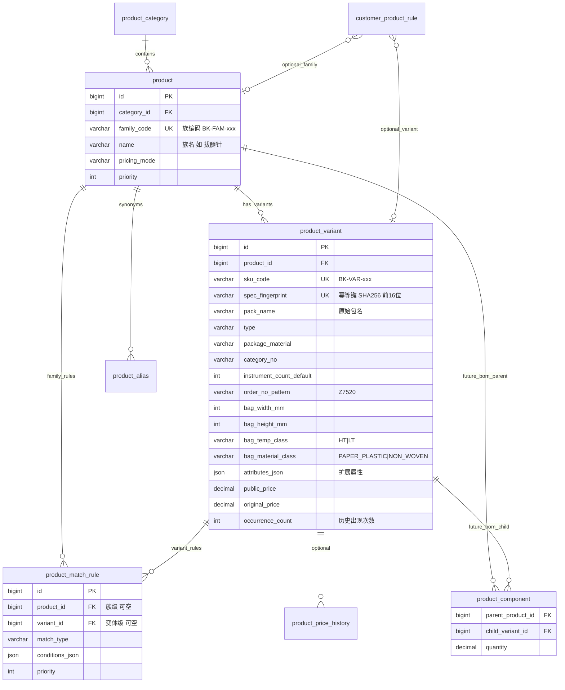

# 产品数据库升级与全量导入方案

> 编制日期：2026-07-10  
> 范围：**仅产品域**（`product` / `product_variant` / `product_match_rule` / 全量导入管线）  
> 关联文档：`[bokang-import-report.md](./bokang-import-report.md)`、`[数据库结构适配对比分析.md](./数据库结构适配对比分析.md)` §3.1、`[iteration-refactoring-plan.md](./iteration-refactoring-plan.md)` Phase 2  
> 文档性质：**规划文档**，不含代码实现；实施前需单独评审。

---

## 1. 背景与问题陈述

### 1.1 当前导入策略的局限

2026-07-10 已上线的 `BokangDataImportRunner` 将铂康 `hospital_reconciliation_row.sql`（**580,915 行**）流式扫描后，仅提取 **Top 500** 高频 `stem|type|material` 组合写入 `product` 表。导入结果：


| 指标                   | 数值                |
| -------------------- | ----------------- |
| 扫描行数                 | 580,915           |
| 写入 `product`         | +456（跳过 44 重名）    |
| 库内 `product` 总量      | **473**（含种子 17）   |
| `product_match_rule` | 473（1:1 CONTAINS） |


该策略适合快速启动主数据种子，但**不满足**「新系统须承载全部产品信息」的要求。

### 1.2 词干化（`extractPackNameStem`）导致的信息丢失

当前词干逻辑（`BokangSqlInsertParser.extractPackNameStem`）：

```java
// 取第一个 '-' 之前；若无 '-' 则取第一个 '/' 之前
// 拔髓针-5件/Z7520  →  拔髓针
// 机扩针架1针10/Z1020  →  机扩针架1针10（无 '-'，保留完整前缀）
// 车针-5（蓝色）Z/7626  →  车针
```

**丢失的语义：**


| 原始 `pack_name`                        | 词干结果                      | 丢失内容                            |
| ------------------------------------- | ------------------------- | ------------------------------- |
| `拔髓针-5件/Z7520`                        | `拔髓针`                     | 件数 `5`、型号 `Z7520`、袋规隐含 `75*200` |
| `机扩针架1针10/Z1020`                      | `机扩针架1针10`                | 型号 `Z1020`、针数 `10`              |
| `球钻-6/Z7520` vs `球钻-7/Z7520`          | 均 → `球钻`                  | 件数差异（影响小件折算与超封顶计价）              |
| `肖啸钻头0.7-1件/Z7520` vs `肖啸钻头1.5/Z7520` | 均 → `肖啸钻头0.7` / `肖啸钻头1.5` | 不一致截断规则                         |
| `棉球/Z1526`                            | `棉球`                      | 敷料型号 `Z1526`                    |
| `吸脂包敷料/W9050`                         | `吸脂包敷料`                   | 无纺布规格 `W9050`                   |


同词干多规格行在聚合时取 `expected_unit_price` **中位数**，进一步模糊规格级价差（如 `球钻-6` 期望 33 元 vs `球钻-7` 期望 38.5 元，词干后均归入「球钻」一条记录）。

### 1.3 对计价 / 匹配 / 客户策略的影响


| 影响面        | 具体后果                                                                                                                                                              |
| ---------- | ----------------------------------------------------------------------------------------------------------------------------------------------------------------- |
| **计价引擎**   | `PricingEngine` 按行字段（`pack_name`、`instrument_count`、`package_material`）实时计算；产品主数据不参与核心计价。但 `ProductMatchService` 用于分类推断、固定价规则前置匹配、UI 预览——词干化导致**预览命中与真实计价分支不一致**。 |
| **客户特例规则** | `customer_product_rule` 支持 `product_id` + `keywords`；当前 `product_id` 指向词干级产品，无法绑定「仅市五院 肖啸钻头 0.7」等规格级规则。                                                           |
| **匹配歧义**   | `CONTAINS` + `pattern_value=拔髓针` 会命中所有拔髓针规格行，无法区分 `Z7520` 与潜在其他型号。                                                                                                |
| **分类错误**   | 导入时硬编码 `category_id = SMALL_ITEM`；敷料包（`敷料包(无纺布包)`）、器械包（`器械包`）等 **14 种** `type` 未映射到 `product_category`。                                                           |
| **回归基线**   | 标杆 job（35/66/324）行级 golden 样本含规格差异；词干级主数据无法支撑「产品目录完整性」验收。                                                                                                         |


### 1.4 全量数据规模实测（2026-07-10 扫描）

对 `hospital_reconciliation_row.sql` 全量解析统计（与导入器相同列序）：


| 维度                                 | 去重数量        | 说明                    |
| ---------------------------------- | ----------- | --------------------- |
| 有效行（`pack_name` 非空）                | **580,911** | 与报告 580,915 基本一致      |
| `distinct pack_name`               | **846**     | 完整包名字符串               |
| `distinct stem`（词干）                | **691**     | 当前 Top 500 筛选池        |
| `distinct type`                    | **14**      | 计价路径分支关键字段            |
| `distinct package_material`        | **75**      | 袋型/材质规格               |
| `distinct stem|type|material`      | **806**     | 当前聚合 key              |
| `distinct pack_name|type|material` | **888**     | **推荐 variant 自然键**    |
| `distinct pack_name|material`      | **886**     | 略少于三元组（极少数 type 为空差异） |


**结论：** 全量导入规模可控（约 **700 产品族 + 900 规格变体**），并非 58 万 SKU；瓶颈在**建模与解析规则**，而非数据量。

---


## 2. 目标与原则


### 2.1 目标

1. **全量产品主数据**：自 58 万 row 去重维度导入 **全部 888 个规格变体**，零 Top-N 截断。
2. **规格维度建模**：引入 SKU 层级（产品族 → 规格变体），保留 `pack_name` 原始串、解析属性、袋型尺寸。
3. **向后兼容**：保留现有 `product` 表语义（产品族），不删除已有 **473 条**；增量迁移。
4. **可渐进迁移**：先 DDL + 并行导入，再切换匹配与 UI，最后废弃词干导入路径。


### 2.2 设计原则


| 原则           | 说明                                                                                |
| ------------ | --------------------------------------------------------------------------------- |
| **规格不可合并**   | 禁止 `extractPackNameStem` 作为持久化主键；可作为展示用 `family_name` 推导字段。                       |
| **自然键优先**    | Variant 幂等键 = `spec_fingerprint`（规范化后的 `pack_name + type + package_material` 哈希）。 |
| **分类可追溯**    | `type` → `product_category` 映射表驱动，非一律 `SMALL_ITEM`。                               |
| **匹配分层**     | 默认 variant 级 `COMPOSITE` 规则；产品族级规则用于宽泛兜底（needle 关键词等）。                            |
| **价格参考非合同价** | `expected_unit_price` 中位数仅作 `public_price` 参考；客户合同价仍在 `customer_product_rule`。    |
| **导入幂等**     | 重复执行全量导入仅 upsert 变更，不重复插入。                                                        |


---


## 3. 现状 Schema 分析


### 3.1 表字段清单


#### `product_category`（`schema.sql` L139–153）


| 字段                                        | 类型             | 说明                                         |
| ----------------------------------------- | -------------- | ------------------------------------------ |
| `id`                                      | BIGINT PK      |                                            |
| `code`                                    | VARCHAR(64) UK | `SMALL_ITEM`、`DRESSING_*`、`HT_PAPER` 等     |
| `name`                                    | VARCHAR(120)   | 展示名                                        |
| `parent_id`                               | BIGINT NULL    | 分类树                                        |
| `pricing_path`                            | VARCHAR(40)    | `standard` / `dressing_cotton` / `fixed` 等 |
| `sort_order` / `is_active` / `deleted_at` |                |                                            |


#### `product`（`schema.sql` L155–171）


| 字段                                      | 类型                             | 说明                     |
| --------------------------------------- | ------------------------------ | ---------------------- |
| `id`                                    | BIGINT PK                      |                        |
| `category_id`                           | BIGINT FK → `product_category` | 当前导入全为 `SMALL_ITEM`    |
| `sku_code`                              | VARCHAR(64) NULL               | 导入生成 `BK-{hash}`       |
| `name`                                  | VARCHAR(200)                   | **当前存词干**，目标改为**产品族名** |
| `pricing_mode`                          | VARCHAR(40) NULL               | 覆盖分类计价路径               |
| `public_price` / `original_price`       | DECIMAL(12,2)                  | 词干级中位价                 |
| `priority` / `is_active` / `deleted_at` |                                |                        |


#### `product_match_rule`（`schema.sql` L173–189）


| 字段                       | 类型                    | 说明                                                |
| ------------------------ | --------------------- | ------------------------------------------------- |
| `id`                     | BIGINT PK             |                                                   |
| `product_id`             | BIGINT FK → `product` | **仅关联产品族**                                        |
| `match_type`             | VARCHAR(20)           | `EXACT_NAME` / `CONTAINS` / `REGEX` / `COMPOSITE` |
| `target_field`           | VARCHAR(40)           | `pack_name` / `type` / `package_material` 等       |
| `pattern_value`          | VARCHAR(500)          | 当前多为词干字符串                                         |
| `match_fields`           | JSON                  | 简单匹配多字段                                           |
| `conditions_json`        | JSON                  | COMPOSITE 条件数组                                    |
| `priority` / `is_active` |                       |                                                   |


#### `product_alias`（`schema.sql` L191–202）


| 字段                       | 类型           | 说明                   |
| ------------------------ | ------------ | -------------------- |
| `id`                     | BIGINT PK    |                      |
| `product_id`             | BIGINT FK    | 同义词，当前几乎未使用          |
| `alias`                  | VARCHAR(200) |                      |
| `match_type`             | VARCHAR(20)  | `EXACT` / `CONTAINS` |
| `priority` / `is_active` |              |                      |


### 3.2 当前匹配模型局限

`ProductMatchServiceImpl` 匹配流程：

1. 遍历全部 `product`（缓存列表，当前 ~473 条）。
2. 先查 `product_alias`（CONTAINS / EXACT on `packName`）。
3. 再查 `product_match_rule`（支持 COMPOSITE，但导入仅写入 CONTAINS + 词干）。
4. 返回 `productId`、`productName`（族名）、`publicPrice`（族级中位价）。

**局限汇总：**


| #   | 局限                                 | 证据                                     |
| --- | ---------------------------------- | -------------------------------------- |
| L1  | 无 variant 实体，规格差异无法表达              | `product.name = 拔髓针` 无法区分 `Z7520`      |
| L2  | 匹配结果无 `variant_id`                 | `MatchPreviewResponse` 仅含 `productId`  |
| L3  | 价格挂在族级                             | `球钻` 族级中位价无法代表 `-6` 与 `-7` 行           |
| L4  | `type` / `package_material` 未结构化入库 | 仅作聚合 key，不落表                           |
| L5  | Top 500 截断                         | `BOKANG_MAX_PRODUCTS=500` 丢弃 306+ 低频组合 |
| L6  | 分类一律 `SMALL_ITEM`                  | 敷料/器械包路径错误                             |


---


## 4. 目标数据模型设计（核心）


### 4.1 方案对比


#### Option A（推荐）：`product`（产品族）+ `product_variant`（规格变体）

```
product (族)          product_variant (SKU)
  拔髓针        →       拔髓针-5件/Z7520 + 高温纸塑袋75*200
                        拔髓针-5件/Z7520 + 高温纸塑袋10  （2 variant）
  机扩针        →       机扩针架1针4/Z1020 + 高温纸塑袋100*200
                        机扩针架1针10/Z1020 + 高温纸塑袋100*200
                        ...（共 10 variant）
```


| 维度      | Option A                              | Option B：单表 + spec JSON                    |
| ------- | ------------------------------------- | ------------------------------------------ |
| 规格查询    | `WHERE variant.sku_code = ?` 索引友好     | `JSON_EXTRACT(spec_json,'$.order_no')` 性能差 |
| 价格维护    | variant 级 `public_price` 列            | JSON 内嵌，更新需整行重写                            |
| 匹配规则    | `product_match_rule.variant_id` 精确绑定  | 规则需解析 JSON，难做 COMPOSITE                    |
| 客户规则    | `customer_product_rule.variant_id` 可选 | 仅能 keywords 模糊匹配                           |
| UI 展示   | 族 → 展开 variant 列表                     | 单表扁平，规格藏 JSON                              |
| 迁移成本    | 新增 1 表 + 扩展 match_rule                | 改动 `product` 列语义，破坏现有 473 条                |
| 子产品 BOM | `product_component` 挂 variant         | 同左，但 JSON 更难约束                             |


**推荐 Option A**：与 `iteration-refactoring-plan.md` Phase 2「产品族 + 未来子产品」方向一致，且对现有 `product` 行零破坏。

### 4.2 ER 图（Mermaid）




### 4.3 DDL 草案（新增 / 扩展）

> 文件命名见 §10.3；通过 `migrate_manifest.txt` 登记，由 `SchemaMigrationRunner` 幂等执行。


#### 4.3.1 扩展 `product`（产品族）

```sql
-- schema_004_product_variant.sql (片段)

ALTER TABLE product
    ADD COLUMN family_code VARCHAR(64) NULL COMMENT '产品族稳定编码 BK-FAM-{hash}' AFTER sku_code,
    ADD COLUMN default_variant_id BIGINT NULL COMMENT '默认展示规格' AFTER family_code,
    ADD COLUMN variant_count INT NOT NULL DEFAULT 0 COMMENT '下属变体数' AFTER default_variant_id,
    ADD UNIQUE INDEX uk_product_family_code (family_code);
```

**语义变更：**

- `product.name`：由词干改为**规范化族名**（如 `拔髓针`、`机扩针`、`棉球`）。
- `product.sku_code`：保留族级编码；variant 使用独立 `sku_code`。
- `product.public_price`：可保留族级「代表价」（默认 variant 或中位数），**计价以 variant 为准**。


#### 4.3.2 新建 `product_variant`

```sql
CREATE TABLE IF NOT EXISTS product_variant (
    id                      BIGINT AUTO_INCREMENT PRIMARY KEY,
    product_id              BIGINT NOT NULL COMMENT '所属产品族',
    sku_code                VARCHAR(64) NOT NULL COMMENT 'SKU 唯一编码 BK-VAR-{fingerprint}',
    spec_fingerprint        VARCHAR(64) NOT NULL COMMENT 'pack_name|type|material 规范化哈希',

    -- 原始行字段（完整保留）
    pack_name               VARCHAR(300) NOT NULL COMMENT '原始包名，如 拔髓针-5件/Z7520',
    type                    VARCHAR(120) NULL COMMENT '额外包(纸塑袋)/敷料包(无纺布包)/器械包 等',
    package_material        VARCHAR(120) NULL COMMENT '高温纸塑袋75*200',
    category_no             VARCHAR(120) NULL COMMENT '铂康 category_no',

    -- 解析属性（结构化）
    family_name_parsed      VARCHAR(200) NULL COMMENT '解析族名 拔髓针',
    spec_suffix             VARCHAR(200) NULL COMMENT '规格后缀 5件/Z7520',
    instrument_count_hint   INT NULL COMMENT '包名解析件数',
    order_no_pattern        VARCHAR(32) NULL COMMENT 'Z7520 / Z1020 / W9050',
    pack_count_hint         INT NULL COMMENT '历史众数 pack_count',
    color_tag               VARCHAR(32) NULL COMMENT '蓝色/黄色 等车针色标',

    -- 袋型解析
    bag_material_class      VARCHAR(40) NULL COMMENT 'PAPER_PLASTIC|NON_WOVEN|COTTON_DRESSING|...',
    bag_temp_class          VARCHAR(10) NULL COMMENT 'HT|LT|NA',
    bag_width_mm            INT NULL COMMENT '75',
    bag_height_mm           INT NULL COMMENT '200',
    bag_size_label          VARCHAR(32) NULL COMMENT '20cm|30cm 计费标签',

    attributes_json         JSON NULL COMMENT '未入列扩展属性',
    display_name            VARCHAR(400) NOT NULL COMMENT 'UI 展示 拔髓针-5件/Z7520 · 高温纸塑袋75*200',

    -- 价格与统计
    public_price            DECIMAL(12,2) NULL COMMENT 'expected_unit_price 中位数',
    original_price          DECIMAL(12,2) NULL,
    price_sample_count      INT NOT NULL DEFAULT 0,
    occurrence_count        INT NOT NULL DEFAULT 0 COMMENT '580k 行中出现次数',
    first_seen_at           DATETIME NULL,
    last_seen_at            DATETIME NULL,

    is_active               TINYINT(1) NOT NULL DEFAULT 1,
    deleted_at              DATETIME NULL,
    created_at              DATETIME NOT NULL DEFAULT CURRENT_TIMESTAMP,
    updated_at              DATETIME NOT NULL DEFAULT CURRENT_TIMESTAMP ON UPDATE CURRENT_TIMESTAMP,

    FOREIGN KEY (product_id) REFERENCES product(id) ON DELETE CASCADE,
    UNIQUE KEY uk_variant_sku (sku_code),
    UNIQUE KEY uk_variant_fingerprint (spec_fingerprint),
    INDEX idx_variant_product (product_id, is_active),
    INDEX idx_variant_pack_name (pack_name(100)),
    INDEX idx_variant_type (type),
    INDEX idx_variant_order_no (order_no_pattern),
    INDEX idx_variant_material (bag_material_class, bag_temp_class, bag_width_mm, bag_height_mm)
) ENGINE=InnoDB DEFAULT CHARSET=utf8mb4;
```


#### 4.3.3 扩展 `product_match_rule`

```sql
ALTER TABLE product_match_rule
    ADD COLUMN variant_id BIGINT NULL COMMENT '变体级规则；与 product_id 互斥或族+变体分层' AFTER product_id,
    ADD INDEX idx_match_rule_variant (variant_id, priority);

-- 约束（应用层）：variant_id 非空时优先匹配变体；product_id 用于族级兜底
```


#### 4.3.4 扩展 `customer_product_rule`（衔接客户特例）

```sql
ALTER TABLE customer_product_rule
    ADD COLUMN variant_id BIGINT NULL COMMENT '规格级固定价/折叠规则' AFTER product_id,
    ADD INDEX idx_cpr_variant (variant_id);
```


#### 4.3.5 Future：`product_component`（子产品 BOM 占位）

```sql
CREATE TABLE IF NOT EXISTS product_component (
    id                  BIGINT AUTO_INCREMENT PRIMARY KEY,
    parent_product_id   BIGINT NOT NULL COMMENT '父产品族',
    child_variant_id    BIGINT NOT NULL COMMENT '子规格变体',
    quantity            DECIMAL(10,4) NOT NULL DEFAULT 1,
    notes               VARCHAR(200) NULL,
    is_active           TINYINT(1) DEFAULT 1,
    created_at          DATETIME NOT NULL DEFAULT CURRENT_TIMESTAMP,
    FOREIGN KEY (parent_product_id) REFERENCES product(id) ON DELETE CASCADE,
    FOREIGN KEY (child_variant_id) REFERENCES product_variant(id) ON DELETE CASCADE,
    UNIQUE KEY uk_component (parent_product_id, child_variant_id)
) ENGINE=InnoDB DEFAULT CHARSET=utf8mb4;
```


#### 4.3.6 可选：`product_price_history`

```sql
CREATE TABLE IF NOT EXISTS product_price_history (
    id              BIGINT AUTO_INCREMENT PRIMARY KEY,
    variant_id      BIGINT NOT NULL,
    price           DECIMAL(12,2) NOT NULL,
    price_type      VARCHAR(20) NOT NULL DEFAULT 'public' COMMENT 'public|original|contract',
    source          VARCHAR(40) NOT NULL DEFAULT 'bokang_row' COMMENT 'bokang_row|manual|import',
    effective_from  DATE NULL,
    created_at      DATETIME NOT NULL DEFAULT CURRENT_TIMESTAMP,
    FOREIGN KEY (variant_id) REFERENCES product_variant(id) ON DELETE CASCADE,
    INDEX idx_price_history_variant (variant_id, effective_from)
) ENGINE=InnoDB DEFAULT CHARSET=utf8mb4;
```


### 4.4 匹配规则分层策略


| 层级             | 挂载点             | `match_type` | 典型用途                                                   |
| -------------- | --------------- | ------------ | ------------------------------------------------------ |
| **Variant 精确** | `variant_id`    | `COMPOSITE`  | `pack_name EXACT` + `package_material CONTAINS 75*200` |
| **Variant 正则** | `variant_id`    | `REGEX`      | `pack_name REGEX ^机扩针架1针4/Z1020$`                      |
| **族级兜底**       | `product_id`    | `CONTAINS`   | needle 关键词：`拔髓针`、`机扩针`（供无 variant 规则时的分类推断）            |
| **别名**         | `product_alias` | `CONTAINS`   | 医院俗称 → 族                                               |


**匹配优先级（**`ProductMatchService` **目标态）：**

1. `variant_id` 非空规则（priority 升序）
2. `product_alias`
3. `product_id` 族级规则
4. 无匹配 → 返回空，由 `PricingEngine` 纯规则计价

---


## 5. 规格解析规则设计


### 5.1 `pack_name` 模式分类（基于铂康真实数据）


| 模式 ID | 正则 / 结构                 | 示例                         | 解析输出                                         |
| ----- | ----------------------- | -------------------------- | -------------------------------------------- |
| P1    | `{族}-{N}件/{ORDER}`      | `拔髓针-5件/Z7520`             | family=拔髓针, count=5, order=Z7520             |
| P2    | `{族}-{N}/{ORDER}`       | `唇钩-2/Z7520`、`成型片-3/Z7526` | family, count=N, order                       |
| P3    | `{族}--{N}/{ORDER}`      | `充填器--1/Z7530`             | family=充填器, count=1（双连字符）                    |
| P4    | `{族}-{N}（{色}）Z/{ORDER}` | `车针-5（蓝色）Z/7626`           | family=车针, count=5, color=蓝色, order=Z7626    |
| P5    | `{族}{N}针{M}/{ORDER}`    | `机扩针架1针10/Z1020`           | family=机扩针, frame=1, needles=10, order=Z1020 |
| P6    | `{族}{规格}-{N}件/{ORDER}`  | `肖啸钻头0.7-1件/Z7520`         | family=肖啸钻头, size=0.7, count=1               |
| P7    | `{族}{规格}/{ORDER}`       | `肖啸钻头1.5/Z7520`            | family=肖啸钻头, size=1.5                        |
| P8    | `{族}/Z{NNNN}`           | `棉球/Z1526`                 | family=棉球, order=Z1526                       |
| P9    | `{族}敷料/{CODE}`          | `吸脂包敷料/W9050`、`眼包敷料/w7050` | family=吸脂包敷料, code=W9050                     |
| P10   | `{族}-1/{order}` 小写      | `手机-1/z7526`、`弯剪刀-1/z7520` | order 大小写归一 Z7526                            |
| P11   | 无规格后缀                   | `眼包敷料`                     | family=眼包敷料, spec_suffix=NULL                |


### 5.2 `package_material` 解析


| 原始值             | `bag_material_class` | `bag_temp_class` | `bag_width_mm` | `bag_height_mm` | `bag_size_label`      |
| --------------- | -------------------- | ---------------- | -------------- | --------------- | --------------------- |
| `高温纸塑袋75*200`   | PAPER_PLASTIC        | HT               | 75             | 200             | 20cm                  |
| `高温纸塑袋75*300`   | PAPER_PLASTIC        | HT               | 75             | 300             | 30cm                  |
| `高温纸塑袋100*200`  | PAPER_PLASTIC        | HT               | 100            | 200             | 10cm                  |
| `高温纸塑袋100*260`  | PAPER_PLASTIC        | HT               | 100            | 260             | 10cm                  |
| `高温纸塑袋150*260`  | PAPER_PLASTIC        | HT               | 150            | 260             | 15cm                  |
| `高温纸塑袋75*260`   | PAPER_PLASTIC        | HT               | 75             | 260             | （非标准，标记 unrecognized） |
| `高温纸塑袋10`       | PAPER_PLASTIC        | HT               | NULL           | NULL            | 10cm（仅高度标签）           |
| `无纺布-90×90-50g` | NON_WOVEN            | HT               | 90             | 90              | 90（敷料 measure）        |
| `无纺布-70×70-50g` | NON_WOVEN            | HT               | 70             | 70              | 70                    |


**正则：**

```text
纸塑袋: ^(高温|低温)?纸塑袋(\d+)[*×](\d+)$
纸塑袋简写: ^高温纸塑袋(\d+)$          → 仅 bag_size_label
无纺布: ^无纺布-(\d+)[×x](\d+)-(\d+)g$
```


### 5.3 `type` → `product_category` 映射


| `type`（铂康）    | 出现次数（约） | `product_category.code`            | `pricing_path`      |
| ------------- | ------- | ---------------------------------- | ------------------- |
| `额外包(纸塑袋)`    | 256,474 | `HT_PAPER_PLASTIC` 或 `SMALL_ITEM`* | `standard`          |
| `敷料包(无纺布包)`   | 140,405 | `DRESSING_NONWOVEN`                | `dressing_nonwoven` |
| `器械包`         | 69,039  | `INSTRUMENT_PACK`                  | `standard`          |
| `器械包(ZSD)`    | 34,182  | `INSTRUMENT_PACK`                  | `standard`          |
| `器械包(哈工大专用)`  | 20,601  | `INSTRUMENT_PACK`                  | `standard`          |
| `器械包装(南岗专用)`  | 19,750  | `INSTRUMENT_PACK`                  | `standard`          |
| `敷料包(哈工大专用)`  | 17,713  | `DRESSING_NONWOVEN`                | `dressing_nonwoven` |
| `敷料包(无纺布包)` 等 | …       | 见种子扩展                              |                     |


 `额外包(纸塑袋)` 内既含小件（拔髓针）也含普通器械；**族级**再按 `family_name` 判断是否 `SMALL_ITEM`（needle 关键词表）。

### 5.4 规范化与 `spec_fingerprint` 生成

```text
canonical_pack_name  = trim(pack_name)
canonical_type       = trim(type ?? "")
canonical_material   = normalize_material(package_material)
                     // 全角×→*，高温纸塑袋统一大小写

fingerprint_input    = lower(canonical_pack_name) + "|" + canonical_type + "|" + canonical_material
spec_fingerprint     = "fp-" + sha256(fingerprint_input).substring(0, 16)
sku_code             = "BK-VAR-" + spec_fingerprint.substring(3)
family_code          = "BK-FAM-" + sha256(normalized_family_name).substring(0, 12)
```

**族名规范化（**`normalized_family_name`**）：**

1. 按 §5.1 模式解析取 `family` 字段。
2. 若解析失败，回退 `extractPackNameStem`（仅用于族归并，**不用于 variant 键**）。
3. 同族合并：`机扩针架1针4` / `机扩针架1针10` → 族名统一 `机扩针`（配置「族名归并表」）。


### 5.5 标杆产品解析示例


#### 拔髓针（2 variant，1709 行提及）


| pack_name      | package_material | type       | variant 唯一性       |
| -------------- | ---------------- | ---------- | ----------------- |
| `拔髓针-5件/Z7520` | `高温纸塑袋75*200`    | `额外包(纸塑袋)` | variant A（主力）     |
| `拔髓针-5件/Z7520` | `高温纸塑袋10`        | `额外包(纸塑袋)` | variant B（袋型标签异常） |


#### 机扩针（10 variant，哈工大 job 324）


| pack_name        | package_material | expected_unit_price（典型） |
| ---------------- | ---------------- | ----------------------- |
| `机扩针架1针4/Z1020`  | `高温纸塑袋100*200`   | 27.5                    |
| `机扩针架1针5/Z1020`  | `高温纸塑袋100*200`   | 33.0                    |
| `机扩针架1针10/Z1020` | `高温纸塑袋100*200`   | 60.5                    |
| `机扩针架1针3/Z1020`  | `高温纸塑袋150*260`   | （按行）                    |


---


## 6. 全量导入方案


### 6.1 Phase 1：维度分析（已完成基线）

**目标：** 确认 cardinality，指导 DDL 与内存预算。

**流式聚合查询设计（伪 SQL / 导入器内存结构）：**

```sql
-- 若 row 已入库（dev 全量场景）：
SELECT pack_name, type, package_material,
       COUNT(*) AS occurrence_count,
       COUNT(DISTINCT expected_unit_price) AS price_distinct_count,
       AVG(expected_unit_price) AS avg_price,
       MIN(expected_unit_price) AS min_price,
       MAX(expected_unit_price) AS max_price
FROM hospital_reconciliation_row
WHERE pack_name IS NOT NULL AND pack_name != ''
GROUP BY pack_name, type, package_material;
-- 预期结果行数：888
```

**文件流式方案（生产导入，row 不入库）：**

```
read hospital_reconciliation_row.sql line-by-line
  → parse INSERT values
  → key = (pack_name, type, package_material)
  → aggregate: occurrence_count, price_list[], first/last seen
  → NO limit (去掉 Top 500)
```

**实测基数（2026-07-10）：**


| 实体                              | 预估数量                              |
| ------------------------------- | --------------------------------- |
| `product`（族）                    | **~400–550**（691 stem 经族名归并后略减）   |
| `product_variant`               | **888**                           |
| `product_match_rule`（variant 级） | **~888**（每 variant 1 条 COMPOSITE） |
| `product_match_rule`（族级兜底）      | **~400**（可选，needle 关键词）           |


### 6.2 Phase 2：导入管线


#### 6.2.1 组件设计


| 组件                        | 职责                                         |
| ------------------------- | ------------------------------------------ |
| `ProductFullImportRunner` | 新主编排；与 `BokangDataImportRunner` 并列，由独立开关触发 |
| `PackNameSpecParser`      | §5 规则解析 pack_name / material               |
| `ProductFamilyResolver`   | 族名归并、category 推断                           |
| `VariantUpsertService`    | 按 `spec_fingerprint` 幂等 INSERT/UPDATE      |
| `ProductMigrationService` | 473 条旧 product → 族 + 默认 variant 映射         |


#### 6.2.2 替换词干逻辑


| 现状                                     | 目标                                                      |
| -------------------------------------- | ------------------------------------------------------- |
| `extractPackNameStem` → `product.name` | **仅**用于 `family_name_parsed`；`product.name` 写规范化族名      |
| `stem|type|material` 聚合 key            | `pack_name|type|package_material` → `spec_fingerprint`  |
| `limit(maxProducts)` Top 500           | **移除上限**；`IMPORT_BOKANG_FULL_PRODUCTS=1` 时全量            |
| 中位价写 `product.public_price`            | 中位价写 `product_variant.public_price`；族级取 default variant |


#### 6.2.3 幂等 Upsert 流程

```
FOR each aggregated variant key:
  1. parse spec → family_name, attributes
  2. upsert product (family_code, name=family_name, category_id=resolved)
  3. upsert product_variant (spec_fingerprint, sku_code, parsed columns, prices, counts)
  4. upsert product_match_rule (variant_id, COMPOSITE conditions — 见 §6.4)
  5. update product.variant_count, default_variant_id
ON CONFLICT spec_fingerprint:
  UPDATE occurrence_count, public_price (if new samples), last_seen_at
```


#### 6.2.4 批处理与运行时估算


| 参数          | 建议值                                          |
| ----------- | -------------------------------------------- |
| 聚合阶段 batch  | 全内存 Map（888 键，约 < 10 MB）                     |
| DB 写入 batch | 100 条/批 `INSERT ... ON DUPLICATE KEY UPDATE` |
| 预计耗时        | 扫描 58 万行 **~30s**；写入 888 variant **< 5s**    |
| 内存峰值        | < 256 MB（远低于对账作业）                            |


#### 6.2.5 Docker / 环境变量

```powershell
# 全量产品导入（与现有客户/规则导入独立）
$env:IMPORT_BOKANG_DATA = "1"              # 原有 master data
$env:IMPORT_BOKANG_FULL_PRODUCTS = "1"     # 新增：全量 variant
$env:BOKANG_MAX_PRODUCTS = "0"             # 0 表示不限制（或废弃该变量）
docker compose up -d --build backend
```

`application.yml` 扩展：

```yaml
app:
  import:
    bokang:
      enabled: ${IMPORT_BOKANG_DATA:false}
      fullProducts: ${IMPORT_BOKANG_FULL_PRODUCTS:false}
      dataDir: ${BOKANG_DATA_DIR:./铂康/建表语句}
```

`sys_setting` 标记：`bokang_full_product_import_v1`（与 `bokang_data_import_v1` 分离）。

### 6.3 Phase 3：价格赋值


| 字段                               | 规则                                                                        |
| -------------------------------- | ------------------------------------------------------------------------- |
| `product_variant.public_price`   | 同 fingerprint 所有 `expected_unit_price` 的**中位数**（与现逻辑一致，但**按 variant 隔离**） |
| `product_variant.original_price` | 初始同 `public_price`；后续 UI 可改                                               |
| `product.public_price`           | `default_variant.public_price`                                            |
| 客户合同价                            | **不在此阶段写入**；仍由 `customer_product_rule` 管理                                 |


**异常处理：**

- `expected_unit_price IS NULL` 的行（如 `充填器--1/Z7530` + `75*300`）→ `public_price = NULL`，`price_sample_count = 0`。
- 同 variant 多个不同价格（医院差异）→ 中位数 + 记录 `price_distinct_count` 于 `attributes_json` 供人工审核。

**可选** `product_price_history`**：** 首次导入写一条 `source=bokang_row`；后续手工调价写 `manual`。

### 6.4 Phase 4：匹配规则升级


#### Variant 级 COMPOSITE 规则模板

```json
{
  "match_type": "COMPOSITE",
  "variant_id": 123,
  "priority": 100,
  "conditions_json": [
    {"field": "pack_name", "operator": "equals", "value": "拔髓针-5件/Z7520"},
    {"field": "package_material", "operator": "contains", "value": "75*200"},
    {"field": "type", "operator": "equals", "value": "额外包(纸塑袋)"}
  ]
}
```


#### 族级兜底（needle 关键词）

```json
{
  "match_type": "CONTAINS",
  "product_id": 45,
  "target_field": "pack_name",
  "pattern_value": "拔髓针",
  "priority": 200
}
```

**注意：** 族级 CONTAINS 仅用于分类/预览兜底；variant 规则 priority 更高（100 < 200）。

---


## 7. 与现有功能衔接


### 7.1 `customer_product_rule`


| 场景        | 推荐挂载                      | 示例                           |
| --------- | ------------------------- | ---------------------------- |
| 客户固定价（整族） | `product_id`              | 省二院 `3.6空心钉工具包`              |
| 客户规格固定价   | `variant_id`              | 市五院 `肖啸钻头0.7-1件/Z7520` = 8 元 |
| 按件价       | `product_id` + `keywords` | 农大 `洁牙机尖` pricePerInstrument |
| 折叠规则      | `product_id` + `keywords` | 松电 `机扩针` fold                |


**迁移：** 现有 32 条 `customer_product_rule` 保持 `product_id`；若 keywords 可唯一定位 variant，可选增量挂 `variant_id`。

### 7.2 `PricingEngine` / `ProductMatchService`


| 组件                        | 变更                                                                                                           |
| ------------------------- | ------------------------------------------------------------------------------------------------------------ |
| `ProductMatchServiceImpl` | 缓存增加 `product_variant` + variant 级 rules；`matchRow` 返回 `variantId`、`variantDisplayName`、`variantPublicPrice` |
| `MatchPreviewResponse`    | 扩展字段：`variantId`、`specFingerprint`、`matchedVariantRuleId`                                                    |
| `PricingRuleCompiler`     | 可选读取 `variantId` 辅助 `customer_product_rule` 精确匹配                                                             |
| `PricingEngine`           | **核心计价不变**（仍读行字段）；产品匹配仅影响分类提示与固定价前置                                                                          |


### 7.3 UI：产品目录


| 页面                    | 行为                                              |
| --------------------- | ----------------------------------------------- |
| `/master/products` 列表 | 展示产品族；`variant_count` 徽章                        |
| 族详情                   | 可展开 variant 表：pack_name、袋型、参考价、出现次数             |
| 匹配模拟器                 | 输入 pack_name + material + type → 命中 variant 行高亮 |
| 客户规则编辑                | 产品选择器支持「族 → 规格」二级选择                             |


### 7.4 已有 473 条 `product` 迁移

**原则：** 不删除、不改 `id`（避免 FK 断裂）。

```
FOR each existing product P (name = stem):
  1. 设置 P.family_code = BK-FAM-{hash(stem)}
  2. 查找全量导入中 family_name = stem 的所有 variant
  3. IF 有 variant:
       设 P.default_variant_id = 出现次数最多的 variant
       更新 P.variant_count
  4. 保留 P 上原有 product_match_rule（族级 CONTAINS）作为低优先级兜底
  5. IF stem 仅对应 1 个 variant：variant.product_id = P.id
     ELSE 合并到同一族或按配置拆分
```

**冲突：** 44 个 skipped 产品（导入时已存在词干）→ 全量导入时合并 variant 到已有 `product.id`。

---


## 8. 实施路线图（仅产品域）


| 阶段                    | 周期            | 交付物                                                                          | 验收标准                                                 | 风险                |
| --------------------- | ------------- | ---------------------------------------------------------------------------- | ---------------------------------------------------- | ----------------- |
| **Phase 0：评审与基线**     | 第 1 周（2 人日）   | 本文档评审纪要；`analyze_row_dimensions` 脚本入 `scripts/`（可选）                          | 888 variant 基数确认；DDL 评审通过                            | 族名归并规则争议          |
| **Phase 1：DDL 迁移**    | 第 2 周（3 人日）   | `schema_004_product_variant.sql`；`migrate_manifest.txt` 更新；`product` 扩展列     | Docker 启动迁移幂等；`product_variant` 表存在                  | 与 Phase 2 客户域迁移顺序 |
| **Phase 2：解析器 + 导入器** | 第 3–4 周（8 人日） | `PackNameSpecParser`；`ProductFullImportRunner`；`IMPORT_BOKANG_FULL_PRODUCTS` | dev 导入 `product_variant` = **888**；`product` 族 ≥ 400 | 族名归并过粗/过细         |
| **Phase 3：匹配服务升级**    | 第 5 周（5 人日）   | `ProductMatchService` variant 支持；API `/api/products/match` 增强                | 标杆行命中正确 variant（见 §9）                                | 缓存刷新性能（888 规则可接受） |
| **Phase 4：UI + 迁移**   | 第 6 周（5 人日）   | 产品列表 variant 展开；473 条旧数据迁移脚本                                                 | UI 可浏览全量 variant；旧 ID 不变                             | 前端工作量             |
| **Phase 5：切换与清理**     | 第 7 周（2 人日）   | 默认启用全量导入；`BOKANG_MAX_PRODUCTS` 废弃文档                                          | `bokang_full_product_import_v1` 标记写入                 | 生产重复导入窗口          |


**总工期：** 约 **7 周 / 25 人日**（可与 `iteration-refactoring-plan` Phase 2 并行）。

---


## 9. 验收标准


### 9.1 数量指标


| 指标                              | 目标                       |
| ------------------------------- | ------------------------ |
| `product_variant` 行数            | **= 888**（±0，与 row 去重一致） |
| `product` 族行数                   | **≥ 400** 且 **≤ 691**    |
| `product_match_rule`（variant 级） | **≥ 888**                |
| 已有 `product` 保留                 | **473 条 id 不变**          |
| `occurrence_count` 之和           | **= 580,911**            |


### 9.2 标杆产品可区分性


| 产品族   | 必须区分的 variant 数            | 验证行                                           |
| ----- | -------------------------- | --------------------------------------------- |
| 拔髓针   | ≥ 2（不同 `package_material`） | job 35：`拔髓针-5件/Z7520` + `75*200` vs `高温纸塑袋10` |
| 机扩针   | ≥ 10                       | job 324：`机扩针架1针4/Z1020` ≠ `机扩针架1针10/Z1020`    |
| 球钻    | ≥ 3（`-4`/`-6`/`-7` 件）      | job 5：期望价 22 / 33 / 38.5                      |
| 肖啸钻头  | ≥ 5（0.7/0.8/1.0/1.5/2.5）   | job 66                                        |
| 棉球    | ≥ 1                        | `棉球/Z1526` + `敷料包(纸塑袋)`                       |
| 吸脂包敷料 | ≥ 2                        | `W9050` vs 无后缀 `眼包敷料`                         |


### 9.3 匹配预览命中

```
POST /api/products/match
{
  "packName": "拔髓针-5件/Z7520",
  "packageMaterial": "高温纸塑袋75*200",
  "type": "额外包(纸塑袋)"
}
→ variantId 对应 fingerprint A；productName=拔髓针；publicPrice=16.5
```


### 9.4 无重复 / 遗漏抽样


| 方法        | 操作                                                                           |
| --------- | ---------------------------------------------------------------------------- |
| **全覆盖**   | `COUNT(DISTINCT spec_fingerprint)` = 888                                     |
| **随机抽样**  | 从 row 随机 200 行，逐行 `matchRow` 必命中 1 个 variant                                 |
| **集差检查**  | row 去重集合 LEFT JOIN variant ON fingerprint → 空集                               |
| **价格一致性** | 标杆 job 35/66/324 每行 `variant.public_price` = `expected_unit_price` 或 NULL 对齐 |


---


## 10. 附录


### 10.1 字段映射表：`hospital_reconciliation_row` → `product_variant`


| row 字段                | product_variant 字段      | 转换说明                               |
| --------------------- | ----------------------- | ---------------------------------- |
| `pack_name`           | `pack_name`             | 原样保留                               |
| `type`                | `type`                  | 原样；并映射 `product.category_id`       |
| `package_material`    | `package_material`      | 原样；解析袋型列                           |
| `category_no`         | `category_no`           | 原样（铂康内部编号）                         |
| `pack_count`          | `pack_count_hint`       | 取该 variant 众数                      |
| `instrument_count`    | `instrument_count_hint` | 取众数；优先包名解析值                        |
| `expected_unit_price` | `public_price`          | 聚合中位数                              |
| —                     | `spec_fingerprint`      | §5.4 生成                            |
| —                     | `family_name_parsed`    | §5.1 解析                            |
| —                     | `order_no_pattern`      | 从 pack_name 提取 Z/W 码               |
| —                     | `display_name`          | `{pack_name} · {package_material}` |
| —                     | `occurrence_count`      | `COUNT(*)` per variant             |


### 10.2 样本数据表（铂康真实 row）


| #   | job_id | pack_name          | package_material | type        | instrument_count | expected_unit_price | pricing_rule      |
| --- | ------ | ------------------ | ---------------- | ----------- | ---------------- | ------------------- | ----------------- |
| 1   | 5      | `拔髓针-5件/Z7520`     | `高温纸塑袋75*200`    | `额外包(纸塑袋)`  | 5                | 16.5                | 高温纸塑袋20cm计费       |
| 2   | 5      | `车针-5（蓝色）Z/7626`   | `高温纸塑袋75*200`    | `额外包(纸塑袋)`  | 5                | 16.5                | 高温纸塑袋20cm计费       |
| 3   | 5      | `球钻-6/Z7520`       | `高温纸塑袋75*200`    | `额外包(纸塑袋)`  | 6                | 33.0                | 高温纸塑袋20cm计费       |
| 4   | 5      | `球钻-7/Z7520`       | `高温纸塑袋75*200`    | `额外包(纸塑袋)`  | 7                | 38.5                | 高温纸塑袋20cm计费       |
| 5   | 5      | `充填器--1/Z7530`     | `高温纸塑袋75*300`    | `额外包(纸塑袋)`  | 4                | NULL                | 高温纸塑袋30cm计费       |
| 6   | 324    | `机扩针架1针10/Z1020`   | `高温纸塑袋100*200`   | `额外包(纸塑袋)`  | 22               | 60.5                | 高温纸塑袋10cm计费       |
| 7   | 324    | `机扩针架1针4/Z1020`    | `高温纸塑袋100*200`   | `额外包(纸塑袋)`  | 5                | 27.5                | 高温纸塑袋10cm计费       |
| 8   | 66     | `肖啸钻头0.7-1件/Z7520` | `高温纸塑袋75*200`    | `额外包(纸塑袋)`  | 1                | 8.0                 | 高温纸塑袋10cm计费       |
| 9   | 40     | `棉球/Z1526`         | `高温纸塑袋150*260`   | `敷料包(纸塑袋)`  | 0                | 2.5                 | 敷料包(纸塑袋)+棉球——15cm |
| 10  | 34     | `吸脂包敷料/W9050`      | `无纺布-90×90-50g`  | `敷料包(无纺布包)` | 0                | 30.0                | 敷料包(无纺布包)——90     |


### 10.3 DDL 迁移文件命名


| 顺序  | 文件名                                                                          | 内容                                                                                 |
| --- | ---------------------------------------------------------------------------- | ---------------------------------------------------------------------------------- |
| 1   | `backend/src/main/resources/db/schema_004_product_variant.sql`               | `product_variant` 建表；`product` / `product_match_rule` / `customer_product_rule` 扩展 |
| 2   | `backend/src/main/resources/db/schema_005_seed_product_categories.sql`       | 补充 `INSTRUMENT_PACK` 等 14 种 type 映射分类                                              |
| 3   | `backend/src/main/resources/db/schema_006_product_component_placeholder.sql` | Future BOM 表（可 Phase 6）                                                            |
| 4   | `backend/src/main/resources/db/schema_007_product_price_history.sql`         | 可选价格历史                                                                             |


`migrate_manifest.txt` **追加：**

```text
schema_004_product_variant.sql
schema_005_seed_product_categories.sql
```


### 10.4 相关代码路径（实施参考）


| 路径                                           | 现状                    | 目标变更                             |
| -------------------------------------------- | --------------------- | -------------------------------- |
| `imports/bokang/BokangSqlInsertParser.java`  | `extractPackNameStem` | 保留；新增 `PackNameSpecParser`       |
| `imports/bokang/BokangDataImportRunner.java` | Top 500 词干导入          | 拆分；全量改 `ProductFullImportRunner` |
| `imports/bokang/BokangImportProperties.java` | `maxProducts=500`     | 新增 `fullProducts` 开关             |
| `service/impl/ProductMatchServiceImpl.java`  | 仅 product 级           | 扩展 variant 级匹配                   |
| `resources/schema.sql`                       | 无 variant             | 长期同步入 baseline（迁移后）              |


---

*文档结束。实施前请确认 §4 族名归并表（尤其「机扩针架1针N」→「机扩针」）与业务方达成一致。*