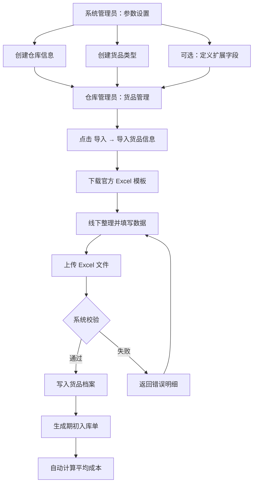
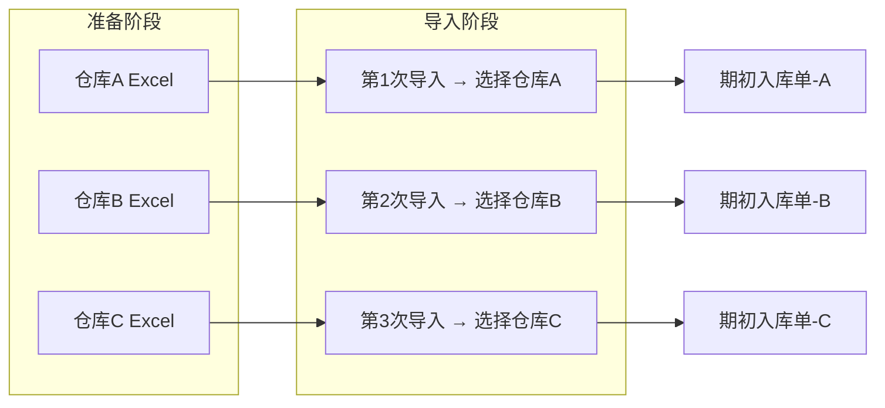

# 冠唐云仓库 · 货品信息批量导入 · 功能分析

> 面向产品与开发 | 编制日期：2026年7月10日  
> 参考系统：冠唐云仓库（对标/借鉴，非医院计费系统）

---

## 一、需求背景与目标

### 1.1 背景

企业在启用「冠唐云仓库」或类似仓库管理系统时，往往已有大量历史货品档案与期初库存数据，分散在 Excel、旧系统或纸质台账中。若逐条手工录入，效率低、易出错，且难以在多仓库场景下统一完成期初建账。

### 1.2 目标

1. **一次性批量建档**：通过 Excel 模板整理货品基本信息，一键上传完成系统建档。
2. **支持期初库存建账**：导入时可携带「初始库存数量」与「初始库存金额」，系统自动生成期初入库单并完成成本核算。
3. **支持多仓库分仓导入**：多仓库管理模式下，可按仓库分别整理数据、分别导入各仓期初库存与金额。
4. **降低上线门槛**：减少实施与客户自助操作成本，缩短系统上线周期。

---

## 二、功能范围

### 2.1 包含（In Scope）

| 编号 | 功能项 | 说明 |
|------|--------|------|
| F1 | 标准模板下载 | 系统提供官方 Excel 导入模板，字段与系统档案一致 |
| F2 | 货品基本信息导入 | 名称、编码、类型、规格、单位、品牌等基础字段 |
| F3 | 期初库存导入 | 支持填写当前库存数量、当前库存金额（总价） |
| F4 | 期初入库单生成 | 导入成功后自动生成一笔期初入库单，用于库存与成本追溯 |
| F5 | 单仓导入约束 | 单次导入绑定一个目标仓库（多仓需分文件/分次导入） |
| F6 | 字段映射与校验 | 上传后系统校验必填项、编码唯一性、仓库/类型是否存在等 |
| F7 | 导入结果反馈 | 成功/失败行提示，便于修正后重传 |

### 2.2 不含（Out of Scope）

| 编号 | 排除项 | 说明 |
|------|--------|------|
| O1 | 库存二次覆盖/叠加 | 期初库存与金额通常**仅可导入一次**，重复导入不替换、不叠加（见参考来源②） |
| O2 | 跨仓混导 | 单次导入不支持同一 Excel 内货品分散写入多个不同仓库（需分仓分次） |
| O3 | 出入库业务单据批量导入 | 本功能聚焦「货品档案 + 期初库存」，不含日常出入库单批量导入 |
| O4 | 图片/附件批量导入 | 货品图片等富媒体不在本功能范围 |
| O5 | 自动从第三方 ERP 拉取 | 需客户自行整理 Excel，系统不提供外部系统自动同步 |

---

## 三、用户角色与使用场景

### 3.1 角色

| 角色 | 职责 | 权限要求 |
|------|------|----------|
| 系统管理员 | 预置仓库、货品类型、扩展字段等基础参数 | 系统设置 / 参数设置 |
| 仓库管理员 | 整理模板、执行导入、核对期初数据 | 货品管理 · 导入权限 |
| 实施顾问 | 协助客户清洗数据、分仓导入、验收 | 同上 + 参数配置 |
| 财务/成本会计 | 核对期初金额、期初入库单 | 库存查询、单据查看 |

### 3.2 典型场景

**场景 A：新账套上线（单仓库）**

- 客户首次使用系统，需导入 500+ SKU 及对应期初库存。
- 管理员先在参数设置中创建仓库与货品类型 → 下载模板 → 批量填写 → 上传 → 系统生成期初入库单。

**场景 B：多仓库分仓期初（用户明确需求）**

- 客户有「主仓」「门店仓」「备件仓」三个仓库，各仓期初库存不同。
- 按仓库拆分为 3 份 Excel（或在同一模板中统一指定同一「所在仓库」列值），**分 3 次导入**，每次选择对应目标仓库。

**场景 C：仅建档、不导库存**

- 先导入货品基本信息（不填数量/金额/仓库），后续通过正常入库流程补库存。

**场景 D：含自定义扩展字段**

- 客户需记录「批次规则」「存储条件」等扩展属性 → 先在参数设置定义扩展字段 → 模板中填写对应列 → 导入时校验字段映射。

---

## 四、业务流程

### 4.1 初始导入（含期初库存）主流程

### 4.2 操作步骤（对标冠唐云仓库官方流程）

1. 进入 **货品管理** 页面，右上角点击 **导入 → 导入货品信息**。
2. 在弹出窗口点击 **模板下载**，获取标准 Excel。
3. 按模板填写货品信息（见第五节字段说明）。
4. 返回系统上传已填写的 Excel，确认导入。
5. 导入成功后：货品档案生效，并 **自动生成一笔期初入库单**。

> **来源**：冠唐云仓库帮助中心官方文档（2025-11-12 更新）。

### 4.3 多仓库分仓导入流程

**关键规则（综合官方文档与扩展资料）：**

- 填写了 **库存数量** 和/或 **库存金额** 的行，**必须填写「所在仓库」**，且该仓库名称须已在系统中存在。
- **每次导入操作仅针对一个目标仓库**（扩展资料明确：期初库存导入需选择导入仓库）；多仓数据应 **分文件或分次上传**。
- 同一货品的期初库存 **通常只允许导入一次**；再次导入不会替换或累加已有期初数据（扩展资料，实施时需向客户说明）。

---

## 五、数据字段与导入模板设计建议

### 5.1 官方已知规则

| 规则 | 说明 | 来源 |
|------|------|------|
| 货品名称 | **必填** | 官方帮助 |
| 货品编码 | 可自定义；不填则系统自动编码；**系统内唯一，不可重复** | 官方帮助 |
| 当前库存金额 | 指该货品**总价**（非单价）；导入后系统自动计算平均成本 | 官方帮助 |
| 所在仓库 | 填写了数量/金额时 **必填**；须与参数设置中已有仓库名称一致 | 官方帮助 |
| 货品类型 | 须与参数设置中已定义类型一致 | 官方帮助 |
| Excel 公式 | **禁止**使用计算公式，须转为数值 | 官方帮助 |
| 模板首行 | 标题行不可修改（扩展资料） | 假设/扩展 |

### 5.2 建议模板字段清单

> 以下字段基于官方说明 + 行业通用 WMS 实践整理；**具体列名以系统下载的官方模板为准**（待下载模板后核对）。

| 列名（建议） | 必填 | 数据类型 | 说明 |
|--------------|------|----------|------|
| 货品名称 | 是 | 文本 | 系统内展示主名称 |
| 货品编码 | 否* | 文本 | 不填则自动生成；填则须唯一 |
| 货品类型 | 否 | 文本 | 须存在于参数设置；多级类型可用 `/` 分隔上下级（扩展资料） |
| 规格型号 | 否 | 文本 | 如「500ml/瓶」 |
| 单位 | 否 | 文本 | 如「个」「箱」「kg」 |
| 品牌 | 否 | 文本 | — |
| 条码 | 否 | 文本 | 可选 |
| 所在仓库 | 条件必填 | 文本 | 有数量/金额时必填 |
| 当前库存数量 | 否 | 数值 | 期初数量；纯整数或小数视业务 |
| 当前库存金额 | 否 | 数值 | 期初**总价** |
| 自定义扩展字段 | 否 | 文本/数值 | 须预置于参数设置 |

\* 扩展资料称「货品编码必填」，与官方「可不填自动编码」存在表述差异 — **以实际上线版本模板及导入窗口选项（如「允许编码为空」）为准**。

### 5.3 模板设计建议

1. **提供「仅建档」与「建档+期初」两种示例 sheet 或说明页**，降低客户误填率。
2. 模板内增加 **填写说明行或独立说明 Sheet**（不影响导入的首行标题）。
3. 对「所在仓库」「货品类型」提供 **下拉枚举**（若 Excel 支持且与系统字典同步）。
4. 金额、数量列设置 **数值格式**，避免文本型数字导致校验失败。
5. 禁止合并单元格、空行、隐藏公式。

---

## 六、业务规则与校验逻辑

### 6.1 前置条件校验

| 序号 | 规则 | 失败提示（建议） |
|------|------|------------------|
| P1 | 仓库已在「系统设置 → 参数设置」中创建 | 「所在仓库【XXX】不存在，请先在参数设置中维护」 |
| P2 | 货品类型已在参数设置中定义 | 「货品类型【XXX】不存在」 |
| P3 | 扩展字段已预定义（若模板含扩展列） | 「扩展字段【XXX】未定义」 |
| P4 | 使用系统标准模板，首行标题未被修改 | 「模板格式不正确，请重新下载官方模板」 |

### 6.2 行级数据校验

| 序号 | 规则 | 失败处理 |
|------|------|----------|
| R1 | 货品名称非空 | 标记该行失败 |
| R2 | 货品编码若填写则全文件及系统内不重复 | 标记重复行 |
| R3 | 数量/金额任一有值 → 所在仓库必填 | 标记该行失败 |
| R4 | 数量、金额为数值类型，且无 Excel 公式 | 标记该行失败 |
| R5 | 不允许空白行（扩展资料） | 跳过或整批警告 |
| R6 | 货品类型值须匹配系统字典 | 标记该行失败 |

### 6.3 导入后系统行为

| 行为 | 说明 |
|------|------|
| 创建/更新货品档案 | 以货品编码为唯一标识（自动生成或手工指定） |
| 写入期初库存 | 写入所选目标仓库 |
| 生成期初入库单 | 便于后续审计与成本追溯 |
| 计算平均成本 | 平均成本 = 库存金额 / 库存数量（数量为 0 时规则待确认） |
| 期初数据幂等 | 同一货品期初库存/金额 **不应** 通过二次导入覆盖（扩展资料） |

### 6.4 权限规则

- 仅具备「货品管理 · 导入」权限的用户可执行批量导入。
- 参数设置（仓库、类型、扩展字段）通常仅管理员可维护。

---

## 七、异常与回滚策略

### 7.1 常见异常场景

| 异常 | 可能原因 | 处理建议 |
|------|----------|----------|
| 整批导入失败 | 模板标题行被改、文件格式不对 | 重新下载模板，另存为 `.xlsx` |
| 部分行失败 | 编码重复、仓库/类型不存在、必填缺失 | 导出错误明细，修正后仅重导失败行或整批重导 |
| 金额/数量未生效 | 未填仓库、仓库名称不匹配 | 核对参数设置中仓库名称与 Excel 完全一致 |
| 公式导致报错 | 单元格含 `=SUM()` 等 | 复制粘贴为值 |
| 二次导入库存无效 | 期初仅允许导入一次 | 通过正常入库/调整单修正，而非重复期初导入 |

### 7.2 回滚策略建议

| 策略 | 说明 |
|------|------|
| 导入前备份 | 导出当前货品清单；记录导入批次号与时间 |
| 事务性导入（建议） | 全批校验通过后再提交；部分失败时明确「全成功 / 全失败 / 部分成功」策略 |
| 期初入库单冲销 | 若误导入，通过作废/红冲期初入库单 + 删除或停用错误货品（需评估关联单据） |
| 操作审计 | 记录操作人、文件名、成功/失败行数、目标仓库 |

> **待确认**：冠唐云仓库对「部分成功」的具体行为（跳过错误行 vs 整批回滚）需结合实际上传界面与错误报告确认。

---

## 八、与现有系统关系

本需求针对 **冠唐云仓库（WMS）**，与当前工作区内的 **医院计费系统** 无直接代码耦合关系。

| 关系类型 | 说明 |
|----------|------|
| 对标参考 | 以冠唐云仓库官方「货品信息批量导入」为功能标杆 |
| 业务借鉴 | 期初入库单、平均成本自动计算、分仓期初等做法可复用于自研 WMS |
| 数据边界 | 货品档案、库存、成本属于 WMS 域；与 ERP/财务的对账接口不在本功能单次交付范围 |
| 实施顺序 | 参数设置（仓库/类型）→ 模板整理 → 分仓导入 → 期初单核对 → 日常出入库 |

---

## 九、非功能需求

### 9.1 性能

| 指标 | 建议目标 |
|------|----------|
| 单次导入行数 | 支持 ≥ 5,000 行（待压测确认） |
| 响应时间 | 1,000 行以内 ≤ 60 秒完成校验与导入 |
| 并发 | 同一账套避免多人同时导入期初，防止编码冲突 |

### 9.2 权限与安全

- 导入权限与货品管理权限绑定，支持按角色分配。
- 上传文件大小限制（建议 ≤ 10MB）。
- 敏感字段（成本金额）仅授权角色可见。

### 9.3 审计

- 记录：操作人、操作时间、源文件名、目标仓库、成功/失败统计。
- 期初入库单保留不可随意删除，或删除需更高权限并留痕。

### 9.4 易用性

- 电脑端 Web 操作（官方明确推荐电脑端批量导入）。
- 中文错误提示，精确到行号与字段名。
- 提供模板下载与帮助文档链接。

---

## 十、风险与待确认项

| 编号 | 待确认项 | 影响 | 建议动作 |
|------|----------|------|----------|
| Q1 | 官方模板完整列清单 | 字段设计准确性 | 下载官方模板逐项核对 |
| Q2 | 货品编码「必填 vs 可选」 | 客户数据准备要求 | 以导入界面选项为准 |
| Q3 | 部分成功时的处理策略 | 验收标准 | 实测上传含故意错误行的文件 |
| Q4 | 期初重复导入的精确行为 | 数据修正流程 | 与冠唐客服或实测确认 |
| Q5 | 数量为 0 但填金额的边界 | 成本计算 | 确认是否允许及如何计价 |
| Q6 | 多规格/SKU 同一编码规则 | 模板设计 | 确认是否一码多规格 |
| Q7 | 期初入库日期默认值 | 财务对账 | 导入时是否必选「期初入库时间」（扩展资料提及） |

### 主要风险

1. **客户 Excel 质量参差**：公式、空行、仓库名称不一致导致大批量失败 → 需提供清洗 checklist 与试导入。
2. **多仓分次导入操作复杂**：客户误将多仓混在同一文件 → 培训强调「一次一仓」。
3. **期初不可重复导入**：误操作后修正成本高 → 导入前强制预览/ dry-run。
4. **官方文档与旧版客户端差异**：部分扩展资料来自桌面版描述 → 以云仓库 Web 版实测为准。

---

## 十一、参考来源

| 序号 | 来源 | URL | 获取日期 | 可信度 |
|------|------|-----|----------|--------|
| ① | 冠唐云仓库帮助中心 · 货品信息批量导入（**主来源**） | https://yckhelp.gtstore.cn/519e/f4b2/cec9/521f | 2026-07-10 | 高 |
| ② | 冠唐官网 · 库存管理软件云仓库版如何批量建立货品信息 | https://www.guantang.cn/page163?article_category=26&article_id=132 | 2026-07-10 | 中（页面抓取超时，内容来自检索摘要） |
| ③ | 冠唐官网 · 冠唐库存管理货品信息批量导入正确方法 | https://www.guantang.cn/page163?article_id=159 | 2026-07-10 | 中（404，内容来自检索摘要，可能为桌面版） |
| ④ | 冠唐云仓库帮助中心 · 快速入门 | https://yckhelp.gtstore.cn/61b5/6895 | 2026-07-10 | 高 |

**说明**：标注为「扩展资料/假设」的规则来自②③检索摘要，与官方云仓库文档①存在细微差异处，已在正文标明，**实施验收以官方模板下载及实际上传测试为准**。

---

*文档版本：v1.0 | 2026-07-10*
