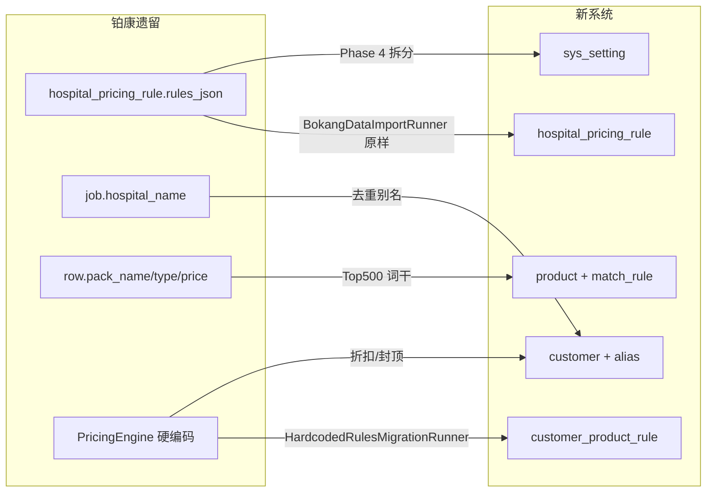
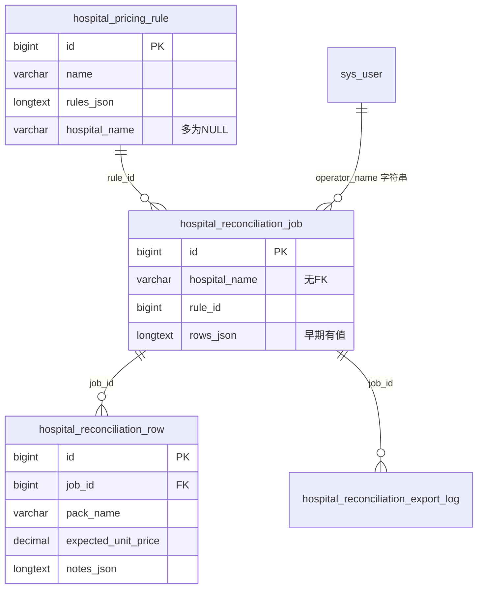
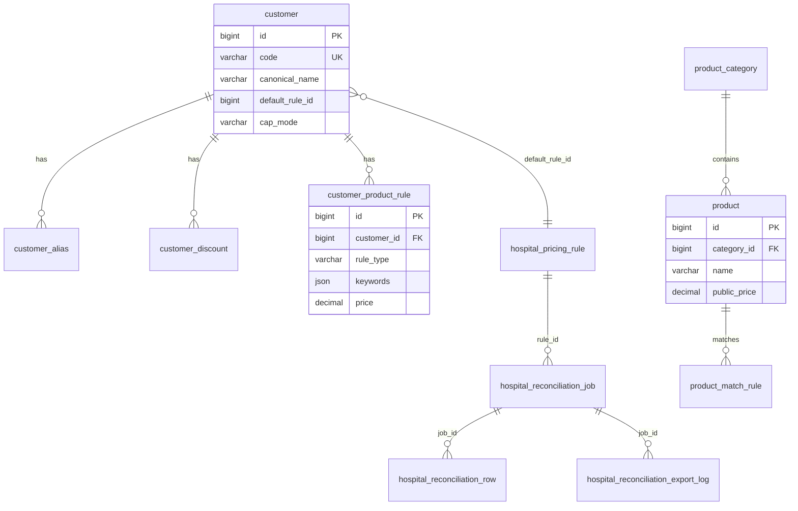

# 数据库结构适配对比分析（铂康遗留 ↔ 当前 Hospital 系统）

> 编制日期：2026-07-10  
> 数据源：`schema.sql` + `db/schema_00x_*.sql`、`铂康/建表语句/*.sql`、`BokangDataImportRunner.java`、`bokang-legacy-analysis.md`、`bokang-import-report.md`、`iteration-refactoring-plan.md` §4

---

## 1. 概述结论

| 维度 | 结论 |
|------|------|
| **总体评分** | **72 / 100 — 部分适配，需改造** |
| **适配等级** | **部分适配**（核心对账表列兼容；主数据与规则已扩展；历史明细与部分业务语义未完整承接） |
| **一句话摘要** | 当前库在 **DDL 层完全兼容** 铂康 9 张业务表，并新增 9 张主数据/配置表；`BokangDataImportRunner` 已将规则、客户别名、产品词干导入，但 **58 万行对账明细、328 条导出日志、Java 硬编码特例规则** 仍待 Phase 2–4 改造后才能完整承接。 |

**分项判断：**

- **可直接承接（良好）**：`hospital_pricing_rule`、`hospital_reconciliation_row` 列结构、`hospital_reconciliation_job` 元数据列
- **已扩展承接（良好）**：客户/产品主数据通过新表 + 导入器映射
- **部分承接（中等）**：规则 JSON → `customer_product_rule` + `sys_setting` 拆分未完成；`rules_json` 内 `settlementLetter`/`exportOptions` 仍嵌在 JSON
- **未承接/故意跳过（弱）**：全量 job/row 历史、export_log、`department_summary` 导出类型、早期 `rows_json` 快照

---

## 2. 表级对照总览

### 2.1 铂康遗留 9 表（转储含数据 6 张）

| 旧系统表/数据源 | 新系统表 | 适配度 | 说明 |
|----------------|----------|--------|------|
| `sys_user`（4 用户） | `sys_user` | ⚠️ 低 | 列少 `is_active`/`is_superuser`；含真实密码哈希，**禁止导入生产** |
| `sys_role`（转储无） | `sys_role` | — | 旧库有表无数据；新库由 `DataInitializer` 初始化 |
| `sys_menu`（6 菜单） | `sys_menu` | ⚠️ 低 | 旧系统仅 RBAC 占位，无医院业务菜单；与现菜单体系不兼容 |
| `sys_user_role`（转储无） | `sys_user_role` | — | 新库独有 |
| `sys_role_menu`（转储无） | `sys_role_menu` | — | 新库独有 |
| `hospital_pricing_rule`（8 条） | `hospital_pricing_rule` + `customer.default_rule_id` + `sys_setting`（规划） | ✅ 高 | 列结构一致；`rules_json` 整包导入；`settlementLetter`/`exportOptions` 待迁 `sys_setting` |
| `hospital_reconciliation_job`（417 条） | `customer` + `customer_alias`（非 job 表） | ⚠️ 中 | **故意不导入 job**；仅 `hospital_name` 去重 → 客户主数据 |
| `hospital_reconciliation_row`（580,915 行） | `product` + `product_match_rule`（非 row 表） | ⚠️ 中 | **故意不导入 row**；流式聚合 Top 500 词干 → 产品种子 |
| `hospital_reconciliation_export_log`（328 条） | `hospital_reconciliation_export_log` | ❌ 未导入 | 列兼容；含 `department_summary` 类型，现系统导出模块未完整支持 |

### 2.2 新系统新增表（铂康不存在）

| 新系统表 | 铂康数据源 | 适配度 | 说明 |
|----------|-----------|--------|------|
| `customer` | `job.hospital_name` 去重 + Engine 种子 | ✅ 高 | 26 条（种子 ~24 + 导入 +2）；`default_rule_id` 来自 job `rule_id` |
| `customer_alias` | `job.hospital_name` 变体 | ✅ 高 | 43 条；`source='bokang_job'` 新增 18 |
| `customer_discount` | Engine 硬编码 0.7 折扣 | ✅ 高 | 非铂康 SQL；`HardcodedRulesMigrationRunner` 迁移 |
| `customer_product_rule` | Engine `fixedPrices`/`foldRules` | ✅ 高 | 32 条；铂康 `rules_json` **无** `specialRules` |
| `product_category` | 规划分类 | ✅ 高 | 种子初始化；导入产品默认 `SMALL_ITEM` |
| `product` | `row.pack_name` 词干聚合 | ⚠️ 中 | 473 条；仅 Top 500 频次；丢失行级上下文 |
| `product_match_rule` | 同上 | ⚠️ 中 | 1:1 产品；`CONTAINS` + `pack_name` |
| `product_alias` | — | — | 铂康无对应；新库预留 |
| `sys_setting` | `rules_json.settlementLetter`/`exportOptions`（规划） | ⚠️ 低 | 表已建；`bokang_data_import_v1` 标记已写入；业务配置待 Phase 4 |

**表数量对比：** 铂康生产库 **9 表** → 当前完整库 **18 表**（`schema.sql` 15 + `schema_002` 客户 4，去重后 18）。

---

## 3. 逐表字段对比详情

### 3.1 `hospital_reconciliation_row` → `product` + `product_match_rule`（不入 row 表）

铂康 INSERT 列序（21 列）：

```
id, job_id, sheet_name, row_number, delivery_date, order_no, type, category_no,
pack_name, package_material, pack_count, instrument_count, unit_price, total_price,
expected_unit_price, corrected_total_price, difference, status, pricing_rule, notes_json, created_at
```

| 旧字段 | 新字段 | 映射方式 | 丢失/增益 | 适配评价 |
|--------|--------|----------|-----------|----------|
| `pack_name` | `product.name` + `product_match_rule.pattern_value` | `extractPackNameStem()` 词干化，如 `拔髓针-5件/Z7520` → `拔髓针` | 丢失规格后缀 `/Z7520`、件数后缀 | ⚠️ 聚合有损 |
| `type` | （聚合 key 之一，未入 product 表） | 仅用于 `stem\|type\|material` 去重 key | 未结构化到 `product_category` | ⚠️ 待改进 |
| `package_material` | （聚合 key 之一） | 同上 | 未写入 `material_tags` | ⚠️ 待改进 |
| `expected_unit_price` | `product.public_price` / `original_price` | 同词干多行取**中位数** | 丢失客户/医院维度价差 | ⚠️ 参考价非合同价 |
| `pricing_rule` | — | **不导入** | 丢失引擎分支标签（回归断言用） | ❌ 需标杆 job 保留 |
| `notes_json` | — | **不导入** | 丢失小件折算/封顶/包装警告文案 | ❌ Phase 3 回归风险 |
| `status` | — | **不导入** | 丢失 `warning`/`corrected` 状态 | ❌ |
| `job_id`/`sheet_name`/`row_number` | — | **不导入** | 丢失科室维度、行序 | ❌ |
| — | `product.category_id` | 硬编码 `SMALL_ITEM` | 敷料包/固定价产品可能分类错误 | ⚠️ |
| — | `product_match_rule.match_type` | 固定 `CONTAINS` | 增益：可配置匹配 | ✅ |
| — | `product.sku_code` | `BK-{hash}` 生成 | 增益 | ✅ |

**导入器逻辑摘录**（`BokangDataImportRunner.importProductsFromRows`）：扫描 580,915 行 → 聚合 → Top `BOKANG_MAX_PRODUCTS`（默认 500）→ 跳过已存在词干。

---

### 3.2 `hospital_pricing_rule` → 自身 + `sys_setting` + `customer_product_rule`

铂康 INSERT 列序：

```
id, created_at, updated_at, description, is_active, name, rules_json, version, hospital_name, plan_name
```

| 旧字段 | 新字段 | 映射方式 | 丢失/增益 | 适配评价 |
|--------|--------|----------|-----------|----------|
| `name` | `hospital_pricing_rule.name` | 按 `name` 幂等插入 | 保留 | ✅ |
| `rules_json`（整包） | `hospital_pricing_rule.rules_json` | 原样写入 | `specialRules` 本就不在铂康 JSON | ✅ |
| `rules_json.needle.keywords` | 同上（客户级） | id=53/58 含**克氏针、种植盒** | 未拆到 `customer` 级覆盖配置 | ⚠️ |
| `rules_json.settlementLetter` | `sys_setting`（规划） | **仍嵌 JSON** | 公司名「黑龙江省铂康医疗灭菌有限公司」未外置 | ⚠️ Phase 4 |
| `rules_json.exportOptions` | `sys_setting`（规划） | **仍嵌 JSON** | `billFilePrefix` 等未外置 | ⚠️ Phase 4 |
| `rules_json.freeBagFeeThreshold` | `rules_json` 或 `sys_setting` | 保留在 JSON（id=8） | — | ✅ |
| `hospital_name` | — | 铂康均为 **NULL** | 医院绑定靠 `name` 字段 | ⚠️ 规划 `customer_id` 未加列 |
| `plan_name` | — | 均为 NULL | — | — |
| `name`（客户方案） | `customer.default_rule_id` | `RULE_NAME_TO_CUSTOMER` 映射 7 家 | id=36/37/38 等中间规则未链 | ⚠️ |
| Engine `fixedPrices`/`foldRules` | `customer_product_rule` | `HardcodedRulesMigrationRunner` | 铂康 DB 无此数据，靠 Engine 补 | ✅ 双源 |

**rules_json 顶层段（id=8 标准 v2.0）：**

`version`, `highTemperature`, `lowTemperature`, `packaging`, `needle`, `cleaning`, `logistics`, `settlementLetter`, `exportOptions`

---

### 3.3 `hospital_reconciliation_job` → `customer` + `customer_alias`

铂康 INSERT 关键列（31 列，节选）：

```
id, created_at, updated_at, corrected_rows, hospital_name, operator_name, ...,
rule_id, ..., source_file_name, source_file_path, total_rows, warning_rows,
source_date_range, sheet_names, sheet_row_counts, sheet_warning_counts, rows_json, ...
```

| 旧字段 | 新字段 | 映射方式 | 丢失/增益 | 适配评价 |
|--------|--------|----------|-----------|----------|
| `hospital_name` | `customer.canonical_name` 或 `customer_alias.alias` | 去重；已知医院映射 `HRB-WY` 等 code | 测试医院 25 条跳过 | ✅ |
| `hospital_name` | `customer_alias.alias` | `source='bokang_job'`, `match_type='contains'` | 增益：可追溯来源 | ✅ |
| `rule_id` | `customer.default_rule_id` | 新客创建时写入 | 仅新客；已知客靠 `linkCustomerDefaultRules()` | ⚠️ |
| `source_file_name` | — | **不导入** | 丢失 xlsx 文件名基线 | ❌ 回归参考 |
| `sheet_names` 等 | — | **不导入** | 市五院 32 科室结构丢失 | ❌ |
| `rows_json` | — | **不导入** | 早期 job 行内嵌 JSON 丢失 | ❌ |
| `review_status` 等 | — | **不导入** | 审核历史丢失 | ❌ |
| — | `hospital_reconciliation_job.customer_id` | **列尚未添加**（规划 Phase 1） | 仍靠字符串 `hospital_name` | ⚠️ 待 DDL |

**已知医院 code 映射**（`KNOWN_HOSPITAL_CODES`）：市五院→`HRB-WY`、哈工大→`HRB-HIT`、胸科→`HRB-XK` 等 11 组。

---

### 3.4 `hospital_reconciliation_export_log` → 自身（未导入）

| 旧字段 | 新字段 | 映射方式 | 丢失/增益 | 适配评价 |
|--------|--------|----------|-----------|----------|
| `export_type` | `export_type` | 列一致 | 旧值含 `result`/`bill`/`warning`/`settlement`/`department_summary` | ⚠️ 枚举未约束 |
| `department_summary` | — | **未导入、导出模块未实现** | 市五院等大客户分科室汇总 | ❌ 功能缺口 |
| `file_name`/`file_path` | 同名列 | 兼容 | 328 条历史未导入 | — |
| `job_id` | `job_id` | 兼容 | job 未导入则无法关联 | ❌ |

---

### 3.5 `sys_user` / `sys_menu`

| 旧字段 | 新字段 | 差异 | 适配评价 |
|--------|--------|------|----------|
| `username, email, password` | 同名列 + `is_active`, `is_superuser` | 新库多 2 列，默认 active | ⚠️ 不导入 |
| 菜单 6 项（系统管理） | `DataInitializer` 医院业务菜单 | 体系完全不同 | ❌ 不导入 |

---

### 3.6 新表：`customer` / `customer_product_rule` / `product_category`

| 新字段 | 铂康来源 | 说明 |
|--------|----------|------|
| `customer.code` | 规划编码或 `BK-{hash}` | 未知医院自动生成 |
| `customer.cap_mode` | Engine 硬编码 | 铂康无 |
| `customer_product_rule.*` | Engine L328–399 | 铂康 `rules_json` 无 `specialRules` |
| `product_category.pricing_path` | Engine 分支 | 铂康 `row.type` 可推断但未自动映射 |

---

## 4. 概念模型变化

### 4.1 旧系统（铂康）

```
Excel 上传
    → hospital_reconciliation_job（hospital_name 字符串，rule_id FK）
    → hospital_reconciliation_row（行级计价结果 + notes_json）
    → hospital_pricing_rule.rules_json（通用参数 JSON blob）
    → PricingEngine Java 硬编码兜底（fixedPrices/foldRules/敷料表）
```

- **无** 客户主数据表；医院名散落字符串
- **无** 产品主数据；包名仅在 row 列
- 客户特例在 **Java 代码**，不在 DB JSON
- 结款函/导出前缀在 `rules_json` 嵌套段

### 4.2 新系统（当前 + 规划）

```
Excel 上传
    → resolveCustomer(hospital_name) → customer + customer_alias
    → RuleCompiler 合并：
        hospital_pricing_rule.rules_json（通用段）
      + customer_product_rule（客户×产品特例）
      + customer_discount（0.7 等）
      + customer.cap_mode
    → PricingEngine（目标：纯解释器，无 Java defaults）
    → hospital_reconciliation_job（规划 +customer_id）
    → hospital_reconciliation_row
```

- **客户主数据**：`customer` + `customer_alias`（`source`: engine | bokang_job | manual）
- **产品主数据**：`product` + `product_match_rule` + `product_category`
- **规则拆分**：通用 JSON + 关系化 `customer_product_rule`
- **系统配置**：`sys_setting`（公司/银行/导出前缀/敷料价表）

### 4.3 迁移路径示意



---

## 5. 已导入 vs 未导入 vs 无法导入

| 数据类别 | 源规模 | 目标 | 状态 | 备注 |
|----------|--------|------|------|------|
| 计价规则 | 8 条 | `hospital_pricing_rule` | ✅ **已导入 +7**，跳过 1（标准模板同名） | 幂等按 `name` |
| 客户主数据 | ~18+ 医院名 | `customer` | ✅ **+2 新客**，种子 ~24 已有 | 测试医院 25 条跳过 |
| 客户别名 | 多变体 | `customer_alias` | ✅ **+18**，跳过 3 已存在 | `source=bokang_job` |
| 客户默认规则 | rule_id | `customer.default_rule_id` | ⚠️ 部分链接 | 7 家已知映射 |
| Engine 特例规则 | 22+7+1 | `customer_product_rule` | ✅ 32 条 | 非铂康 SQL |
| 产品词干 | 580,915 行扫描 | `product` + `product_match_rule` | ✅ **+456 产品**，跳过 44 重名 | Top 500 频次 |
| 产品价格 | 行内 `expected_unit_price` | `product.public_price` | ⚠️ 中位数，**+2 补价** | 非全量 |
| 对账作业 | 417 job | `hospital_reconciliation_job` | ❌ **故意跳过** | 仅 dev 标杆 job 可抽样 |
| 对账明细 | 580,915 row | `hospital_reconciliation_row` | ❌ **故意跳过** | CI 用 job 35,40,66,74,324,362 子集 |
| 导出日志 | 328 条 | `hospital_reconciliation_export_log` | ❌ **未导入** | 含 94 条 `department_summary` |
| 用户/菜单 | 4+6 | `sys_user`/`sys_menu` | ❌ **禁止/不兼容** | 安全与菜单体系 |
| `rows_json`（早期 job） | 部分 job | — | ❌ **无法完整迁移** | 新流程用 row 表；早期快照无对应 Excel |
| `specialRules` JSON | 不存在于铂康 | `customer_product_rule` | ⚠️ **只能靠 Engine** | 双轨验证前须合并 |
| xlsx 源文件 | 仓库无实体 | — | ❌ **无法导入** | 仅文件名在 job 元数据 |

**2026-07-10 Docker 导入后计数**（`bokang-import-report.md`）：

| 表 | 数量 |
|----|------|
| `customer` | 26 |
| `customer_alias` | 43 |
| `product` | 473 |
| `product_match_rule` | 473 |
| `hospital_pricing_rule` | 9 |
| `customer_product_rule` | 32 |
| `hospital_reconciliation_job` | **0** |
| `hospital_reconciliation_row` | **0** |

---

## 6. 适配短板与改造建议

### 6.1 已丢失或弱化的语义

| 短板 | 影响 | 优先级 |
|------|------|--------|
| `department_summary` 导出类型 | 市五院等分科室汇总无法复现 | **P1** |
| 58 万 `row` 未入库 | 无法 DB 级全量回归；仅文件转储 | **P1**（dev 抽样） |
| `notes_json` 计价说明 | Phase 3 双轨无法断言 warning 文案 | **P1** |
| 早期 `rows_json` in job | 无 Excel 时无法重放 | **P2** |
| `product` 仅 `SMALL_ITEM` | 敷料/固定价产品分类不准 | **P2** |
| `hospital_name` 无 FK | job 与客户主数据未关联 | **P1**（加 `customer_id`） |
| `rules_json` 内 `settlementLetter`/`exportOptions` | 配置分散，前端仍有副本 | **P2**（Phase 4） |
| 铂康无 `specialRules` | 生产特例依赖 Java，DB 不完整 | **P0**（Engine 已迁 32 条，待去兜底） |

### 6.2 建议 Schema 扩展

```sql
-- Phase 1（规划已有，待落地）
ALTER TABLE hospital_reconciliation_job
    ADD COLUMN customer_id BIGINT NULL AFTER hospital_name;

ALTER TABLE hospital_pricing_rule
    ADD COLUMN customer_id BIGINT NULL,
    ADD COLUMN schema_version VARCHAR(20) DEFAULT '2.0';

-- Phase 4 建议
-- sys_setting: company_info, export_templates, dressing_price_table
-- export_type 文档化枚举: bill|warning|settlement|department_summary|result(legacy)
```

### 6.3 优先级改造路线图

| 优先级 | 动作 | 预期效果 |
|--------|------|----------|
| **P0** | 标杆 job（35,40,66,74,324,362）row 子集导入 **测试库** | 可跑双轨 diff |
| **P0** | 完成 `RuleCompiler` + 删除 Engine defaults | 规则单一数据源 |
| **P1** | `job.customer_id` DDL + 上传时 `resolveByName` | 客户 FK 闭环 |
| **P1** | 实现 `department_summary` 导出 | 对齐铂康 export_log |
| **P2** | `row.type` → `product_category` 自动推断 | 产品分类准确 |
| **P2** | `settlementLetter`/`exportOptions` → `sys_setting` | 配置外置 |
| **P3** | 按 `material_tags` 丰富 `product_match_rule` | 袋型匹配增强 |

---

## 7. 附录：ER 关系对比

### 7.1 铂康旧库 ER（简化）



### 7.2 当前新库 ER（含扩展表）



---

## 8. 参考：铂康真实列样本

**row 样本（job_id=5）：**

| pack_name | package_material | type | expected_unit_price | status | pricing_rule |
|-----------|------------------|------|---------------------|--------|--------------|
| 拔髓针-5件/Z7520 | 高温纸塑袋75*200 | 额外包(纸塑袋) | 16.5 | warning | 高温纸塑袋20cm计费 |

**pricing_rule 客户级 needle 差异（id=53 市五院）：**

`["克氏针","种植盒","小件","探针",...]` vs 标准 id=8：`["针","小件","缝针",...]`

**export_type 分布（328 条）：** `result`/`bill`、`warning`、`settlement`、**`department_summary`（94 条）**

---

*文档结束。实施请参阅 `iteration-refactoring-plan.md` Phase 0–5 及 `bokang-import-report.md` 导入命令。*
