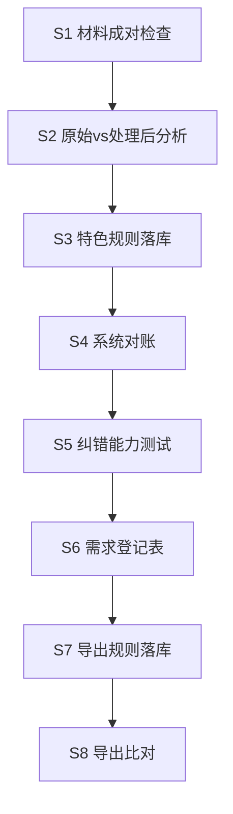

# 特色账单 · 新医院接入操作流程与规范

> 版本：**2026-08-01** · 依据一期 38 院验收经验（[`优先医院对齐TODO.md`](优先医院对齐TODO.md)）提炼  
> 适用范围：铂康医疗特色账单新客户 / 二期及后续批次  
> 日常看板：一期 → [`优先医院对齐TODO.md`](优先医院对齐TODO.md) · 二期 → [`二期医院对齐TODO.md`](二期医院对齐TODO.md)

---

## 1. 前置条件

| 项 | 要求 |
|----|------|
| 本地环境 | `docker compose up -d backend` 可用 · API `http://127.0.0.1:8000` |
| 院文件夹 | `测试用例/{规范医院名}/原始表格/` + `处理后表格/` |
| 客户档案 | 客户管理或 billing-seeds 中：`billingEnabled=true` · `billingPricingMode` · 客户编码 |
| 参考登记 | `docs/逐院需求登记表/{院}.md` v1.1+（S6） |

**命名规范：** 文件夹名与 [`batch_june_price_reconciliation.py`](../scripts/batch_june_price_reconciliation.py) 中 `TODO_HOSPITALS` / 需求登记表一致；处理后文件前缀 `{月}__`（双下划线）。

---

## 2. 标准八步流程（S1→S8）

上一步未闭环不得跳步。材料缺失见 [`pass_zero与缺材料医院-客户收集清单.txt`](pass_zero与缺材料医院-客户收集清单.txt) · [`二期材料缺口清单.md`](二期材料缺口清单.md)。



**图例：** `⬜` 未开始 · `🔄` 进行中/登记已知差 · `✅` 通过 · `⏭` 跳过 · `🚫` 阻塞

### S1 · 材料检查

**做什么：** 确认每账期 **原始账单 + 处理后账单 + 结款函** 成对齐全。

| 通过标准 | 说明 |
|----------|------|
| `pick_june_pair()` 返回 raw 路径 | 6 月（或验收账期）成对 |
| 原始表 = 铂康未改价导出 | 禁止只有处理后无原始 |
| 结款函 xlsx/docx | S8 settlement 必需（可后补） |

```bash
# 单院材料探测（脚本内 pick_june_pair）
python3 -c "
from pathlib import Path; import sys
sys.path.insert(0,'scripts')
from batch_june_price_reconciliation import pick_june_pair
d=Path('测试用例/{医院名}')
r, p, n = pick_june_pair(d)
print('raw=', r, 'proc=', p, 'note=', n)
"
python3 scripts/ingest_bokang_supplements.py   # 铂康补件入库
```

**材料类型（接入必备）：**

| 类型 | 用途 | 一期典型缺口 |
|------|------|-------------|
| 原始账单 xlsx | S4 导入 · 期待 diff 基准 | 二期 4 院全无原始 |
| 处理后账单 xlsx | 黄金价 · S8 比对 | — |
| 结款函 | S8 settlement | 国药三、香坊中（已闭合） |
| kit BOM 拆包对照表 | 器械包→组件行 | 国药主/二 |
| vendor 补录 sheet | 外来器械/钉盒 | 市二 7 sheet |
| part3/vendor 明细 | kit 拆行 | 省二松北 |
| PDF 特殊价格单 | 规则数值 | 道外、省医院 |

---

### S2 · 表格对比分析

**做什么：** 原始 vs 处理后自动 diff，生成期待校正清单。

| 通过标准 | 产出 |
|----------|------|
| `数据问题分析.md` + `数据问题清单.csv` 已生成 | 含单价/总价/包名差异行 |

```bash
python3 scripts/analyze_test_case_excel.py "测试用例/{医院名}"
```

**规范（2026-07-31 起）：**

- 期待 CSV 由 **原始 vs 处理后自动 diff** 生成
- **禁止**手工改期待 CSV
- **禁止**使用 `sync_june_expected_from_warnings.py` 回填期待

**跨月账期：** 在 `HOSPITAL_PAIR_OVERRIDE` 或院文件夹 README 登记固定成对路径（如 5.21–6.20、6.15–7.14）。

---

### S3 · 特色规则落库

**做什么：** 将院级计价/结款/路径规则写入 billing-seeds 或客户管理 UI。

| 通过标准 | 位置 |
|----------|------|
| seed marker 落库 · dev 库 verified | `backend/src/main/resources/billing-seeds/` |
| PDF 特殊价格单 → productRules | OCR 或手工录入 |

参考：[`S7导出规则配置说明.md`](S7导出规则配置说明.md) · 院级 `特色计价规则.md`（复杂院可选）。

---

### S4 · 系统对账

**做什么：** 导入原始表 · 跑计价引擎 · 期待 CSV 与 API warnings 比对。

| 通过标准 | 口径 |
|----------|------|
| `missed=0` 且 `extra=0` | pass / pass_zero |
| `missed>0` 或 `extra>0` | **fail**（extra = P0 bug 或规则未覆盖） |

```bash
# 单院定点重导（禁止全量覆盖 stable 主表）
python3 scripts/batch_june_system_test.py "{医院名}"

# 只读审计（不重导）
python3 scripts/s4_stable_job_audit.py
python3 scripts/s4_stable_job_audit.py --job-map 测试用例/job_baseline_pricing.json \
  --output 测试用例/s4_pricing_job_audit.json
```

**Job 双轨（必守）：**

| 轨道 | 文件 | 用途 | 禁止 |
|------|------|------|------|
| **stable** | [`job_baseline_stable.json`](job_baseline_stable.json) | S4/S8 签字主表 | 全量重导覆盖 |
| **pricing** | [`job_baseline_pricing.json`](job_baseline_pricing.json) | 定点重导验收附录 | 替代 stable 做全院 S8 |

单院重导后：**更新 stable map → 复跑 S8 → 更新** [`批量6月系统对账结果.md`](批量6月系统对账结果.md)。

**附一教训：** pricing 全量重导可能 extra 暴增（745 extra=1082）→ stable 可回退旧 Job（607 保 S4+S8 双 pass）。

**哈工大教训：** S4 extra 来自 **totalPrice 与 unitPrice 不一致** → 需同时校正原始表 col14/15，非仅改处理后表。

---

### S5 · 纠错能力测试

**做什么：** 故意构造改价/改包名/关 billing，验证引擎 warning 与 UI 链路。

| 通过标准 | 场景 |
|----------|------|
| 每院 ≥3 条：EC-PRICE / EC-PACK / EC-BILLING-OFF | 见 [`S5纠错测试最小用例集.md`](S5纠错测试最小用例集.md) |

产出：院文件夹 `纠错测试记录.md` · 引擎单测 `PricingEngineS5ErrorCorrectionTest`。

---

### S6 · 需求登记表

**做什么：** 维护 `docs/逐院需求登记表/{院}.md`，与 S3 规则、参考材料同步。

```bash
python3 scripts/generate_hospital_requirement_docs.py   # 批量刷新已知项
```

---

### S7 · 导出规则落库

**做什么：** 绑定 export_template · billLayout · settlement 策略 · 导出阶段折扣。

| 配置项 | 说明 |
|--------|------|
| `billLayout` | `auto` / `dept_split` / `combined` |
| `settlement_only` 折扣 | 结款函独立折扣 |
| `export_only` 折扣 | 账单导出阶段（如太平 2+把 75%） |

种子：`phase-export-rules-20260723.json` · `phase-export-dept-split-20260728.json`

---

### S8 · 导出比对验收

**做什么：** 系统 export-v2 输出 vs 处理后黄金表 · bill + settlement 双比对。

```bash
python3 scripts/batch_s8_export_compare.py --job-map 测试用例/job_baseline_stable.json
python3 scripts/batch_s8_settlement_compare.py --job-map 测试用例/job_baseline_stable.json

# 单院 / 单 exportType
python3 scripts/batch_s8_export_compare.py --hospital "{医院名}" --job-map 测试用例/job_baseline_stable.json
python3 scripts/batch_s8_export_compare.py --export-type dept_summary --hospital "{医院名}"
```

| 结论 | 含义 |
|------|------|
| pass | 行级/总额一致 |
| warn | 已知差登记（四舍五入/fold）· 不阻塞 stable |
| fail material | kit/vendor/part3 材料阻塞 · 计 `blocked_material` |
| skip | 缺结款函参考 · 不计 fail |

参考：[`S8失败修复指南.md`](S8失败修复指南.md) · [`S8导出比对摘要.md`](S8导出比对摘要.md)

**附一专项：** `python3 scripts/verify_fuyi_11col_export.py 测试用例/.s8_exports/job607_*_bill.xlsx`

---

## 3. 院文件夹模板

```
测试用例/{医院名}/
├── 原始表格/              # 铂康未改价 xlsx
├── 处理后表格/            # 客户确认价 + 结款函
├── 特色计价规则.md        # 可选 · 复杂计价院
├── 数据问题分析.md        # S2 产出
├── 数据问题清单.csv
├── 纠错测试记录.md        # S5
├── 6月期待价格校正清单.csv  # S2 自动生成
└── 验收进度.md            # 可选 · 复制看板勾选模板
```

**勾选模板（复制到 `验收进度.md`）：**

```markdown
- [ ] **1 材料检查**：原始 __ 个；处理后 __ 个；结款函 __ 个；缺：__
- [ ] **2 对比分析**：`数据问题分析.md` + CSV 已生成
- [ ] **3 规则落库**：种子/UI __ · dev 库 verified __
- [ ] **4 系统对账 pass**：__月 · Job #__（stable / pricing）
- [ ] **5 纠错测试**：EC-PRICE / EC-PACK / EC-BILLING-OFF
- [ ] **6 需求登记表**：`docs/逐院需求登记表/__.md` v__
- [ ] **7 导出规则落库**：模板/策略 __
- [ ] **8 导出比对**：bill + settlement pass · 汇总 type structure_ok
```

---

## 4. 常见阻塞与处置

| 现象 | 根因 | 处置 |
|------|------|------|
| S1 🚫 | 缺原始 xlsx | 向铂康/院方索取 · 见 [`二期材料缺口清单.md`](二期材料缺口清单.md) |
| S4 extra>0 | 规则未覆盖 / 引擎假阳性 | billing-seed 补规则 · raw 价校正 |
| S4 missed>0 | 期待 CSV 与 DB warnings 不对齐 | 定点重导 · 检查 import 匹配 |
| S8 Δ 大 + material | kit 拆行 / vendor 未入库 | 索 BOM/vendor 补录（**非**常规账单） |
| S8 warn | export 四舍五入 / fold 登记 | 登记 warn · 不阻塞 stable |
| 6月两表无差别 | 该月无改价行 | 换「有差别月份」或 pass_zero |
| 全量重导劣化 | pricing Job extra 暴增 | stable 回退旧 Job · 仅单院定点重导 |

---

## 5. 新院接入检查清单（Quick Start）

1. 创建 `测试用例/{院}/` 目录结构
2. 入库原始+处理后+结款函 → S1 pass
3. `analyze_test_case_excel.py` → S2
4. 编写/更新 billing-seeds + 客户编码 → S3
5. `batch_june_system_test.py "{院}"` → 确认 S4 pass → 写入 `job_baseline_stable.json`
6. S5 纠错记录 · S6 需求登记表 · S7 导出种子
7. S8 bill + settlement 复跑 → 更新二期/一期 TODO 看板

**禁止事项：**

- 全量 `batch_june_system_test.py` 不写 stable 主表全院
- 手工改期待 CSV
- 用 pricing Job 替代 stable 做 S8 签字
- 将 kit BOM / vendor 补录与普通账单混为一类材料

---

## 6. 相关文档索引

| 文档 | 用途 |
|------|------|
| [`优先医院对齐TODO.md`](优先医院对齐TODO.md) | 一期 38 院看板 |
| [`二期医院对齐TODO.md`](二期医院对齐TODO.md) | 二期 8 院看板 |
| [`二期材料缺口清单.md`](二期材料缺口清单.md) | 二期缺件明细 |
| [`铂康材料缺口清单.md`](铂康材料缺口清单.md) | 一期 P0 材料阻塞 |
| [`pass_zero与缺材料医院-客户收集清单.txt`](pass_zero与缺材料医院-客户收集清单.txt) | 客户转发话术 |
| [`phase2_s1_material_audit.json`](phase2_s1_material_audit.json) | 二期 S1 自动化审查 JSON |
